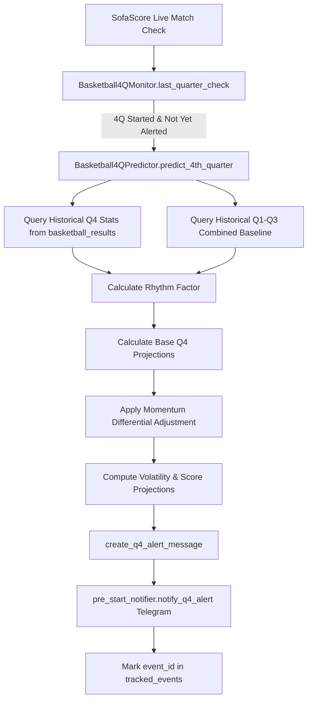

# Basketball 4th Quarter Prediction & Alert System

Source of truth: [`modules/alerts/basketball_4q/`](file:///c:/Users/gadie/Documents/projects/sofascore/modules/alerts/basketball_4q/)  
Predictor engine: [`modules/alerts/basketball_4q/predictor.py`](file:///c:/Users/gadie/Documents/projects/sofascore/modules/alerts/basketball_4q/predictor.py)  
Live monitor: [`modules/alerts/basketball_4q/run_basketball_4q.py`](file:///c:/Users/gadie/Documents/projects/sofascore/modules/alerts/basketball_4q/run_basketball_4q.py)  
Alert formatter: [`modules/alerts/alerts_formatter/q4_alert.py`](file:///c:/Users/gadie/Documents/projects/sofascore/modules/alerts/alerts_formatter/q4_alert.py)

---

## Overview

The **Basketball 4Q Prediction System** monitors live basketball games (primarily NBA) in real time. As soon as the fourth quarter begins, it calculates an econometric projection of final scores, 4th-quarter scoring outputs, and team volatility using a multi-step empirical model based on:

1. **Historical Team Performance**: Quarter-4 scoring distributions conditioned by season stage.
2. **In-Game Rhythm**: Pace factor computed from actual Q1–Q3 scoring relative to historical benchmarks.
3. **Score Differential Momentum**: Game-state adjustments based on blowouts or tight leads.
4. **Statistical Volatility & Confidence**: Standard deviations derived from database records.
5. **Instant Alert Delivery**: Rich Telegram messages dispatched via `modules.alerts.pre_start_notifier`.

---

## Architecture & Components



---

## Prediction Mathematical Model

### Step 1: Historical Baseline Query

Historical games are queried from the `basketball_results` table partitioned by team and competition round:

* **Season Stage Mapping (`map_season_stage_to_db_round`)**:
  Maps incoming tournament stages to database round keys:
  * `"playoff"` or `"knockout"` $\rightarrow$ `'knockouts/playoffs'`
  * Everything else $\rightarrow$ `'regular_season'`
* **Metrics Extracted**:
  $$\text{avg\_q4} = \text{AVG}(\text{points\_q4}), \quad \sigma_{\text{q4}} = \text{STDDEV\_POP}(\text{points\_q4})$$
  *(Fallback defaults: $\text{avg\_q4} = 25.0$, $\sigma_{\text{q4}} = 5.0$ if historical records are missing).*

### Step 2: In-Game Rhythm Factor

Rhythm measures the relative scoring velocity of the current game compared to the historical league average for the active season stage:

$$\text{total\_q1\_q3}_{\text{combined}} = \sum_{q=1}^3 (\text{home}_q + \text{away}_q)$$

$$\text{rhythm\_factor} = \frac{\text{total\_q1\_q3}_{\text{combined}}}{\text{avg\_q1\_q3}_{\text{historical}}}$$

* $\text{rhythm\_factor} > 1.0$: Fast-paced, high-possession game.
* $\text{rhythm\_factor} < 1.0$: Slow, defensive, low-possession game.

### Step 3: Base Q4 Expectation

Each team's expected fourth-quarter baseline scales with the game rhythm:

$$\text{base\_q4}_{\text{home}} = \text{avg\_q4}_{\text{home}} \times \text{rhythm\_factor}$$
$$\text{base\_q4}_{\text{away}} = \text{avg\_q4}_{\text{away}} \times \text{rhythm\_factor}$$

### Step 4: Momentum & Differential Adjustment

Game script adjustments account for tactical pacing changes caused by score margin:

$$\Delta_{\text{score}} = \text{total\_q1\_q3}_{\text{home}} - \text{total\_q1\_q3}_{\text{away}}$$

* **Home Leading ($> 8$ points)**:
  $$\text{adj\_q4}_{\text{home}} = \text{base\_q4}_{\text{home}} \times 0.95 \quad (\text{leading team bleeds clock})$$
  $$\text{adj\_q4}_{\text{away}} = \text{base\_q4}_{\text{away}} \times 1.06 \quad (\text{trailing team pushes pace})$$
* **Away Leading ($> 8$ points, i.e. $\Delta_{\text{score}} < -8$)**:
  $$\text{adj\_q4}_{\text{away}} = \text{base\_q4}_{\text{away}} \times 0.95$$
  $$\text{adj\_q4}_{\text{home}} = \text{base\_q4}_{\text{home}} \times 1.06$$
* **Within Range ($-8 \le \Delta_{\text{score}} \le 8$)**:
  $$\text{adj\_q4} = \text{base\_q4} \quad (\text{neutral competitive pace})$$

### Step 5: Volatility & Projections

* **Explosiveness (Quarter Volatility)**:
  $$\text{explosiveness} = \sigma_{\text{q4}} \times 0.5$$
* **Final Projected Totals**:
  $$\text{final\_projected}_{\text{home}} = \text{total\_q1\_q3}_{\text{home}} + \text{adj\_q4}_{\text{home}}$$
  $$\text{final\_projected}_{\text{away}} = \text{total\_q1\_q3}_{\text{away}} + \text{adj\_q4}_{\text{away}}$$
  $$\text{total\_game\_projected} = \text{final\_projected}_{\text{home}} + \text{final\_projected}_{\text{away}}$$

---

## Live Monitoring (`Basketball4QMonitor`)

The runner continuously tracks live basketball fixtures without duplicate alert spam:

### 4th Quarter Detection (`last_quarter_check`)

The monitor evaluates two authoritative signals from the SofaScore live event payload:
1. **Score Object Presence**: `homeScore.period4 is not None` or `awayScore.period4 is not None`.
2. **Status Code / Description**: `status.code == 16` or `status.description.lower() == "4th quarter"`.

If either condition is met and the event has not been processed in the current runtime session (`tracked_events`), the prediction pipeline executes.

### Alert Notification

Builds a formatted HTML Telegram message with calculation steps and dispatches via `pre_start_notifier.notify_q4_alert(message)`. Once sent, `event_id` is added to `self.tracked_events`.

---

## Execution Entrypoints

### Programmatic Usage

```python
from modules.alerts.basketball_4q import predictor_4q

# Predict Q4 scores given quarter scores
prediction = predictor_4q.predict_4th_quarter(
    home_team="Boston Celtics",
    away_team="Miami Heat",
    q1_home=28, q2_home=26, q3_home=31,
    q1_away=24, q2_away=29, q3_away=25,
    season_stage="Regular Season",
)

print(prediction["predicted_final_home"])
print(prediction["predicted_final_away"])
print(prediction["total_projected"])
```

### Live Monitor Job

```bash
python -m modules.alerts.basketball_4q.run_basketball_4q
```
