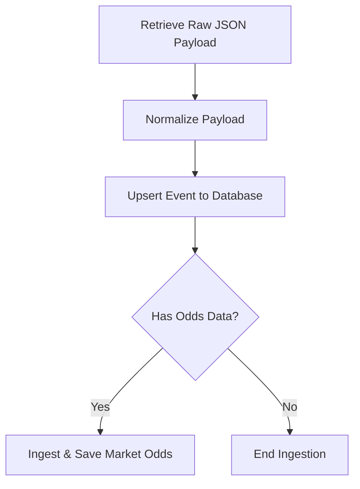

# SofaScore Event Parsing and Persistence Flow

This document details the unified architecture used across the SofaScore odds ingestion system to retrieve, parse (normalize), and persist event and odds metadata.

---

## Architecture Overview

Whenever the system encounters event data from SofaScore, it follows a standardized sequence:



This pipeline ensures consistent sport classification, gender determination, and proper relational database mappings (linking external SofaScore event IDs to canonical internal database IDs).

---

## Core Process & File Breakdown

### Phase 1: Normalization (The Parser)
* **File**: [event_normalizer.py](../modules/sofascore/event_normalizer.py)
* **Function**: `normalize_event_payload(event: Dict, discovery_source: str) -> Dict`
* **SofaScore API Client Proxy**: [client.py](../modules/sofascore/client.py) (`SofaScoreAPI.normalize_event_payload`) — a thin pass-through that delegates to the module-level function.

**What it does:**
This is a purely offline parsing method. It takes a SofaScore nested JSON `event` object and transforms it into a flat, persistence-ready dictionary with three top-level keys: `event`, `home_participant`, `away_participant`, and `competition_ref`.

**Detailed steps:**

1. **Unpack nested objects** — extracts `tournament`, `uniqueTournament`, `category`, `homeTeam`, `awayTeam`, and `season` from the raw event dict.
2. **Sport Classification** — calls `sport_classifier.classify_sport(sport, home_team, away_team)` via the singleton instance in [sport_classifier.py](../modules/sofascore/sport_classifier.py).
   * For Tennis, inspects team names for `/` separators to distinguish `Tennis` (singles) vs `Tennis Doubles`.
   * All other sports pass through unchanged.
3. **Gender Assignment** — calls `get_gender(home_team, away_team)` using the `gender` field SofaScore provides on each team object. Falls back to `"unknown"` when both teams lack the field; returns `"mixed"` on mismatch.
4. **Season Processing** — extracts `season.id`, `season.name`, and `season.year`. Season name is cleaned with `SeasonRepository._parse_season_name(season_name, unique_tournament_name)` which prepends the tournament name if the season name has no alphabetical characters (e.g. `"24/25"` → `"Premier League 24/25"`). Year is parsed via `SeasonRepository._parse_year()`.
5. **Competition Text** — builds a legacy comma-separated string via `_build_competition_text()`: `"{category.name}, {tournament.name}, {uniqueTournament.name}"`, de-duplicated by `clean_competition()`.
6. **Competition Ref** — builds a structured `competition_ref` dict containing `source_tournament_id`, `source_unique_tournament_id`, `canonical_name` (uniqueTournament.name), `display_name` (tournament.name), `slug`, `unique_slug`, `category_id`, and `category_name`.
7. **Round Derivation** — calls `_derive_round(competition, season_name, round_info, competition_ref)`:
   * Checks the `competition_ref` text (or falls back to legacy competition string) for keyword patterns: relegation/promotion, qualification, friendly, or preseason.
   * Uses `roundInfo.slug` when available — if the slug matches knockout patterns (quarterfinal, semifinal, etc.) returns `"knockouts/playoffs"`.
   * Cup competitions with non-knockout slugs default to `"regular_season"`.
   * Falls back to `"regular_season"` when no slug is present and no keyword matches.
8. **Country Derivation** — cascades through `event.venue.country.name` → `category.country.name` → `category.name`.
9. **Validation Warnings** — logs warnings for missing `id`, `startTimestamp`, home/away participant IDs, or tournament ID.
10. **Output** — returns a dict:
    ```python
    {
        "event": { "id", "customId", "slug", "startTimestamp", "sport", "competition", "country",
                   "homeTeam", "awayTeam", "gender", "discovery_source", "season_id",
                   "season_name", "season_year", "round" },
        "home_participant": { "source", "source_participant_id", "name", "slug", "short_name" },
        "away_participant": { "source", "source_participant_id", "name", "slug", "short_name" },
        "competition_ref": { "source", "source_tournament_id", "source_unique_tournament_id",
                             "canonical_name", "display_name", "slug", "unique_slug",
                             "category_id", "category_name" },
    }
    ```

---

### Phase 2: Relational Mapping (The Repository)
* **File**: [event_repository.py](../infrastructure/persistence/repositories/event_repository.py)
* **Method**: `EventRepository.upsert_event(event_data: Dict) -> Optional[Event]`

**What it does:**
Takes the normalized dict produced by Phase 1 and persists it across multiple related tables inside a single database session. The incoming `event_payload["id"]` is always the **SofaScore external ID**; the returned `Event.id` is the **canonical internal database ID** (auto-incremented primary key).

**Detailed steps:**

1. **Payload Extraction** — separates the incoming dict into `event_payload`, `home_participant_data`, `away_participant_data`, and `competition_data`.
2. **Guard Clauses** — rejects the upsert if `sofascore_event_id` or `startTimestamp` is missing.
3. **Canonical ID Lookup** — calls `EventSourceMappingRepository.get_event_id_by_source(source="sofascore", source_event_id=sofascore_event_id)` ([event_source_mapping_repository.py](../infrastructure/persistence/repositories/event_source_mapping_repository.py)) to check if this external event already exists in the database.
4. **Open Session** — starts a database session via `db_manager.get_session()`.
5. **Season Creation** — if `season_id` is present, calls `SeasonRepository.get_or_create_season_in_session(session, season_id, season_name, year, sport)` ([season_repository.py](../infrastructure/persistence/repositories/season_repository.py)) to upsert the season row.
   * Special-case: if the `season_id` matches an NBA Cup season and the competition contains `"nba cup"`, overrides `round_info` to `"knockouts/playoffs"`.
6. **Participant Upsert** — for both home and away, if participant data includes a `source_participant_id`, calls `ParticipantRepository.upsert_participant(session, data)` ([participant_repository.py](../infrastructure/persistence/repositories/participant_repository.py)). This finds-or-creates a row in the `participants` table keyed by `(source, source_participant_id)`.
7. **Competition Upsert** — if competition data includes a `source_tournament_id`, calls `CompetitionRepository.upsert_competition(session, data)` ([competition_repository.py](../infrastructure/persistence/repositories/competition_repository.py)). This finds-or-creates a row in the `competitions` table keyed by `(source, source_tournament_id)`.
8. **Event Row — Update or Insert**:
   * **Update** (canonical ID found): loads the existing `Event` row, updates all mutable fields (`start_time_utc`, `sport`, `competition`, `home_team`, `away_team`, `gender`, `round`, `season_id`, FK pointers to participants and competition). Preserves `knockouts/playoffs` round when the incoming round is `regular_season` (prevents demotion). Sets `updated_at` timestamp.
   * **Insert** (new event): creates a new `Event` row via `session.add()` + `session.flush()` to obtain the auto-incremented `Event.id`.
9. **Source Mapping Record** — calls `EventSourceMappingRepository.upsert_mapping(event_id, source="sofascore", source_event_id, match_method="direct", confidence=1.000, session=session)` to create or refresh the mapping between the canonical ID and the SofaScore external ID.
10. **Return** — returns the SQLAlchemy `Event` object (with `Event.id` set to the canonical internal ID).

> **Note:** Legacy columns (`home_team`, `away_team`, `competition` as plain text) are still written alongside normalized FK relationships. These are marked with `LEGACY_DB_SHIM_REMOVE_AFTER_SCHEMA_MIGRATION` comments and will be removed after the migration is complete.

---

### Phase 3: Market Odds Ingestion (The Ingestion Service)
* **File**: [market_odds_ingestion_service.py](../modules/odds_ingestion/market_odds_ingestion_service.py)
* **Key Methods**:
  * `MarketOddsIngestionService.save_from_event_odds_response(event_id, odds_response, source)` — for `/event/{id}/odds/1/all` responses
  * `MarketOddsIngestionService.save_from_dropping_odds_map_entry(event_id, odds_map_entry, source)` — for dropping odds `oddsMap` entries
  * `MarketOddsIngestionService.save_from_daily_odds_entry(event_id, daily_odds_entry, source)` — for daily discovery odds feed entries

**What it does:**
Persists the raw odds snapshot for the canonical internal event ID. All three entry points follow the same internal pipeline:

1. **Adaptation** — the raw SofaScore response variant is adapted into a uniform market payload by `SofaScoreMarketAdapter` ([sofascore_market_adapter.py](../modules/odds_ingestion/adapters/sofascore_market_adapter.py)). This normalizes different SofaScore odds response shapes (list, dict, single-entry) into `{ "markets": [...] }`.
2. **Canonical Normalization** — calls `CanonicalMarketNormalizer.normalize_sofascore_response()` ([canonical_market_normalizer.py](../modules/odds_ingestion/canonical_market_normalizer.py)). This resolves SofaScore market names (e.g. `"Full Time"` + group `"1X2"`) to canonical market type keys (e.g. `"1x2_full_time"`) and normalizes choice labels (Home/Draw/Away, Over/Under).
3. **Persistence** — calls the internal `_save_normalized()` method which delegates to `MarketRepository.save_markets_from_response_with_stats(event_id, normalized_response, bookie_id=1, source=source)` ([market_repository.py](../infrastructure/persistence/repositories/market_repository.py)). This upserts rows across `markets`, `choices`, and `odds_snapshots` tables.
4. **Dual-Process Check** — verifies whether the event has dual-process-compatible odds via `DualProcessOddsRepository.event_has_dual_process_odds(event_id)`.
5. **Result** — returns a `MarketIngestionResult` dataclass summarizing counts (`markets_detected`, `markets_saved`, `choices_saved`, `snapshots_saved`, etc.) and any diagnostics (unmapped markets, missing choice groups).

---

## Event Ingestion Workflows in the Codebase

All ingestion flows in the system run on this unified pipeline. Below are the key entry points:

### 1. Daily Discovery Job
* **Runner**: [run_daily_discovery.py](../modules/jobs/daily_discovery/run_daily_discovery.py) → `run_daily_discovery_job()`
* **Orchestration**: [extractor.py](../modules/jobs/daily_discovery/extractor.py) → `DailyDiscoveryExtractor.discover_events_for_date()`
* **Persistence Helper**: [persistence.py](../modules/jobs/daily_discovery/persistence.py) → `persist_event_and_optional_odds(api_client, event, odds_data)`
* **Odds Parsing**: [odds_parser.py](../modules/jobs/daily_discovery/odds_parser.py) → `parse_today_market_odds_response()`
* **Filtering**: [filters.py](../modules/jobs/daily_discovery/filters.py) → `filter_events_starting_after_threshold(events, min_minutes_away=10)`

**Flow Details:**
1. Determines the current discovery slot (`AM` or `PM`) via `resolve_daily_discovery_slot()`.
2. For each sport in `DEFAULT_DAILY_DISCOVERY_SPORTS`:
   a. **Fetches odds feed** — `api_client.get_today_sport_events_odds_response(date, sport)` → SofaScore API `/sport/{sport}/odds/1/{date}`. The response is parsed by `parse_today_market_odds_response()` into a dict keyed by event ID, where each value is already adapter-normalized via `SofaScoreMarketAdapter.from_daily_odds_entry()`.
   b. **Fetches scheduled tournaments** — paginates through `api_client.get_today_sport_events_response(date, sport, page)` → SofaScore API `/sport/{sport}/scheduled-tournaments/{date}/page/{page}`. Collects unique tournament IDs from the response.
   c. **Fetches events per tournament** — for each unique tournament ID, calls `api_client.get_unique_tournament_scheduled_events(ut_id, date)` → SofaScore API `/unique-tournament/{id}/scheduled-events/{date}`. Aggregates all events.
   d. **Filters upcoming events** — uses `filter_events_starting_after_threshold(all_events, min_minutes_away=10)` to identify events that have not started yet.
   e. **Persists each event** — for each event, calls `persist_event_and_optional_odds(api_client, event, event_odds)`:
      1. Normalizes the raw event via `api_client.normalize_event_payload(event, discovery_source="daily_discovery")` → **Phase 1**.
      2. Upserts via `EventRepository.upsert_event(event_data)` → **Phase 2**.
      3. If odds data is available (event present in both the odds feed and the upcoming set), saves via `MarketOddsIngestionService.save_from_event_odds_response(db_event.id, odds_data, source="daily_discovery")` → **Phase 3**.
   f. **Tracks progress** — updates `DailyDiscoveryRepository` status per sport.

### 2. Dropping Odds Discovery Job
* **Runner**: [run_discover_dropping_odds.py](../modules/jobs/discover_dropping_odds/run_discover_dropping_odds.py) → `run_discover_dropping_odds()`
* **Parallelism**: [discovery_optimization.py](../modules/jobs/parallelism/discovery_optimization.py) → `process_with_parallel_db_ops()`

**Flow Details:**
1. **Step 1 — Global Fetch**: calls `api_client.get_dropping_odds_with_odds_and_events_response()` → SofaScore API `/odds/1/dropping/all`.
   * Extracts events and odds via `api_client.extract_events_and_odds_from_dropping_response(response, odds_extraction=True, discovery_source="dropping_odds")` ([discovery_feeds.py](../modules/sofascore/discovery_feeds.py)). This internally calls `normalize_event_payload()` on each event → **Phase 1**. Returns `(events_list, odds_map)`.
   * Filters to upcoming-only via `filter_upcoming_events()` from [event_filters.py](../modules/jobs/parallelism/event_filters.py).
   * Processes in parallel via `process_with_parallel_db_ops(events, odds_map, discovery_source="dropping_odds", max_workers=10)`. For each event in a `ThreadPoolExecutor`:
     1. `EventRepository.upsert_event(event_data)` → **Phase 2**.
     2. `MarketOddsIngestionService.save_from_dropping_odds_map_entry(event.id, odds_map_entry, source="dropping_odds")` → **Phase 3**.
2. **Step 2 — Per-Sport Fetch**: iterates individual sports (`football`, `basketball`, `volleyball`, etc.) via `/odds/1/dropping/{sport}`. Deduplicates against already-processed event IDs from Step 1. Processes new events via the same parallel pipeline.

### 3. Secondary/Discovery Sources Job
* **Runner**: [run_discover_secondary_sources.py](../modules/jobs/discover_secondary_sources/run_discover_secondary_sources.py) → `run_discover_secondary_sources()`
* **Sub-Runners**:
  * [run_high_value_streaks.py](../modules/jobs/discover_secondary_sources/run_high_value_streaks.py) → `/odds/1/high-value-streaks`
  * [run_team_streaks.py](../modules/jobs/discover_secondary_sources/run_team_streaks.py) → `/odds/top-team-streaks/wins/all`
  * [run_top_h2h.py](../modules/jobs/discover_secondary_sources/run_top_h2h.py) → `/odds/1/top-h2h/all`
  * [run_winning_odds.py](../modules/jobs/discover_secondary_sources/run_winning_odds.py) → `/odds/1/winning/all`
* **Optimized Processor**: [discovery_optimization.py](../modules/jobs/parallelism/discovery_optimization.py) → `process_odds_first()`, `process_events_only()`, `batch_upsert_events()`

**Flow Details:**
  * Each sub-runner fetches its respective SofaScore API endpoint and extracts raw events.
  * For feeds that include embedded odds (dropping odds, winning odds), events and odds maps are extracted together.
  * For feeds that only contain event references (high value streaks, team streaks, H2H), `extract_events_from_high_value_streaks()` or similar extraction functions extract the raw event objects.
  * Team streaks events require an extra step: `parallel_team_event_fetching(team_ids)` fetches the nearest upcoming event for each team via `/team/{id}/near-events`, then normalizes each via `normalize_event_payload(event, discovery_source="team_streaks")`.
  * Extracted events are processed via optimization functions like `run_optimization()` which uses `process_odds_first()`:
    1. **Check odds first** — `parallel_odds_checking()` fetches `/event/{id}/odds/1/all` for each event in parallel.
    2. **Skip events without odds** — avoids the insert-then-delete pattern.
    3. **Upsert valid events** — `batch_upsert_events()` loops through events calling `EventRepository.upsert_event()` → **Phase 2**.
    4. **Process odds** — `batch_process_odds()` processes each event's odds via `MarketOddsIngestionService.save_from_event_odds_response()` → **Phase 3**.

### 4. Results Synchronization & Collection Job
* **Runner**: [run_results_collection_job.py](../modules/jobs/results_collection_job/run_results_collection_job.py) → `run_results_collection_previous_day()`, `run_results_collection_all_finished()`, `run_results_collection_for_date()`
* **Event Info Update**: [event_details.py](../modules/sofascore/event_details.py) → `update_event_information_from_response(response)`
* **ID Resolution**: [event_identity.py](../modules/sofascore/event_identity.py) → `resolve_sofascore_event_id(canonical_event_id)`

**Flow Details:**
  * Results collection is triggered by scheduled jobs. The system queries `EventRepository` for finished events (by date or by status) and resolves each canonical event ID to its SofaScore external ID via `resolve_sofascore_event_id()`.
  * For each event, calls `api_client.get_event_results(sofascore_event_id)` → which internally calls `fetch_event_response(client, event_id)` → SofaScore API `/event/{event_id}`.
  * **Event Information Sync**: when `update_event_info=True` (the default), `get_event_results()` calls `update_event_information_from_response(response)` ([event_details.py](../modules/sofascore/event_details.py)):
    1. Normalizes the response's `event` payload via `normalize_event_payload(event_response, discovery_source="results_sync")` → **Phase 1**.
    2. Removes `discovery_source` from the event payload to avoid overwriting the original source.
    3. Upserts via `EventRepository.upsert_event(event_data)` → **Phase 2** — updating any changed fields (season_id, round, start_time, etc.).
  * **Result Persistence**: the extracted score data is persisted via `ResultRepository.upsert_result(event_id, result_data)`.
  * **Final Odds Collection**: `run_results_collection_for_date()` also fetches final odds via `api_client.get_event_final_odds(sofascore_event_id)` → SofaScore API `/event/{id}/odds/1/all`, and saves them via `MarketOddsIngestionService.save_from_event_odds_response()` → **Phase 3**.
  * **Event Deletion on 404**: if the SofaScore `/event/{id}` endpoint returns 404, `fetch_event_response()` resolves the canonical event ID and deletes it via `EventRepository.batch_delete_events()`. Similarly, if the event is marked as canceled in the response (`_canceled` flag), it is deleted.

### 5. Admin Scripts & Backfills
* **Files**: 
  * [sport_seasons_processing.py](../scripts/sport_seasons_processing.py)
  * [backfill_event_entities_from_sofascore.py](../scripts/maintenance/backfill_event_entities_from_sofascore.py)
  * [backfill_event_metadata.py](../scripts/backfill/backfill_event_metadata.py)
* **Flow Details**:
  * Backfills fetch events by ID or batch and invoke `normalize_event_payload` followed by `upsert_event` to structure and fix legacy database entries.

---

## Key Supporting Files Reference

| Layer | File | Key Exports |
|---|---|---|
| **API Client** | [client.py](../modules/sofascore/client.py) | `SofaScoreAPI`, singleton `api_client` |
| **Normalizer** | [event_normalizer.py](../modules/sofascore/event_normalizer.py) | `normalize_event_payload()`, `get_gender()`, `clean_competition()` |
| **Sport Classifier** | [sport_classifier.py](../modules/sofascore/sport_classifier.py) | `SportClassifier.classify_sport()`, singleton `sport_classifier` |
| **Discovery Feeds** | [discovery_feeds.py](../modules/sofascore/discovery_feeds.py) | `extract_events_and_odds_from_dropping_response()`, `extract_events_from_high_value_streaks()` |
| **Schedule Feeds** | [schedule_feeds.py](../modules/sofascore/schedule_feeds.py) | `get_today_sport_events_response()`, `get_today_sport_events_odds_response()`, `get_unique_tournament_scheduled_events()` |
| **Event Details** | [event_details.py](../modules/sofascore/event_details.py) | `update_event_information_from_response()`, `get_event_results()`, `fetch_event_response()` |
| **Event Identity** | [event_identity.py](../modules/sofascore/event_identity.py) | `resolve_sofascore_event_id()` |
| **Event Repository** | [event_repository.py](../infrastructure/persistence/repositories/event_repository.py) | `EventRepository.upsert_event()` |
| **Source Mapping** | [event_source_mapping_repository.py](../infrastructure/persistence/repositories/event_source_mapping_repository.py) | `EventSourceMappingRepository.get_event_id_by_source()`, `.upsert_mapping()` |
| **Season Repository** | [season_repository.py](../infrastructure/persistence/repositories/season_repository.py) | `SeasonRepository.get_or_create_season_in_session()`, `._parse_season_name()`, `._parse_year()` |
| **Participant Repository** | [participant_repository.py](../infrastructure/persistence/repositories/participant_repository.py) | `ParticipantRepository.upsert_participant()` |
| **Competition Repository** | [competition_repository.py](../infrastructure/persistence/repositories/competition_repository.py) | `CompetitionRepository.upsert_competition()` |
| **Market Ingestion** | [market_odds_ingestion_service.py](../modules/odds_ingestion/market_odds_ingestion_service.py) | `MarketOddsIngestionService.save_from_event_odds_response()`, `.save_from_dropping_odds_map_entry()`, `.save_from_daily_odds_entry()` |
| **SofaScore Adapter** | [sofascore_market_adapter.py](../modules/odds_ingestion/adapters/sofascore_market_adapter.py) | `SofaScoreMarketAdapter.from_event_odds_response()`, `.from_dropping_odds_map_entry()`, `.from_daily_odds_entry()` |
| **Canonical Normalizer** | [canonical_market_normalizer.py](../modules/odds_ingestion/canonical_market_normalizer.py) | `CanonicalMarketNormalizer.normalize_sofascore_response()` |
| **Market Repository** | [market_repository.py](../infrastructure/persistence/repositories/market_repository.py) | `MarketRepository.save_markets_from_response_with_stats()` |
| **Parallelism** | [discovery_optimization.py](../modules/jobs/parallelism/discovery_optimization.py) | `process_with_parallel_db_ops()`, `process_odds_first()`, `batch_upsert_events()`, `batch_process_odds()` |

---

## Daily Discovery Note

`persist_event_and_optional_odds()` performs one event upsert per event and then conditionally writes odds. That means:

1. The canonical event row is written once through `EventRepository.upsert_event()`.
2. The helper logs the mapping between the SofaScore `source_event_id` and the canonical `event_id`.
3. Odds are written only when the event is still upcoming and exists in the daily odds feed.

So the two event-related log lines you see are not two separate event inserts. They are the repository log and the helper log for the same upsert.
