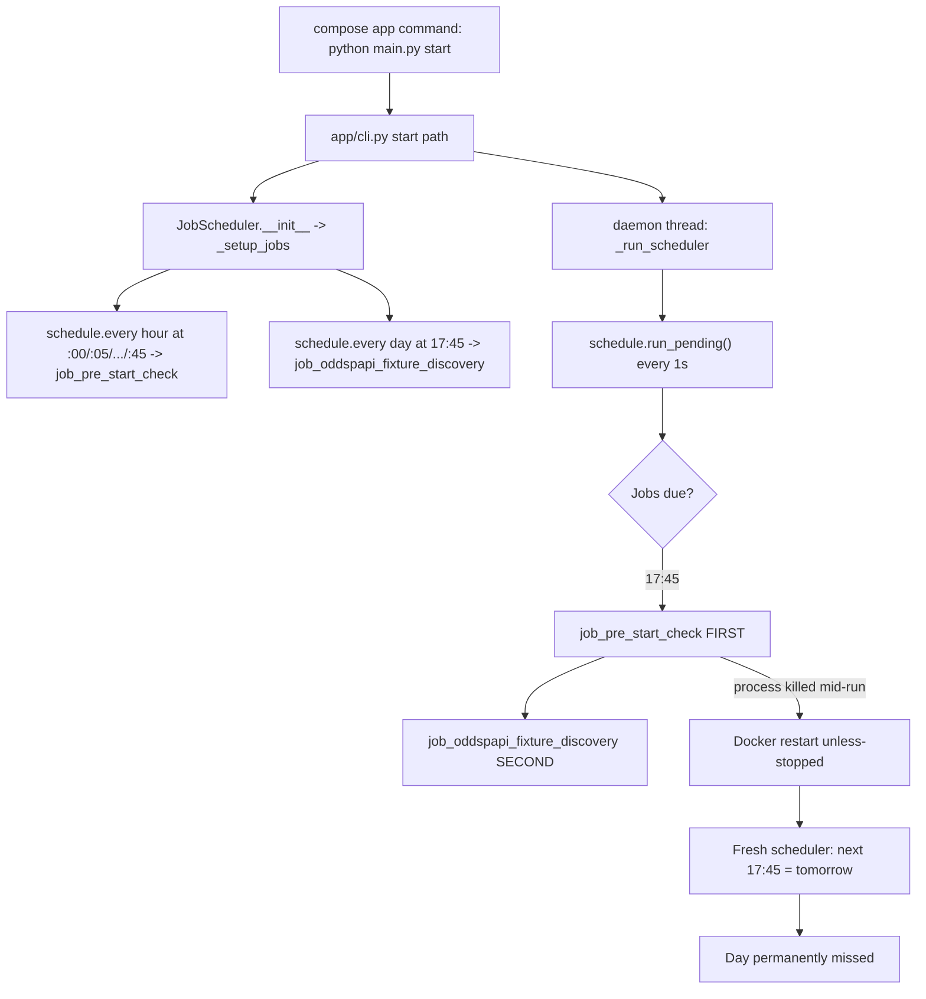

# Oddspapi Fixture Discovery — Missed Daily Runs Report

**Date:** 2026-07-25  
**Log evidence:** `logs/07_July/week_4/sofascore_odds.log` (server pull, week of 2026-07-22+)  
**Status:** Root-cause analysis complete; no code changes in this report  
**Audience:** Engineers owning scheduler / pre-start / OddsPapi discovery

---

## 1. Executive summary

The Oddspapi fixture discovery job is scheduled daily at **17:45** (local app TZ, typically `America/Mexico_City`). In the inspected window it **ran successfully only on 2026-07-23**. It was **missed on 2026-07-22 and 2026-07-24**.

This is **not** a bug inside the fixture-matching logic. The misses come from a combination of:

1. **Process death / container restart** near 17:40–17:48, usually while the pre-start **alert / matchup-streak pipeline** is under heavy load.
2. A **single-threaded `schedule` loop** that runs pending jobs sequentially.
3. A **hard collision at `:45`**: pre-start (`every hour at :45`) and fixture discovery (`daily at 17:45`) become due together; pre-start always runs first.
4. **No catch-up** after restart: a fresh `JobScheduler` recalculates `next_run` to the *next* 17:45 (tomorrow), so a missed day is permanently lost unless run manually.

Docker `restart: unless-stopped` brings the app back (`python main.py start`), which produces the familiar init logs — but does **not** re-fire the missed daily job.

---

## 2. Corrected timeline (from logs)

> Note: an initial read assumed the only success was 07-22. Log markers show the opposite: success was **07-23**.

| Local date | Fixture discovery | What actually happened |
|---|---|---|
| **2026-07-22** | **MISSED** | Pre-start at 17:40 entered matchup-streak work; last useful log ~17:40:40; process restart at **17:52:13**. Never reached 17:45 while alive. |
| **2026-07-23** | **OK** | Pre-start at 17:45 finished lightly (~24s, 2 key-moment events, both streak-skipped). Discovery started **17:45:24**, completed **17:46:38** (`fixtures=589`, `mappings_created=457`, `errors=0`, target UTC day `2026-07-24`). |
| **2026-07-24** | **MISSED** | Pre-start at 17:45 started and reached alert/streak phase; last useful logs ~17:45:54 mid H2H/team-history; process restart at **17:48:31**. Discovery never started (still queued behind pre-start). |

### Key log markers to search

```text
Starting Oddspapi fixture discovery for UTC day:
Oddspapi fixture discovery completed
PRE-START CHECK EXECUTED at 17:45
Logging system initialized successfully
Starting SofaScore Odds System with command: start
System initialized successfully
Starting job scheduler...
Evaluating N events for matchup streak analysis
```

### Restart density (same log file)

Multiple cold starts on the afternoons of 07-22 and 07-24 (examples):

- 07-22: 11:52, 13:28, 16:19, 16:49, **17:52**
- 07-24: 16:14, 16:19, 16:43, 17:35, **17:48**

This indicates systemic process instability under load, not a one-off clock miss.

---

## 3. How scheduling works today



### Critical behaviors

| Behavior | Implication |
|---|---|
| Jobs run **synchronously** on the scheduler thread | A long pre-start blocks discovery |
| Registration order puts pre-start before discovery | At 17:45, pre-start always wins the race |
| `schedule` daily jobs do **not** catch up after downtime | Restart after 17:45 ⇒ miss until next day |
| No durable “last successful run” gate | No automatic compensation |

---

## 4. Root causes (ranked)

### RC1 — Process kill during heavy pre-start alert/streak work (primary)

**Evidence pattern**

- Last logs before gap are consistently in:
  - `modules.jobs.pre_start_check_job.alert_pipeline`
  - `modules.alerts.matchup_streak_analysis.*`
  - `modules.sofascore.h2h` / `team_history`
  - `historical_form_service` DB/API fan-out
- Next log is a clean process boot (`Logging system initialized successfully`) with **no Python traceback**.
- That signature matches **SIGKILL / OOM killer / hard container restart** more than an uncaught exception.

**Why this window is dangerous**

- Pre-start key-moment alerts run on the **main scheduler path** (same thread that would later run fixture discovery).
- Alert batch uses `ThreadPoolExecutor(max_workers=min(4, n))`.
- Each event can pull large H2H payloads + historical form (API pagination and/or DB queries).
- Parallel workers amplify peak RSS.

**Not yet proven in-app** (needs host evidence):

```bash
docker inspect sofascore-app --format '{{.State.OOMKilled}} {{.RestartCount}} {{.State.ExitCode}}'
dmesg -T | rg -i "oom|killed process|sofascore"
docker stats --no-stream
```

### RC2 — 17:45 job collision + single-threaded scheduler (amplifier)

Even when the process stays alive, discovery cannot start until pre-start returns.

- Happy path (07-23): pre-start short → discovery starts at 17:45:24.
- Failure path (07-24): pre-start long + kill → discovery never invoked.

### RC3 — No missed-run recovery after restart (durability gap)

After Docker brings the container back:

1. `JobScheduler._setup_jobs()` re-registers `every().day.at("17:45")`.
2. Library sets `next_run` to the **next future** occurrence.
3. There is no startup check like “did today’s discovery succeed?”.

This turns a transient crash into a **full-day product miss**.

### RC4 — Docker restart policy hides the failure

`compose.yaml` / `compose.prod.yaml`:

- `restart: unless-stopped` on `app`
- healthcheck only validates DB connectivity, not “scheduler alive and today’s jobs ran”

Ops sees “app is up”; product still missed fixture mapping for the target UTC day.

---

## 5. Modules and files involved

### 5.1 Process entry + orchestration

| File | Role |
|---|---|
| `compose.yaml` / `compose.prod.yaml` | Runs `python main.py start`; `restart: unless-stopped`; app healthcheck |
| `main.py` | CLI entry |
| `app/cli.py` | `start` command → initialize system → start `job_scheduler` |
| `app/initialize.py` | Boot / DB migrations / “System initialized successfully” |
| `app/logging_setup.py` | Emits `Logging system initialized successfully` on cold start |

### 5.2 Scheduler (collision + no catch-up)

| File | Role |
|---|---|
| `infrastructure/scheduler/job_scheduler.py` | Registers jobs; single-thread `_run_scheduler`; `job_pre_start_check`; `job_oddspapi_fixture_discovery` |
| `infrastructure/settings/config.py` | `POLL_INTERVAL_MINUTES` (default 5), `ODDSPAPI_FIXTURE_DISCOVERY_TIMES` (default `["17:45"]`) |

Relevant registration order inside `_setup_jobs()`:

1. Discovery / Discovery2 timed jobs  
2. **Pre-start** minute marks (`:00`, `:05`, …, `:45`, `:55`)  
3. Midnight sync / cache cleanup / daily discovery heartbeat  
4. **Oddspapi fixture discovery** at configured times  

At 17:45, both (2) and (4) are due; (2) runs first.

### 5.3 Pre-start path that blocks / kills the window

| File | Role |
|---|---|
| `modules/jobs/pre_start_check_job/run_pre_start_check_job.py` | End-to-end pre-start; after odds work, evaluates key-moment alerts on the **same call stack** |
| `modules/jobs/pre_start_check_job/alert_pipeline.py` | `evaluate_and_dispatch_alerts_batch` + `ThreadPoolExecutor` |
| `modules/jobs/pre_start_check_job/timing.py` | Key-moment detection |
| `modules/jobs/pre_start_check_job/timestamp_corrections.py` | Parallel timestamp checks |
| `modules/jobs/pre_start_check_job/intraday_result_freshness.py` | Intraday results fan-out |
| `modules/jobs/pre_start_check_job/odds_extraction.py` | Odds extraction for upcoming events |
| `modules/jobs/oddspapi/pre_start_odds/` | OddsPapi pre-start odds ingestion (runs inside pre-start) |

### 5.4 Heavy work observed at death sites

| File / package | Role |
|---|---|
| `modules/alerts/matchup_streak_analysis/run_matchup_streak_analysis.py` | Matchup analysis orchestration |
| `modules/alerts/matchup_streak_analysis/head_to_head.py` | H2H filtering (can process hundreds of events) |
| `modules/alerts/matchup_streak_analysis/historical_form.py` | Form retrieval (API and/or DB) |
| `modules/alerts/matchup_streak_analysis/historical_form_service.py` | DB historical form queries |
| `modules/sofascore/h2h.py` | External H2H fetches |
| `modules/sofascore/team_history.py` | Paginated team last-events fetches |
| `modules/pillars/streak_analysis_resolver.py` | Skip/allow streak by minutes-until-start |

### 5.5 Fixture discovery itself (healthy when reached)

| File | Role |
|---|---|
| `modules/jobs/oddspapi/fixture_discovery/run_fixture_discovery.py` | Job entry / CLI window helpers |
| `modules/jobs/oddspapi/fixture_discovery/fixture_discovery_job.py` | Per-sport orchestration |
| `modules/jobs/oddspapi/fixture_discovery/fixture_batch_processor.py` | Pool load, shortlist, resolve, persist |
| `modules/jobs/oddspapi/fixture_discovery/candidate_shortlist.py` | Cheap candidate prefilter |
| `modules/oddspapi/event_resolver.py` | L1/L2/L3 resolution |
| `modules/oddspapi/event_candidate_matcher.py` | Fuzzy candidate scoring (incl. primary-name disambiguation) |
| `modules/oddspapi/client.py` | OddsPapi HTTP client |
| `infrastructure/persistence/repositories/event_source_mapping_repository.py` | Persist mappings |
| `infrastructure/persistence/repositories/event_source_resolution_queue_repository.py` | Queue unresolved / clear resolved |

On 07-23 the discovery path completed cleanly in ~74s after start. Matching performance is **not** the miss cause.

---

## 6. Detailed incident reconstructions

### 6.1 2026-07-22 (miss)

```text
17:40:00  PRE-START CHECK EXECUTED
17:40:39  Evaluating 17 events for matchup streak analysis...
17:40:40  H2H + DB form for MLB matchups (Cubs/Tigers, Astros/Marlins)
17:40:40  <<< last useful log
17:52:13  Logging system initialized successfully   # cold start
17:52:35  Job scheduler started
          # no "Starting Oddspapi fixture discovery" for this day
```

**Interpretation:** process died before 17:45. Daily job never became runnable in a living process.

### 6.2 2026-07-23 (success)

```text
17:45:00  PRE-START CHECK EXECUTED
17:45:11  Pre-start check completed: 81 games
17:45:24  Evaluating 2 key-moment events; both streak-skipped
17:45:24  Starting Oddspapi fixture discovery for UTC day: 2026-07-24
17:46:38  Oddspapi fixture discovery completed fixtures=589 mappings_created=457 errors=0
```

**Interpretation:** pre-start returned quickly; scheduler proceeded to the second due job.

### 6.3 2026-07-24 (miss)

```text
17:45:00  PRE-START CHECK EXECUTED (98 upcoming events)
17:45:17  Pre-start check completed; alerts on main thread (10 key moments)
17:45:34+ Matchup streak / H2H / team_history under load
17:45:54  <<< last useful log in streak/API path
17:48:31  Logging system initialized successfully   # cold start
          # fixture discovery never logged a start
```

**Interpretation:** discovery was pending behind pre-start; kill destroyed the in-memory pending execution. Restart scheduled tomorrow’s 17:45 only.

---

## 7. Why fixture discovery is uniquely fragile here

Other jobs (pre-start every 5 minutes) self-heal on the next tick after restart.  
Fixture discovery is **once per day**. Missing the minute = missing the product outcome for that UTC target day (mappings for tomorrow’s fixtures).

Target-day logic in `job_oddspapi_fixture_discovery`:

- If local/UTC hour `>= 12`, target = **tomorrow UTC calendar day**
- Else target = today UTC

So a missed 17:45 evening run often means **tomorrow’s OddsPapi fixtures are not mapped**.

---

## 8. Recommended fixes (priority order)

### P0 — Recover missed runs (product safety)

On scheduler start (and optionally on a heartbeat):

1. Read durable marker: last successful fixture-discovery date (DB table or log row).
2. If today’s configured slot is already past and no success exists for the intended `target_date`, run catch-up once.
3. Log clearly: `Catch-up Oddspapi fixture discovery for missed slot ...`.

This alone would have saved 07-22 and 07-24.

### P0 — Confirm OOM / kill source on server

Collect `OOMKilled`, restart count, `dmesg`, and `docker stats` during a heavy 17:40/17:45 pre-start. Without this, memory mitigations are speculative.

### P1 — Remove 17:45 collision

Options (can combine):

- Move `ODDSPAPI_FIXTURE_DISCOVERY_TIMES` to e.g. `17:50` or `18:05`.
- Add a backup slot (`17:45,18:15`) until catch-up ships.
- Prefer running discovery **before** alert fan-out, or in a dedicated thread/process.

### P1 — Isolate heavy alert work from the scheduler thread

- Do not block `schedule.run_pending()` on full matchup-streak batches.
- Or run fixture discovery in a separate worker/container so pre-start death cannot strand it (container-level isolation is stronger than threads if OOM kills the whole cgroup).

### P2 — Reduce peak memory in alert/streak path

Candidates:

- Lower `ThreadPoolExecutor` workers in `alert_pipeline.py` under load.
- Bound H2H payload size / early filter before materializing large lists.
- Cap concurrent team-history pagination.
- Add RSS/timeout guards around streak evaluation.

### P2 — Observability

- Persist `fixture_discovery_runs(target_date, started_at, finished_at, status, summary)`.
- Telegram/ops alert if no successful run by e.g. 18:30 local.
- Log when due jobs are skipped because another long job is still holding the scheduler thread.

---

## 9. Manual recovery (ops)

If a day was missed:

```bash
# inside app container / venv
python main.py oddspapi-fixture-discovery --date YYYY-MM-DD --commit
```

(Exact CLI flag wiring lives in `app/cli.py` + `run_fixture_discovery.py`; confirm current args before running in prod.)

Or via scheduler helper:

```python
from infrastructure.scheduler import job_scheduler
job_scheduler.run_job_oddspapi_fixture_discovery_now(target_date="YYYY-MM-DD")
```

Choose `target_date` as the UTC day that should have been resolved (for an evening 17:45 miss, usually **tomorrow UTC** relative to that evening).

---

## 10. Out of scope / ruled out

| Hypothesis | Verdict |
|---|---|
| Fixture matcher too slow / hangs discovery | Ruled out for these misses; discovery never started on miss days; on success it finished in ~1–2 minutes |
| Config missing `ODDSPAPI_FIXTURE_DISCOVERY_TIMES` | Ruled out; boot logs show `Oddspapi fixture discovery: daily at 17:45` |
| Pre-start “disables” discovery intentionally | No such gate found; ordering + crash explain the misses |
| Only one bad day | False; pattern repeats whenever process dies across the 17:45 window |

---

## 11. Suggested verification checklist after fixes

1. Deploy catch-up + (optional) time shift.  
2. Intentionally restart container at 17:46; confirm catch-up fires.  
3. On a heavy 17:45 pre-start day, confirm discovery still starts (or catch-up recovers).  
4. Confirm durable run row / log for each target UTC day.  
5. Re-check `OOMKilled` stays false across peak alert windows.

---

## 12. Quick reference — ownership map

| Concern | Primary modules |
|---|---|
| Why didn’t 17:45 fire? | `infrastructure/scheduler/job_scheduler.py`, Docker restart policy |
| What blocked/killed the slot? | `modules/jobs/pre_start_check_job/*`, `modules/alerts/matchup_streak_analysis/*` |
| What should have run? | `modules/jobs/oddspapi/fixture_discovery/*` |
| Config knobs | `infrastructure/settings/config.py` → `ODDSPAPI_FIXTURE_DISCOVERY_TIMES`, `POLL_INTERVAL_MINUTES`, `ENABLE_LEGACY_ALERT_PIPELINE` |
| Evidence source | `logs/07_July/week_4/sofascore_odds.log` |

---

## 13. Bottom line

Fixture discovery is scheduled correctly and works when the process survives the 17:45 pre-start. Misses happen because the **shared scheduler process dies (likely OOM/kill) during heavy alert/streak work around that minute**, and because **`schedule` + current boot path never replay a missed daily slot**. Fix durability (catch-up) and isolation/time-shift first; confirm and then harden the alert memory path.
