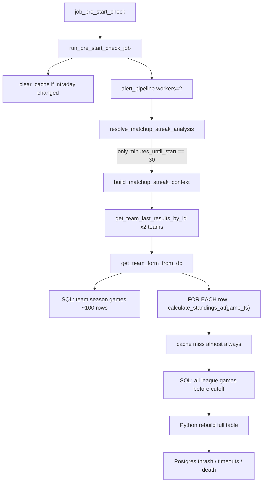

# Matchup / Standings Bottleneck Report

**Date:** 2026-07-25  
**Evidence:** `logs/07_July/week_4/sofascore_odds.log` (pre-start starting `2026-07-25 13:35:00`)  
**Related:** `docs/audits/oddspapi_fixture_discovery_missed_runs_report.md`  
**Status:** Actionable root-cause brief for the engineer who will fix the inner standings loop  
**Audience:** Any dev who has not worked this path before

---

## 0. Start here (60-second brief)

**Symptom:** Pre-start alerts hang for minutes, Postgres times out, app dies uncleanly, sometimes Docker CLI hangs afterward.

**Root cause (one sentence):**  
In DB historical form, **every past game** triggers a **full-league standings recompute** keyed by that game’s timestamp, so MLB (~100 games/team) ≈ **100 league-wide SQL + rebuilds per team**.

**Open these two files first:**

1. `modules/alerts/matchup_streak_analysis/historical_form_service.py` — **act here** (the N× loop).  
2. `modules/alerts/matchup_streak_analysis/standings_engine.py` — **understand / refactor helper** (fetch + cache + rebuild).

**Do not start in:** OddsPapi fixture discovery, matcher, or shortlist. Those were collateral victims when the process/Docker died.

---

## 1. Executive summary

The production incident around **13:35–13:51 America/Mexico_City** died inside:

```text
pre_start → alert_pipeline → resolve_matchup_streak_analysis
         → build_matchup_streak_context → get_team_form_from_db
         → calculate_standings_at(cutoff=each_game_ts)  × ~100/team
```

Not in OddsPapi fixture discovery.

Mitigations already shipped (workers=2, H2H cap, catch-up, 17:47 schedule) reduce *outer* pressure and recover missed discovery, but they **do not** remove this inner O(games_count) standings storm.

---

## 2. Product context (why this code exists)

Matchup streak alerts need, for each team game in form history:

| Field on each form row | Purpose |
|------------------------|---------|
| `own_ranking` / `team_standing` | Team’s table position **just before/at that past game** |
| `opponent_ranking` / `opponent_standing` | Opponent’s position at the same cutoff |

That powers “beat #3 seed”, ranking-aware streak copy, etc.

Historically this was implemented as:  
“for game at time T, recompute standings using all league results with `start_time_utc < T`”.

Correctness idea is fine. The implementation is catastrophically expensive on long seasons (MLB) when done naively inside a hot pre-start path on a 1 GB host.

**When streak analysis runs at all:**

```82:84:modules/pillars/streak_analysis_resolver.py
    if minutes_until_start != 30 or not getattr(event_obj, "custom_id", None):
        logger.info(f"🚫 Skipping streak analysis for event {event_obj.id} with {minutes_until_start} minutes until start")
        return None, False
```

Only the **30-minute** key moment builds matchup streak context.  
In the 13:35 incident, 9 events entered the alert batch; only the ones at 30m paid the standings cost (others log “Skipping streak analysis…”). Two MLB 30m matchups were enough to wedge Postgres.

---

## 3. Incident evidence (what the logs prove)

| Time (MX) | Evidence |
|-----------|----------|
| 13:34:31 | Prior pre-start finished after **270.9s** |
| 13:35:00 | `Operation started name=pre_start_check` (`rss≈108`, limit `768`) |
| 13:35:59 | `Evaluating 9 events…` / `Alert pipeline concurrency … workers=2` |
| 13:36:00–01 | `DB query returned ~99–102 events` for MLB teams (form row fetch OK) |
| 13:36:01 → 13:42:41 | **~6.5 min silence** (standings loop; almost no progress logs) |
| 13:42:41+ | `Error computing standings for season 84695` + `ConnectionTimeout` |
| 13:45:51 | `Temporary failure in name resolution` (Docker DNS to `postgres`) |
| 13:49:45 | Heartbeat: still `active_operation=pre_start_check`, `rss_mb=385.9` |
| 13:51:06 | Unclean restart; `cgroup_oom_kill=0` |

Search markers in the log:

```text
Alert pipeline concurrency events=9 workers=2
DB query returned 102 events for Arizona Diamondbacks
Error computing standings for season 84695
ConnectionTimeout
Previous process ended without a clean shutdown: active_operation=pre_start_check
```

**Interpretation for the fixer:** the cheap “list team games” query finished. The expensive “standings at each game timestamp” phase is what never completed cleanly.

Host constraints (`docker info`): **1 CPU**, **~957 MB RAM**, app often capped at **768 MB**, Postgres co-located.

---

## 4. Exact place to act

### 4.1 PRIMARY HOTSPOT — change this loop

**File:** `modules/alerts/matchup_streak_analysis/historical_form_service.py`  
**Function:** `HistoricalFormService.get_team_form_from_db`  
**Lines:** ~150–225 (especially **186–203**)

After fetching `all_rows` for one team:

```186:203:modules/alerts/matchup_streak_analysis/historical_form_service.py
                    game_timestamp = row.start_time_utc.timestamp()
                    standings = self.standings_calculator.calculate_standings_at(
                        season_id,
                        game_timestamp,
                        sport,
                        source_unique_tournament_id=source_unique_tournament_id,
                        source_tournament_id=source_tournament_id,
                        send_debug_standings=send_debug_standings,
                    )

                    team_standing = _normalize_standing_snapshot(
                        standings.get(team_name, {}),
                        standings_method,
                    )
                    opponent_standing = _normalize_standing_snapshot(
                        standings.get(opponent_name, {}),
                        standings_method,
                    )
```

Those ranks are stored on each result dict:

```208:224:modules/alerts/matchup_streak_analysis/historical_form_service.py
                    results.append(
                        {
                            ...
                            "opponent_ranking": opponent_standing.get("rank") or 0,
                            "own_ranking": team_standing.get("rank") or 0,
                            "team_standing": team_standing,
                            "opponent_standing": opponent_standing,
                        }
                    )
```

**What a fix must preserve:** each form row still gets meaningful `own_ranking` / `opponent_ranking` (and standing snapshots if downstream still reads them).  
**What a fix must remove:** one full `calculate_standings_at` + league SQL per row.

### 4.2 ENGINE — understand / extend, don’t ignore

**File:** `modules/alerts/matchup_streak_analysis/standings_engine.py`

| Symbol | Lines (approx) | Role |
|--------|----------------|------|
| `HistoricalStandingsCalculator._cache` | ~401 | In-process dict cache |
| `_get_cache_key` | ~403–417 | Key includes **exact** `cutoff_timestamp` |
| `_fetch_match_records_before_cutoff` | ~419–501 | League-wide SQL + `fetchall()` |
| `calculate_standings_bundle_at` | ~522–578 | Cache lookup; on miss compute; logs **`Error computing standings for season %s`** |
| `_calculate_standings_bundle_internal` | ~599–691 | Apply every match → finalize → build payload |
| `clear_cache` | ~727–729 | Wipes cache |

Cache key shape:

```text
(canonical_season_id, cutoff_timestamp, sport, source_unique_tournament_id, source_tournament_id)
```

Because every game has a distinct `cutoff_timestamp`, the per-game loop gets ~0 hits.

League SQL (every miss):

```447:479:modules/alerts/matchup_streak_analysis/standings_engine.py
        query_sql = """
            SELECT
                event_id,
                start_time_utc,
                home_team,
                away_team,
                home_score,
                away_score,
                winner,
                result_subtype
            FROM season_events_with_results
            WHERE season_id = ANY(:season_ids)
              AND round = 'regular_season'
              AND start_time_utc < :cutoff_dt
        """
        ...
        with db_manager.get_session() as session:
            result = session.execute(query, query_params)
            all_rows = result.fetchall()
```

### 4.3 VIEW under the SQL

**File:** `infrastructure/persistence/models.py`  
**Constant:** `SEASON_EVENTS_WITH_RESULTS_VIEW_SQL` (~964–1000)

Joins `events` + `results` + `participants` + `competitions`.  
Both form listing and standings fetches hit this view. Index health on underlying tables matters, but **indexes alone will not fix N× full scans**.

---

## 5. Full call chain with file:function map

Use this when navigating the repo cold:

| # | File | Function / spot | What it does |
|---|------|-----------------|--------------|
| 1 | `infrastructure/scheduler/job_scheduler.py` | `job_pre_start_check` | Wraps run in `observe_operation("pre_start_check")` |
| 2 | `modules/jobs/pre_start_check_job/run_pre_start_check_job.py` | main job body | Upcoming + intraday + key moments → alerts |
| 3 | same | ~251–258 | **`standings_calculator.clear_cache()`** after intraday upserts/deletes — forces cold standings right before alerts |
| 4 | `modules/jobs/pre_start_check_job/alert_pipeline.py` | `evaluate_and_dispatch_alerts_batch` | `ALERT_PIPELINE_WORKERS` (default 2) |
| 5 | same | `EventAlertProcessor.process_event` → streak helper | Per-event alert work |
| 6 | `modules/pillars/streak_analysis_resolver.py` | `resolve_matchup_streak_analysis` | Gate: only **30m**; H2H fetch; `build_matchup_streak_context` |
| 7 | `modules/alerts/matchup_streak_analysis/run_matchup_streak_analysis.py` | `build_matchup_streak_context` ~285–375 | Loads home/away form via `get_team_last_results_by_id` |
| 8 | same | ~448+ | Also calls `calculate_standings_bundle_at` once for **current** standings (extra, but not the N× loop) |
| 9 | `modules/alerts/matchup_streak_analysis/historical_form.py` | `get_team_last_results_by_id` ~631–640 | Chooses DB path → `get_team_form_from_db` |
| 10 | `historical_form_service.py` | **`get_team_form_from_db` loop** | **BOTTLENECK** |
| 11 | `standings_engine.py` | `calculate_standings_at` / `_fetch_match_records_before_cutoff` | Per-cutoff league recompute |



---

## 6. Cost model (why MLB explodes)

For **one** MLB event at the 30m moment, DB form path:

| Step | Approx count |
|------|-------------:|
| Teams | 2 |
| Games/team (from incident logs) | ~100 |
| `calculate_standings_at` calls | ~200 |
| League-wide SQL on cache miss | ~200 |
| With 2 such events concurrent (`workers=2`) | ~400 heavy ops |

Complexity class today:

```text
O(concurrent_30m_events × teams × games_per_team × cost(league_standings_query))
```

Target after fix:

```text
O(concurrent_30m_events × teams × games_per_team) for light per-row work
+ O(1) or O(league_games) for standings materialization (single pass)
```

---

## 7. Secondary amplifiers (fix second, don’t confuse with root cause)

| Amplifier | Location | Effect |
|-----------|----------|--------|
| `ALERT_PIPELINE_WORKERS=2` | `config.py`, `alert_pipeline.py` | Two 30m MLB events can storm DB together |
| `MATCHUP_TEAM_HISTORY_WORKERS=2` | `run_matchup_streak_analysis.py` | Home+away form in parallel **inside** one event |
| `clear_cache()` after intraday | `run_pre_start_check_job.py` ~255 | Guarantees cold standings in the same pre-start |
| H2H payload | `streak_analysis_resolver.py` | Memory pressure (already capped via `MATCHUP_H2H_MAX_EVENTS`) |
| Debug standings rounds | `historical_form_service.py` ~236–281 | Extra cutoffs when `send_debug_standings` / personal chat enabled |

---

## 8. Recommended fix shape (for the implementer)

### Preferred: single-pass standings walk

Inside `get_team_form_from_db` (or a new helper used by it):

1. Fetch team games once (existing query) — keep order `start_time_utc DESC` or sort ASC for the walk.  
2. Fetch **all league match records for the season once** (or reuse one ordered list from `standings_engine`).  
3. Walk time ascending: after each league game, update in-memory table; when the next team-form game timestamp is reached, snapshot ranks for that team/opponent.  
4. Attach `own_ranking` / `opponent_ranking` without calling `calculate_standings_at` per row.

Optional API addition on `HistoricalStandingsCalculator`, e.g.:

```text
build_rank_snapshots_for_games(season_id, tournament ids, list[game_ts] or list[event_id])
  -> dict[event_id or ts, standings_snapshot]
```

### Acceptable interim mitigations (if full rewrite slips)

- Cap how many form games get rank snapshots (e.g. latest 15–20).  
- Circuit breaker: if standings errors/timeouts exceed N, skip ranks and continue alert.  
- Do not clear standings cache immediately before alert fan-out unless correctness requires it.  
- Serialize team-history workers to 1 on 1 GB hosts until single-pass lands.

### Non-goals

- Rewriting H2H filtering.  
- Changing fixture discovery.  
- “Just add indexes” as the only change.

---

## 9. How to verify locally / on staging

1. Pick one MLB event with `minutes_until_start == 30` and DB form enabled (`season_id=84695` style).  
2. Instrument temporarily (or log counts):
   - `# calls to calculate_standings_at`
   - `# calls to _fetch_match_records_before_cutoff`
   - wall time of `get_team_form_from_db`
3. **Before fix:** calls ≈ games_returned (≈100).  
4. **After fix:** league fetches ≈ 1 (or small constant); form still returns rankings.  
5. Run a pre-start with multiple 30m MLB alerts:
   - no multi-minute silence after `DB query returned … events`
   - no `ConnectionTimeout` storm
   - always see `Operation finished name=pre_start_check`
6. Sanity: alert payload still has non-zero ranks where standings data exists.

Useful greps:

```bash
rg -n "calculate_standings_at|Error computing standings|DB query returned|DB-based form" logs/.../sofascore_odds.log
rg -n "for row in all_rows|calculate_standings_at" modules/alerts/matchup_streak_analysis/historical_form_service.py
```

---

## 10. Platform fallout (so ops symptoms make sense)

When this loop wedges Postgres on a 1 GB droplet:

1. App holds `pre_start_check` open; RSS climbs.  
2. New DB sessions time out; Docker DNS to `postgres` can fail.  
3. Compose healthchecks `docker exec` into sick containers → stuck `runc` → **`docker ps` / `docker logs` hang**.  
4. `systemctl restart docker` recovers the daemon (as seen in prod).

Fixing the standings loop is the durable product fix; Docker restart is only emergency ops.

---

## 11. Checklist for the PR that fixes this

- [ ] Remove per-game `calculate_standings_at` from the `all_rows` loop in `get_team_form_from_db`  
- [ ] Preserve `own_ranking` / `opponent_ranking` (and standing dicts if still required)  
- [ ] Add/extend a single-pass API in `standings_engine.py` (or equivalent)  
- [ ] Confirm cache/`clear_cache` interaction with intraday freshness still correct  
- [ ] Add a unit/integration test:  N team games ⇒ O(1) league fetches  
- [ ] Manual MLB 30m pre-start smoke on a small host  
- [ ] No regression for non-DB form path (API form in `historical_form.py` after the DB branch)

---

## 12. Bottom line

| Question | Answer |
|----------|--------|
| Where do I change code? | **`historical_form_service.py` lines ~186–203** first |
| What helper owns the expensive work? | **`standings_engine.py`** `_fetch_match_records_before_cutoff` + cache-by-cutoff |
| Why did prod die? | N× full standings for MLB form games saturated Postgres mid pre-start |
| What must stay true? | Form rows still carry ranking context for streak alerts |
| What is out of scope? | Fixture discovery matcher; treat catch-up/schedule as separate resilience |

**Success metric:** one team with ~100 season games performs **one** league materialization (or a small constant), not ~100.
