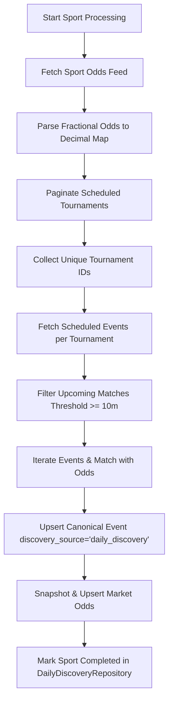

# Daily Discovery Job Documentation

Source of truth: [`modules/jobs/daily_discovery/`](file:///c:/Users/gadie/Documents/projects/sofascore/modules/jobs/daily_discovery/)  
Entrypoints: [`modules/jobs/daily_discovery/run_daily_discovery.py`](file:///c:/Users/gadie/Documents/projects/sofascore/modules/jobs/daily_discovery/run_daily_discovery.py)  
Extractor: [`modules/jobs/daily_discovery/extractor.py`](file:///c:/Users/gadie/Documents/projects/sofascore/modules/jobs/daily_discovery/extractor.py)  
Repository: [`infrastructure/persistence/repositories/daily_discovery_repository.py`](file:///c:/Users/gadie/Documents/projects/sofascore/infrastructure/persistence/repositories/daily_discovery_repository.py)

---

## Overview

The **Daily Discovery Job** (Job E in scheduler architecture) ensures comprehensive database coverage of all scheduled fixtures across multiple sports for a target date, along with their initial/current market odds.

Unlike reactive discovery channels (such as dropping odds, high-value streaks, or winning odds), Daily Discovery systematically queries SofaScore's scheduled tournament and odds feeds, populating the canonical `events` and `event_odds` tables before pre-start checkpoints occur.

---

## Supported Sports

Configured via `DEFAULT_DAILY_DISCOVERY_SPORTS` in [`constants.py`](file:///c:/Users/gadie/Documents/projects/sofascore/modules/jobs/daily_discovery/constants.py):

* `basketball`
* `tennis`
* `baseball`
* `ice-hockey`
* `american-football`
* `football` (soccer)
* `handball`

---

## Dual-Slot Scheduling Architecture (AM & PM Slots)

Daily Discovery operates on a slot-aware heartbeat scheduled through `run_daily_discovery_job()` and `run_daily_discovery_retry_job()`.

### Slot Resolution (`resolve_daily_discovery_slot`)

The execution slot is resolved based on local time (`Config.TIMEZONE`):
* `Config.DAILY_DISCOVERY_AM_OPEN_HOUR` (e.g. 17:00 / 5:00 PM local)
* `Config.DAILY_DISCOVERY_PM_OPEN_HOUR` (e.g. 08:00 / 8:00 AM local)

| Slot | Local Window (Mexico Time) | Target Date (UTC) | Objective |
| :--- | :--- | :--- | :--- |
| **AM Slot** | Evening / Night | `current_utc + timedelta(days=1)` (Tomorrow) | Early capture of next day's scheduled tournaments and opening odds overnight. |
| **PM Slot** | Morning / Afternoon | `current_utc` (Today) | Intraday synchronization and late addition capture for today's fixtures. |

If the scheduler heartbeat triggers outside an active slot window, execution gracefully skips until the designated hour opens.

---

## State & Lifecycle Tracking (`DailyDiscoveryRepository`)

The job maintains granular, crash-resilient state per `(date, slot, sport)` in the database:

1. **Log Cleanup**: At the beginning of each run, `DailyDiscoveryRepository.cleanup_old_logs(days_to_keep)` purges discovery logs older than `Config.DAILY_DISCOVERY_DAYS_TO_KEEP` (default: 1 day).
2. **Initialization**: `DailyDiscoveryRepository.initialize_sports_for_slot(date_str, run_slot, sports)` seeds pending records for the active slot.
3. **Pending Sports Selection**: `DailyDiscoveryRepository.get_pending_sports(date_str, run_slot)` returns only sports that are not yet marked `completed`. If all sports are done, the job logs completion and exits immediately.
4. **Status Transitions**: Individual sport runs are marked `in_progress` -> `completed` (or `failed` if the tournament feed is unreachable).

---

## Extraction & Ingestion Pipeline (`DailyDiscoveryExtractor`)

For each pending sport, the extractor executes the following structured workflow:



### Detailed Pipeline Steps

1. **Odds Ingestion First**:
   * Calls `api_client.get_today_sport_events_odds_response(date, sport)`.
   * Parses the response via `parse_today_market_odds_response(odds_response)`. Fractional values (`initialFractionalValue`, `fractionalValue`) are converted to `Decimal` (e.g. `"33/20"` $\rightarrow$ `Decimal('2.65')`).
   * Produces an in-memory `odds_map` keyed by `event_id`. If the odds feed is temporarily unavailable or empty, the extractor continues to fetch events without odds.
2. **Tournament Pagination**:
   * Calls `api_client.get_today_sport_events_response(date, sport, page)` starting at page 1.
   * Traverses scheduled items and inspects `timezoneEventCount` to ensure active event volume.
   * Extracts `uniqueTournament.id` until `hasNextPage` is false.
   * If page 1 fails to respond, the sport is recorded as `failed` in `DailyDiscoveryRepository` and execution moves to the next sport.
3. **Tournament Event Gathering**:
   * Iterates unique tournament IDs and calls `api_client.get_unique_tournament_scheduled_events(ut_id, date)`.
   * Aggregates all discovered match payloads.
4. **Temporal Threshold Filtering**:
   * Runs `filter_events_starting_after_threshold(all_events, min_minutes_away=10)`.
   * Converts each event's `startTimestamp` into a UTC-aware instant and ensures `event_start >= utc_now() + timedelta(minutes=10)`. Events that have already started or are within 10 minutes of kickoff are excluded from odds snapshotting.
5. **Persistence (`persist_event_and_optional_odds`)**:
   * Extracts canonical metadata via `api_client.get_event_information(event, discovery_source='daily_discovery')`.
   * Persists the canonical event record via `EventRepository.upsert_event(event_data)`.
   * If the event is upcoming and present in the odds feed, creates an odds snapshot and upserts market odds via `OddsRepository.create_odds_snapshot` and `OddsRepository.upsert_event_odds`.
6. **Graceful Shutdown Integration**:
   * Inspects `shared.shutdown.is_shutdown_requested()` between sport iterations and inside event loops, enabling clean process termination without database corruption.

---

## Operational Execution

### Scheduled Execution

Configured in `infrastructure/scheduler/`:
* `run_daily_discovery_job()`: Main slot heartbeat.
* `run_daily_discovery_retry_job()`: Retry mechanism delegating to the slot-aware heartbeat.

### Manual / CLI Execution

To run daily discovery programmatically or via a script:

```python
from modules.jobs.daily_discovery.run_daily_discovery import run_daily_discovery

# Discover all default sports for today
stats = run_daily_discovery()

# Discover specific sports for a specific UTC date and slot
stats = run_daily_discovery(
    sports=["basketball", "football"],
    date_str="2026-09-18",
    run_slot="AM",
)
print(stats)
# Output: {'events_processed': 42, 'events_inserted': 40, 'odds_inserted': 38}
```
