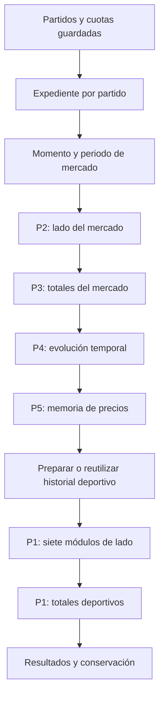

# Guía funcional del pre start check y de los cinco pilares

Esta colección explica el código revisado el 9 de octubre de 2026 para una persona sin experiencia en programación. Describe qué información entra, cómo se transforma y qué significa cada resultado. Los nombres del código se incluyen para reconocer los datos en un reporte y se explican en español. Los ejemplos son ilustrativos; los pesos, fórmulas y reglas del motor proceden de la implementación.

## 1. Ruta de lectura

Hay cinco pilares y seis documentos. P1 produce dos análisis, lado y totales, que se explican juntos.

| Documento | Pregunta que responde |
|---|---|
| Esta guía | ¿Cómo llega un partido al análisis y qué hace el coordinador? |
| [Pilar 1: estructura deportiva](01-pilar-1-estructura-deportiva.md) | ¿Qué muestran los resultados, los rivales y la situación de los equipos? Incluye siete módulos, su combinación y totales. |
| [Pilar 2: mercado de lado](02-pilar-2-mercado-de-lado.md) | ¿Hacia qué participante se inclinan los precios y cómo se relacionan casas, hándicap y exchange? |
| [Pilar 3: mercado de totales](03-pilar-3-mercado-de-totales.md) | ¿Cómo se inclinan precios y líneas hacia mayor o menor anotación? |
| [Pilar 4: movimiento temporal](04-pilar-4-movimiento-temporal.md) | ¿Cómo cambió el mercado, por qué recorrido y en qué momentos? |
| [Pilar 5: memoria de precios](05-pilar-5-memoria-de-precios.md) | ¿Qué ocurrió en otros partidos con el mismo conjunto de precios? |

Lea primero las secciones 2–7 y después el pilar de interés. P1 es mucho más extenso porque tiene siete motores deportivos y otro motor de totales con sus propias entradas, ventanas y fórmulas.

Cada guía incluye un **recorrido integrado del dato al resultado**. Después de las definiciones y fórmulas, esa sección muestra cómo se encadenan las entradas, los cálculos intermedios y la salida. Puede ir directamente a [P1: lado y totales](01-pilar-1-estructura-deportiva.md#recorrido-integrado-del-dato-al-resultado), [P2: mercado de lado](02-pilar-2-mercado-de-lado.md#recorrido-integrado-del-dato-al-resultado), [P3: mercado de totales](03-pilar-3-mercado-de-totales.md#recorrido-integrado-del-dato-al-resultado), [P4: movimiento temporal](04-pilar-4-movimiento-temporal.md#recorrido-integrado-del-dato-al-resultado) o [P5: memoria](05-pilar-5-memoria-de-precios.md#recorrido-integrado-del-dato-al-resultado).

## 2. Qué hace el sistema

Un **evento** es un encuentro. El pre start check revisa eventos próximos, actualiza información y recoge cuotas en momentos concretos. Una **cuota decimal** es un precio de mercado: 2.00 representa un retorno bruto de dos unidades por cada unidad si se cumple el resultado.

Un **pilar** es una perspectiva analítica. P1 mira la historia deportiva; P2 y P3, el estado del mercado; P4, su evolución; P5, antecedentes con precios iguales.

El coordinador no combina los cinco pilares en una puntuación única ni establece una votación. Calcula resultados y puede conservarlos para análisis posteriores. El envío de alertas pertenece a otro recorrido que puede compartir el historial deportivo.

## 3. Lo que sucede antes de pillar_pipeline

El punto de entrada es [run_pre_start_check_job.py](../../../modules/jobs/pre_start_check_job/run_pre_start_check_job.py), función `run_pre_start_check_job`.

1. **Busca eventos próximos.** Lee encuentros que comienzan dentro de la ventana de revisión, predeterminada en 120 minutos. Un encuentro reprogramado recientemente puede esperar una revisión posterior.
2. **Calcula cuánto falta.** `minutes_until_start` resulta de restar la hora actual a `starts_at`, convertir segundos a minutos y redondear al entero más próximo. 5 significa unos cinco minutos antes, 0 el límite de inicio y −5 unos cinco minutos después. En un empate exacto de medio minuto, este redondeo usa el entero par.
3. **Inicia la consulta complementaria de OddsPortal.** Puede trabajar mientras continúa el recorrido principal. Sus cuotas de apertura y participación en alertas tienen reglas propias.
4. **Construye el plan de candidatos.** `PreStartEventPlan` reúne una lista de eventos y un índice por identificador. Cada candidato contiene horario, minutos, información adicional y si corresponde recoger cuotas ahora. Si el proveedor anuncia otro horario, se corrige antes de utilizar la lectura prevista.
5. **Completa observaciones y recoge cuotas.** SofaScore y Oddspapi guardan sus precios antes de la evaluación que depende de ellos.
6. **Selecciona momentos de análisis.** El conjunto general predeterminado es 120, 30, 5, 1, 0 y −5 minutos. El ciclo normal excluye el momento de cierre, habitualmente 1, que tiene un recorrido específico. La lista de momentos de ejecución de pilares puede ser más pequeña: recoger cuotas no implica calcular todos los pilares cada vez.
7. **Prepara el expediente.** [key_moment_evaluation.py](../../../modules/jobs/pre_start_check_job/key_moment_evaluation.py) construye un `EventContext` con participantes, competición, temporada, inicio y observaciones. Añade información de la liga, como número de equipos y partidos de temporada regular.
8. **Ejecuta las alertas que participen.** Este recorrido ocurre antes de los pilares y puede dejar preparado el historial deportivo que reutiliza P1.
9. **Carga el historial de cuotas.** Solo carga el de los eventos que analizará. Después fija `evaluation_as_of`, la hora de corte de esa ejecución, para reconocer qué información ya estaba disponible.
10. **Entrega expedientes e historiales al coordinador.** La llamada es `evaluate_and_calculate_pillars_batch`.

Después del análisis de eventos próximos, el trabajo general puede revisar encuentros recientemente iniciados y partidos en juego. Esa continuación no constituye otro pilar.

## 4. Expedientes, variables y objetos compartidos

Un **objeto** es un expediente con campos relacionados. Una **lista** reúne elementos. Un **diccionario** permite consultar un dato por nombre o identificador. Una **asignación** guarda un resultado con un nombre para usarlo en el siguiente paso.

| Nombre del código | Significado y uso |
|---|---|
| `events_for_pillars` | Expedientes que llegan al coordinador. |
| `event_repo` | Acceso a registros guardados de eventos. |
| `EventContext` / `event_context` | Expediente completo con participantes, competición, temporada, tiempo, observaciones e historial deportivo. |
| `event_id`, `custom_id` | Identidad interna del evento e identidad auxiliar para consultar enfrentamientos. No son puntuaciones. |
| `home`, `away` | Expedientes del local y visitante: identidades, nombres y fuente. En encuentros sin localía física siguen identificando los dos lados. |
| `competition` | Identidad y características de la competición. |
| `number_of_teams` | Número de equipos, utilizado para interpretar posiciones y escalas deportivas. |
| `total_regular_season_games` | Partidos esperados por equipo en temporada regular; sirve para las ventanas de P1 Totales. |
| `standings_grouping` | Organización de la clasificación, por ejemplo grupos o una tabla conjunta. |
| `season_id`, `season_name`, `season_year` | Identificador, nombre y año de temporada. |
| `sport`, `country`, `round` | Deporte, país y fase. El recorrido estudiado admite temporada regular, `regular_season`. |
| `participants_label` / `participants` | Texto de presentación, como «Equipo A vs Equipo B». |
| `starts_at`, `minutes_until_start` | Hora de inicio y minutos restantes. |
| `success`, `context_status` | Si se pudo preparar el expediente y cómo quedó representado. No predicen el ganador. |
| `observations` | Información adicional, como superficie o recinto cuando aplica. |
| `trajectories_by_event_id` | Índice de historiales de cuotas por evento. |
| `trajectory_points`, `odds_trajectory` | Observaciones originales del evento. |
| `EventIdentity` / `event_identity` | Ficha breve con identidad, participantes, inicio, minutos, deporte, fase, competición, temporada, país y estado. La utilizan P2–P5. |
| `OddsTrajectoryContext` / `odds_trajectory_context` | Cuotas organizadas por mercado, periodo, línea, casa, resultado y lado del exchange, con momentos y procedencia. |
| `evaluation_minute` | Minutos restantes usados para seleccionar un momento ya observable. |
| `evaluation_as_of` | Hora de corte de datos disponibles para esta ejecución. |
| `TargetMinuteSelection` / `target_selection` | Momento de mercado elegido, explicación y evidencia de la elección. |
| `EventMarketEvaluation` / `market_evaluation` | Contratos, periodo de tiempo completo y disponibilidad compartidos por P2–P5. |
| `streak_analysis` | Resultados deportivos, enfrentamientos y referencias de liga utilizados por P1. |
| `p2_result`…`p5_result` | Salidas terminadas de los pilares de mercado. |
| `p1_output`, `p1_result`, `p1_totals_result` | Paquete de P1, lectura de lado y lectura de totales. |

Los identificadores de fuente, nombres alternativos, fechas de creación y actualización describen identidad y procedencia. No tienen un peso deportivo por estar presentes. `None` o `null` significa «no disponible» y no debe interpretarse como cero.

## 5. Elección del momento de mercado

`build_odds_trajectory_context` organiza las cuotas una vez por evento. `select_target_minute` conserva los momentos presentes y permitidos cuyo número de minutos sea mayor o igual al tiempo restante de evaluación. Elige el menor número entre esos candidatos: el momento más próximo al inicio que ya puede observarse.

Ejemplo: a cinco minutos del inicio, si existen 120, 30 y 5, elige 5. Si solo existen 120 y 30, elige 30. Si únicamente existe 1, no lo utiliza a cinco minutos: corresponde a un instante posterior.

El instante nominal es «inicio menos minuto elegido». La tolerancia predeterminada es de tres minutos alrededor de él. La ventana se limita por la hora de corte y, para momentos anteriores al inicio, por el inicio del partido. Así no admite observaciones recogidas después de lo que podía conocer esa ejecución.

Entre candidatos se prefiere la menor distancia al instante nominal. Los empates se resuelven usando el momento efectivo más reciente, luego la recogida más reciente y finalmente la identidad de la observación.

Hay dos relojes: **cuándo cambió el precio según el proveedor** y **cuándo lo recogió el sistema**. El momento efectivo utiliza la hora del proveedor cuando existe, sin situarla después de la recogida. La selección comprueba disponibilidad; P4 conserva ambos relojes para medir duraciones.

Esta selección es común a P2–P5. Las fórmulas deportivas de P1 no utilizan cuotas ni reciben el minuto seleccionado como ingrediente.

## 6. Elección del tiempo completo y los mercados

Un **contrato de mercado** identifica familia, periodo, línea y condición previa o en juego. «Más de 2.5 en tiempo reglamentario» y «más de 2.5 incluyendo prórroga» son distintos.

`prepare_event_markets` revisa primero tiempo completo incluyendo prórroga. Si permite alguna lectura soportada —par de precios, separación de líneas o movimiento temporal— lo selecciona. En caso contrario revisa tiempo completo reglamentario. Si ninguno permite una lectura, queda sin tiempo completo seleccionado.

No escoge el periodo con más datos: una lectura válida con prórroga prevalece aunque regulación tenga mayor cobertura. Los antecedentes de P5 no deciden esta selección. Todos los pilares de mercado reciben el mismo tiempo completo, conservando las lecturas independientes de otros periodos soportados.

P2–P4 utilizan Pinnacle, bet365 y Betfair. P5 calcula memoria por separado para Pinnacle, bet365 y SofaScore (identificador 1), y conserva Betfair como diagnóstico. **Proveedor** y **casa** son conceptos diferentes: Oddspapi puede entregar precios de otras casas; la procedencia SofaScore, por sí sola, tampoco identifica qué casa publicó una cuota.

## 7. Recorrido dentro de pillar_pipeline

Las flechas indican orden. P3 no usa la puntuación de P2, ni P4 la de P3, ni P5 la de P4. Comparten entradas. P1 tampoco usa esas puntuaciones.

**Organización del lote.** Se prepara un procesador y el mecanismo de conservación. Pueden procesarse varios partidos a la vez. La cantidad de trabajadores es el menor valor entre la capacidad prevista y la cantidad de eventos.

**Preparación de un evento.** Se comprueba que su expediente sea utilizable, esté en el ámbito de competiciones y corresponda a temporada regular. Se construye el historial de cuotas, se selecciona el momento y se preparan los mercados comunes.

**Cálculo de P2, P3 y P4.** Reciben ficha breve, historial, momento y selección. Sus señales y explicaciones se pueden conservar por separado.

**Cálculo de P5.** Recibe además acceso a la memoria histórica. Cuando se conserva la muestra, muestra y resultado se guardan conjuntamente para poder revisar qué partidos se usaron.

**Preparación de P1.** Se deja de retener el historial crudo de cuotas. Se completa información de competición si hace falta y se resuelve el historial deportivo. Si ya existe en el expediente, se reutiliza. Si debe construirse, el recorrido normal lo hace a cinco minutos y necesita identidades completas de participantes, competición y temporada.

**Dos ramas de P1.** Primero M1–M7 y su combinación de lado; después el perfil de totales. Un fallo en totales puede dejar disponible lado. Si no hay historial deportivo, se conservan los resultados anteriores de P2–P5.

**Paquete del evento.** `process_event` entrega `event_id`, `participants`, `pillar_1`, `pillar_1_totals`, `pillar_2`, `pillar_3`, `pillar_4` y `pillar_5`. La función por lotes gestiona ejecución y conservación; no devuelve una lista de paquetes ni un score combinado.

## 8. Lectura de resultados de P2–P5

| Campo | Explicación |
|---|---|
| `event_id`, `pillar_id` | Partido y perspectiva analítica. |
| `engine_version`, `policy_version`, `payload_schema_version` | Reglas y formato utilizados para interpretar esa ejecución. |
| `target_minute`, `checkpoint` | Momento seleccionado y límites temporales. |
| `selected_full_time_period`, `selection` | Periodo seleccionado, alternativas y motivo. |
| `signals` | Lecturas concretas con valor y estado. Pueden ser números, relaciones o condiciones verdaderas/falsas. |
| `inputs` | Precios, líneas y observaciones utilizados. |
| `contracts` | Identidad de los mercados de esos datos. |
| `input_refs`, `contract_refs` | Referencias para seguir cada señal hasta sus ingredientes. |
| `analysis` | Intermedios organizados por familia, periodo o serie. |
| `coverage` | Datos esperados completos, incompletos, ausentes, inválidos, ambiguos, excluidos o no aplicables. |
| `observed_status` | Disponibilidad observada antes de una exclusión de política. |
| `evidence`, `diagnostics`, `reason` | Hechos, conteos y explicación del cálculo o de su ausencia. |
| `status`, `execution_status` | Disponibilidad global y cómo terminó la ejecución. |

Una señal `COMPUTED` se calculó; `BLOCKED` carece de algún requisito; `ERROR` sufrió un fallo de ejecución. Un cero calculado es válido. Un dato ausente conserva su ausencia.

Globalmente, `ACTIVE` significa al menos una señal calculada, aunque otras falten. `INSUFFICIENT_DATA` significa ningún cálculo válido y ningún error. `ERROR` significa ningún cálculo válido y al menos un error. Un pilar que no participó aparece como `SKIPPED`.

La ejecución puede terminar normalmente (`COMPLETED`), con errores y resultados aprovechables (`COMPLETED_WITH_ERRORS`), fallar sin cálculos válidos (`FAILED`) o no participar (`SKIPPED`). Estos estados no son porcentajes de confianza. P1 conserva sus propias clasificaciones, explicadas en su documento.

## 9. Conservación y continuidad

La **minería de resultados**, `mining`, significa guardar salidas y evidencias para estudiarlas después. No añade otra fórmula. P1 se conserva en dos registros, lado y totales; P2–P5 conservan sus señales.

En P5, la muestra guardada permite reconstruir qué partidos históricos entraron en esa ejecución. Si falla la conservación, un cálculo puede seguir disponible, pero no debe presentar una muestra inexistente como guardada. Los problemas de un pilar no invalidan automáticamente los resultados de los demás.

## 10. Referencias

Las explicaciones de cada pilar están enlazadas en la sección 1. Para profundizar en contratos o almacenamiento:

| Documento existente | Qué amplía |
|---|---|
| [Entradas](../inputs.md) | Origen de expedientes, cuotas y referencias temporales. |
| [Política común de mercados](../market-evaluation-v1.md) | Selección, compatibilidad y estados. |
| [Conservación para minería](../mining-persistence.md) | Ejecuciones y señales guardadas. |
| [Recopilación previa de cuotas](../../providers/pre_start_odds_ingestion.md) | Recorrido de proveedores. |
| [Identidad de mercados](../../architecture/canonical_market_identity.md) | Diferencias entre contratos. |

Fuentes: [run_pre_start_check_job.py](../../../modules/jobs/pre_start_check_job/run_pre_start_check_job.py), [key_moment_evaluation.py](../../../modules/jobs/pre_start_check_job/key_moment_evaluation.py), [pillar_pipeline.py](../../../modules/jobs/pre_start_check_job/pillar_pipeline.py), [context.py](../../../modules/pillars/context.py), [trajectory_selection.py](../../../modules/pillars/trajectory_selection.py), [market_evaluation.py](../../../modules/pillars/market_evaluation.py) y [evaluation_contracts.py](../../../modules/pillars/evaluation_contracts.py).

