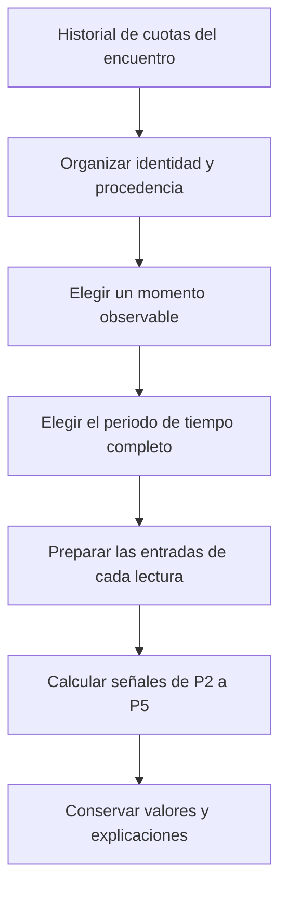

# Política común de evaluación de mercados de P2–P5

[Guía funcional del flujo](guia-funcional/00-flujo-principal.md) · [Entradas y expedientes](inputs.md) · [Conservación de resultados](mining-persistence.md)

Documento contrastado con el código el 8 de octubre de 2026. Explica cómo P2, P3, P4 y P5 acuerdan qué cuotas pueden leer, qué momento representan y qué condiciones de mercado están comparando. La política se identifica como `market-evaluation-v1`; el formato actual de sus resultados es `payload_schema_version = 4`.

P1 conserva sus propios motores y formatos. Los detalles de cada fórmula están en las guías de [P2](guia-funcional/02-pilar-2-mercado-de-lado.md), [P3](guia-funcional/03-pilar-3-mercado-de-totales.md), [P4](guia-funcional/04-pilar-4-movimiento-temporal.md) y [P5](guia-funcional/05-pilar-5-memoria-de-precios.md).

## 1. Qué resuelve esta política

Un precio solo se puede interpretar si se sabe a qué resultado, periodo, línea y fuente pertenece. Esta política prepara esa identidad antes de que cada pilar aplique sus fórmulas.

Un **contrato** es la condición del mercado: por ejemplo, Over 2.5 de tiempo reglamentario. Una **observación** es el precio registrado para un resultado de ese contrato en un momento. Un **punto de evaluación**, también llamado checkpoint, es una lectura que representa un momento previsto, como cinco minutos antes del inicio.

El recorrido común es:

P2–P5 comparten una selección temporal y un periodo de tiempo completo. Cada señal mantiene sus propios requisitos: una lectura calculable puede conservarse aunque otra no tenga suficientes ingredientes.

## 2. Casas, proveedores y capacidades

Una **casa** publica el precio. Un **proveedor** entrega ese dato al sistema. Oddspapi puede entregar cuotas de Pinnacle; no se convierte por ello en la casa del contrato.

El registro actual reconoce:

| Casa | Identificador `bookie_id` | Participación |
|---|---|---|
| Pinnacle | 302 | Lecturas de precios, líneas, movimiento y memoria. |
| bet365 | 3 | Las mismas familias de lectura que estén soportadas. |
| Betfair | 4 | Exchange: precios BACK/LAY y cantidades; en P5 es información de diagnóstico. |

Un **mercado de intercambio**, o exchange, permite negociar posiciones entre participantes. BACK representa apoyar un resultado; LAY, tomar la posición contraria. Sus niveles y cantidades se conservan por resultado. Una lectura BACK puede ser válida aunque falte su correspondiente LAY.

SofaScore participa en la recopilación y en el contexto deportivo, pero no es una casa admitida por los cálculos nuevos de esta política. No existe una casa obligatoria para que un pilar tenga algún resultado válido.

### Familias y periodos reconocidos

| Pilar | Familias | Periodos reconocidos |
|---|---|---|
| P2 | 1X2, Home/Away, Asian Handicap y Handicap estándar. | Tiempo reglamentario, tiempo completo con prórroga, primera mitad y primeras cinco entradas. |
| P3 | Over/Under. | Tiempo reglamentario, tiempo completo con prórroga y primera mitad. |
| P4 | 1X2, Home/Away, Asian Handicap y Over/Under. | Tiempo reglamentario, tiempo completo con prórroga, primera mitad y primer cuarto. |
| P5 | 1X2 y Home/Away. | Tiempo completo seleccionado, reglamentario o con prórroga. |

Esta tabla describe capacidades generales. **No significa que exista toda combinación posible de familia y periodo**. El catálogo canónico actual reconoce:

| Familia | Periodos presentes en el catálogo de esta política |
|---|---|
| 1X2 | Tiempo reglamentario, primera mitad y primeras cinco entradas. |
| Home/Away | Tiempo reglamentario, con prórroga, primera mitad y primeras cinco entradas. |
| Over/Under | Tiempo reglamentario, con prórroga, primera mitad y primer cuarto. |
| Asian Handicap | Tiempo reglamentario, con prórroga y primera mitad. |
| Handicap estándar | Tiempo completo con prórroga y primeras cinco entradas. |

Por ejemplo, P4 puede leer primer cuarto de totales, pero esta tabla no habilita automáticamente primer cuarto de 1X2. P2 conserva las primeras cinco entradas con su significado de béisbol; no las presenta como una mitad.

1X2 distingue victoria local, empate y victoria visitante. Home/Away compara local y visitante sin una opción de empate. Over/Under compara superar o quedar por debajo de una cifra total. El hándicap ajusta el marcador mediante una ventaja o desventaja; Asian Handicap identifica una familia de liquidación particular, descrita en la guía de P2.

Una lectura denominada **edge** expresa una diferencia o ventaja relativa entre los precios de dos resultados según la fórmula de su pilar. No es por sí sola una probabilidad de acierto.

`Bookmaker` reúne nombre, identificador y si se trata de un exchange. `ReadingCapability` identifica pilar, nombre de lectura, familias, resultados requeridos, casas y periodos. Esas declaraciones permiten comprobar qué puede calcularse con los datos presentes.

## 3. Identidad del contrato y procedencia

La identidad común incluye `canonical_market_key`, `market_group`, `market_period`, `line_value` y `is_live`: tipo canónico, familia, periodo, línea y si es un mercado en juego. En este recorrido se admiten contratos reconocidos previos al juego.

La clave `contract_key` se deriva de esa combinación. Sirve para referenciar el contrato de manera estable; no es una puntuación.

Las observaciones conservan también:

- `market_id`: mercado identificado en la fuente.
- `bookie_id`, `bookie_name`: casa.
- `source`: proveedor.
- `choice_name`: resultado, como local, visitante, Over o Under.
- `exchange_side`, `exchange_level`: BACK/LAY y nivel.
- `quote_id`, `snapshot_id`: cotización y observación.
- Fechas de recogida y de cambio informado por el proveedor.

Dos contratos con distinta línea se conservan separados. Tampoco se unen fragmentos de mercados distintos del proveedor para fabricar un par completo. El conjunto de referencias `market_ids` permite reconocer los mercados de origen; si hay más de uno, no se inventa una identidad única de mercado de proveedor.

Una cuota utilizable debe ser finita y mayor que 1. Una línea debe ser un número finito cuando la operación la necesita. Tamaños y límites pueden faltar si la fórmula utiliza únicamente precios.

## 4. Selección temporal compartida

El sistema construye un `OddsTrajectoryContext` por encuentro y obtiene una única `TargetMinuteSelection`. Ese objeto contiene `target_minute`, `reason` y `diagnostics`: minuto elegido, explicación y evidencia.

### 4.1. Elegir el minuto

`evaluation_minute` expresa cuánto falta para el inicio cuando se evalúa. `target_minute` identifica el momento de mercado representado.

Entre los momentos presentes y permitidos, conserva los que cumplen:

**minuto candidato ≥ minuto de evaluación.**

Después elige el menor de esos candidatos. Como la escala cuenta minutos restantes, un número mayor representa un instante más antiguo.

Ejemplo: evaluando en T−5, elige 5 si existe; si solo existen 30 y 120, elige 30. No elige 1, porque ese momento todavía es posterior a la evaluación.

Sin historial disponible, con identidad de evento incompatible o sin un minuto elegible, conserva un motivo de ausencia. No asigna un precio de otro encuentro ni un cero para completar la selección.

### 4.2. Ventana de una observación

Para cada minuto elegido:

**instante nominal = inicio del partido − minuto objetivo.**

**inicio de ventana = instante nominal − tolerancia.**

**fin de ventana = instante nominal + tolerancia**, limitado por la hora de evaluación y, cuando el minuto es cero o positivo, por el inicio del partido.

La tolerancia habitual es de tres minutos. Si el llamador no aporta hora de evaluación, el límite final se acota al instante nominal.

`SnapshotTargetWindow` conserva `target_minute`, `nominal_at`, `earliest_at` y `latest_at`. Los extremos están incluidos.

Dentro de la ventana se prefiere la observación más cercana al instante nominal. En igualdad se prefiere el momento efectivo más reciente, después la recogida más reciente y después el identificador mayor de observación.

### 4.3. Dos relojes

`collected_at` es la fecha de recogida asignada a la observación guardada. Se utiliza para comprobar disponibilidad y cercanía al checkpoint. En una historia reconstruida puede ser aproximada; la tolerancia se aplica de forma común.

`source_collected_at` es el momento informado por el proveedor. Para situar el cambio en la trayectoria:

**momento efectivo = menor entre momento del proveedor y recogida**, si existen ambos; sin momento de proveedor se utiliza la recogida.

Ejemplo: el partido comienza a las 03:10:00 UTC. T−5 corresponde a 03:05:00. Una cuota recogida a 03:05:15 puede representar ese checkpoint si la evaluación se realiza a 03:05:16. Una recogida a 03:05:45 no estaba disponible para esa evaluación.

P4 conserva además su endpoint, la observación que representa el final de la serie. Sus puntos adaptativos cumplen simultáneamente: momento efectivo no posterior al del endpoint y disponibilidad no posterior al corte de evaluación. Un cambio antiguo recogido más tarde puede entrar si ya estaba disponible al evaluar.

## 5. Elección del tiempo completo

`prepare_event_markets` prepara un `EventMarketEvaluation` común. Primero examina `Full Time Including Overtime`, tiempo completo con prórroga.

Lo selecciona si permite alguna lectura actual soportada:

- Un par de precios requerido por una capacidad.
- Una separación de líneas calculable.
- Un movimiento temporal con observaciones válidas y endpoint.

Si no permite ninguna, examina `Full Time`, tiempo reglamentario. Si tampoco es utilizable, no selecciona un tiempo completo.

**La prioridad no maximiza la cantidad de datos.** Una lectura válida con prórroga prevalece aunque el tiempo reglamentario tenga más información. El historial de coincidencias de P5 no decide el periodo: esa consulta histórica ocurre después.

Todos los pilares reciben el mismo tiempo completo. Los otros periodos soportados pueden seguir produciendo lecturas independientes.

| Motivo de selección | Significado |
|---|---|
| `OVERTIME_PRIORITY` | Se pudo elegir el periodo con prórroga. |
| `REGULATION_FALLBACK` | Se eligió tiempo reglamentario al no poder usar el anterior. |
| `NO_USABLE_FULL_TIME` | Ninguno permitió una lectura actual. |

`selection` conserva periodo elegido, candidatos, contratos utilizables, lecturas que no pudieron calcularse, motivo y checkpoint.

## 6. Requisitos de cada lectura

| Pilar | Qué permite calcular y qué se conserva |
|---|---|
| P2 | Local y visitante del mismo contrato permiten un edge. Si falta empate en 1X2, puede existir esa lectura del par, pero la cobertura sigue incompleta. Casas, ganador/hándicap, exchange y periodos se comparan solo con sus ingredientes compatibles. |
| P3 | Over y Under del mismo contrato permiten un edge. Las líneas bastan para medir su separación. Comparar precios entre casas o con el exchange exige la misma línea y periodo. |
| P4 | Movimiento requiere al menos dos observaciones válidas y endpoint. Un hueco puede permitir el cambio entre extremos y dejar sin cálculo la velocidad global o eficiencia. Una línea nueva no completa la serie de precios de una línea anterior. |
| P5 | Un vector actual propio de Pinnacle o bet365. En 1X2 exige local/empate/visitante; en Home/Away, local/visitante. La memoria requiere al menos tres eventos elegibles con precios iguales después del redondeo a tres decimales. |

Las relaciones necesitan más ingredientes que una lectura individual. Una casa ausente no elimina el edge de otra; un LAY ausente no elimina el BACK independiente. Un cero calculado es un resultado válido. Un dato que falta conserva su ausencia.

El historial de P4 refleja las líneas y resultados que la recopilación logró reconstruir. El hecho de seleccionar la línea principal actual y consultar su historia no proporciona por sí solo todas las líneas principales del pasado. **No observar una transición no demuestra que la línea real nunca cambiara.**

## 7. Cobertura y estados

### 7.1. Cobertura de ingredientes

`coverage` enumera combinaciones de casa, familia, periodo, línea y lado del exchange, incluidas las ausentes.

| Estado | Lectura |
|---|---|
| `COMPLETE` | Están los ingredientes requeridos para esa combinación. |
| `INCOMPLETE` | Hay datos, pero falta parte del conjunto. |
| `MISSING` | No hay la lectura requerida. |
| `INVALID` | Hay valores que no cumplen el contrato. |
| `AMBIGUOUS` | Más de un candidato impide elegir una lectura única. |
| `EXCLUDED` | La política no utiliza ese contrato o periodo en esta evaluación. |
| `NOT_APPLICABLE` | La combinación no corresponde a una capacidad de cálculo. |

`observed_status` conserva la disponibilidad observada antes de excluir un periodo. En P5, Betfair se presenta como diagnóstico; su presencia no añade una señal de memoria.

La cobertura no se transforma en porcentaje de confianza ni en un peso estadístico.

### 7.2. Estado de cada señal

Una `SignalResult` contiene `key`, `status`, `value`, `input_refs`, `contract_refs`, `reason` y `evidence`: identidad, disponibilidad, valor, ingredientes, contratos, explicación y hechos.

| Estado | Significado |
|---|---|
| `COMPUTED` | La señal se calculó, incluido cero, una condición falsa o una etiqueta neutral. |
| `BLOCKED` | No se reunieron sus requisitos. |
| `ERROR` | Falló su consulta o cálculo. |

Motivos como `MISSING_INPUT`, `INVALID_VALUE`, `AMBIGUOUS_CANDIDATE`, `INCOMPATIBLE_CONTRACT`, `INSUFFICIENT_OBSERVATIONS`, `MISSING_ENDPOINT`, `NON_CONTIGUOUS_GAP` e `INSUFFICIENT_HISTORY` explican el problema local. No significan que todos los cálculos del pilar hayan fallado.

### 7.3. Resultado global

| Estado global | Condición |
|---|---|
| `ACTIVE` | Hay al menos una señal COMPUTED, aunque otras falten o fallen. |
| `INSUFFICIENT_DATA` | No hay señal calculada ni error de ejecución. |
| `ERROR` | No hay señal calculada y existe al menos un error. |
| `SKIPPED` | El pilar no participó en esa ejecución. |

`execution_status` indica COMPLETED, COMPLETED_WITH_ERRORS, FAILED o SKIPPED: final normal, final con resultados y errores, fallo sin resultados calculados o ausencia de participación.

«Activo» certifica que hubo algún cálculo, no cobertura completa ni confianza en un pronóstico.

## 8. Paquete de resultado y referencias

`EvaluationResult` reúne:

| Campo | Significado |
|---|---|
| `event_id`, `pillar_id`, `engine_version` | Encuentro, pilar y versión de sus fórmulas. |
| `payload_schema_version`, `policy_version` | Formato del resultado y política compartida. |
| `target_minute`, `checkpoint` | Momento elegido y límites de tiempo. P4 añade límites nominal y operativo propios. |
| `selected_full_time_period`, `selection` | Periodo común y explicación de su elección. |
| `signals` | Señales independientes con sus estados y referencias. |
| `inputs` | Ingredientes utilizados y procedencia. |
| `contracts` | Identidad de los mercados. |
| `analysis` | Cálculos intermedios organizados por pilar. |
| `coverage`, `diagnostics`, `evidence` | Disponibilidad, motivos y conteos de señales calculadas o sin requisitos. |
| `status`, `execution_status` | Disponibilidad global y final de ejecución. |

Las referencias permiten recorrer **señal → ingrediente → observación y contrato**. Una señal derivada de varias fuentes conserva los contratos de todas sus series constituyentes, aunque no tenga una única casa.

El registro de diagnóstico de P4 lee el resultado terminado; no vuelve a seleccionar ni a calcular cuotas.

## 9. P5: población histórica y auditoría

P5 compara deporte, casa, familia, periodo, forma de dos/tres resultados y precios redondeados a tres decimales. Puede añadir restricciones de competición, temporada o país cuando participan en la población elegida.

Excluye el evento actual; exige inicio histórico anterior al del actual, resultado compatible, ambos marcadores y un evento único después de deduplicar. Utiliza toda la población elegible, sin límite de coincidencias.

Ese corte por inicio de evento **no reconstruye por sí mismo qué resultados se conocían a la hora del checkpoint**. No debe confundirse con la disponibilidad temporal de la cuota actual.

Cuando se conserva auditoría, `p5_memory_samples` guarda la consulta, corte, política, conteos y ejecución propietaria; `p5_memory_sample_members` guarda los miembros exactos. Los conteos proceden de esos miembros capturados.

Captura y resultado se conservan en una misma transacción: se confirman juntos o se revierten juntos. Cada consulta independiente utiliza un punto de recuperación para que su fallo pueda representarse sin perder consultas anteriores.

`SampleAuditReader.get_sample_page(sample_id, cursor, page_size)` devuelve una página de miembros y un cursor para seguir. El tamaño predeterminado es 100, el máximo 1.000; el orden es fecha de inicio e identificador descendentes. Lee la muestra conservada sin rehacer la consulta contra precios posteriores.

Sin conservación, P5 puede consultar los agregados históricos y calcular el mismo perfil; `sample_id` queda ausente y `audit_persisted` es falso. Si guardar falla, el pipeline elimina referencias a muestras no conservadas y registra PERSISTENCE_ERROR, manteniendo cálculos disponibles.

## 10. Conservación, versiones y fuentes

P2–P5 usan respectivamente `p2-signal-profile-v3`, `p3-signal-profile-v3`, `p4-signal-profile-v3` y `p5_price_memory_v4_0`, con formato 4.

La minería normaliza ACTIVE como SUCCESS y conserva cada señal. Los resultados nuevos no usan PARTIAL global por cobertura incompleta. Los formatos históricos 1–3 conservan sus significados; no se reescriben con reglas nuevas. La [guía de persistencia](mining-persistence.md) explica identidad, reemplazo, muestras y consultas.

| Fuente | Responsabilidad |
|---|---|
| [market_evaluation.py](../../modules/pillars/market_evaluation.py) | Casas, capacidades, catálogo, periodo seleccionado y cobertura. |
| [odds_trajectory_context.py](../../modules/pillars/odds_trajectory_context.py) | Organizar cuotas e índice por encuentro. |
| [trajectory_selection.py](../../modules/pillars/trajectory_selection.py) | Elegir minuto, ventanas y desempate temporal. |
| [trajectory_sampling.py](../../modules/pillars/trajectory_sampling.py) | Puntos válidos, deduplicación, checkpoints y endpoint. |
| [market_snapshot_extractor.py](../../modules/pillars/market_snapshot_extractor.py) y [market_candidate_selection.py](../../modules/pillars/market_candidate_selection.py) | Extraer ingredientes e identificar ausencias, valores inválidos y ambigüedades. |
| [signal_dependencies.py](../../modules/pillars/signal_dependencies.py) y [profile_evaluation.py](../../modules/pillars/profile_evaluation.py) | Requisitos y referencias de señales de P2/P3. |
| [market_math.py](../../modules/pillars/market_math.py) | Operaciones numéricas comunes. |
| [evaluation_contracts.py](../../modules/pillars/evaluation_contracts.py) | Señales, cobertura y estados globales. |
| [market.py](../../modules/pillars/mining/adapters/market.py) | Conservación del formato de mercados. |
| [Repositorio de memoria P5](../../infrastructure/persistence/repositories/pillar_5_price_memory_repository.py) | Población histórica, captura y lectura de muestras. |

Los detalles de adquisición están en [recopilación previa de cuotas](../providers/pre_start_odds_ingestion.md). Las instrucciones de evolución del esquema se concentran en [persistencia](mining-persistence.md#12-notas-para-mantenimiento-del-esquema). Las mediciones de rendimiento son registros históricos de una revisión concreta, disponibles en la [auditoría de minería](../audits/2026-10-04-pillar-mining-performance.md); no son garantías actuales de consumo.
