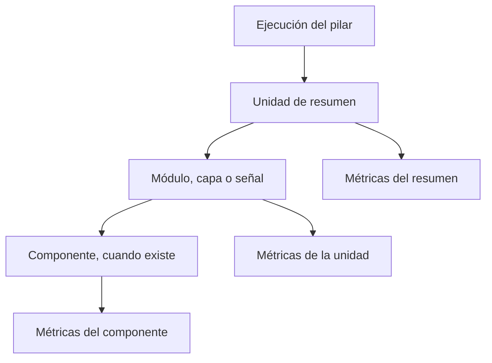

# Conservación de resultados para análisis de los pilares

[Guía funcional del flujo](guia-funcional/00-flujo-principal.md) · [Entradas y expedientes](inputs.md) · [Evaluación de mercados](market-evaluation-v1.md)

Documento contrastado con el código el 8 de octubre de 2026. Explica la persistencia de minería: guardar los resultados de los pilares para consultarlos, compararlos y revisar después qué datos y reglas los produjeron. «Minería» se refiere aquí a preparar información para análisis; esta capa no vuelve a calcular los pilares ni convierte sus resultados en una decisión de apuesta.

P1 tiene dos salidas independientes, lado y totales. P2–P5 conservan señales individuales con formato 4. Los seis adaptadores están implementados y registrados en el flujo actual.

## 1. Qué se guarda y en qué momento

El recorrido es **resultado del pilar → adaptación → validación → conservación**.

Un **adaptador** traduce el resultado a un formato común. Conserva el vocabulario original del pilar y añade un estado comparable con los demás. Un **repositorio** escribe ese formato en la base de datos.

En el flujo principal, el orden de cálculo es P2, P3, P4, P5 y P1. Las salidas disponibles se envían al servicio de minería después de su cálculo. P1 se envía por dos entradas explícitas: una para lado y otra para totales; no se intenta adivinar la salida por la forma del documento.

P5 tiene una particularidad: cuando se guarda su auditoría, la captura de eventos históricos y la escritura del resultado comparten una transacción. Una transacción es un conjunto de cambios que se confirma completo o se revierte completo.

| Pilar y salida | Identificador guardado `pillar_id` | Ámbito `result_scope` | Formato | Detalle consultable |
|---|---|---|---|---|
| P1 lado | `pillar_1_team_structure` | `side` | 2 | Resumen, módulos M1–M7 y componentes. |
| P1 totales | `pillar_1_team_structure` | `totals` | 2 | Resumen y capas estructural, temporal y de tendencia. |
| P2 | `pillar_2_side_market` | `side_market` | 4 | Resumen y señales de mercados de lado. |
| P3 | `pillar_3_totals_market_context` | `totals_market_context` | 4 | Resumen y señales de totales. |
| P4 | `pillar_4_temporal_market_drift` | `temporal_market_drift` | 4 | Resumen y señales de movimiento. |
| P5 | `pillar_5` | `price_memory` | 4 | Resumen, señales y muestras históricas cuando se conservan. |

El servicio devuelve verdadero cuando entrega el resultado al escritor. Devuelve falso cuando la conservación está desactivada o la política de estados no admite ese resultado. Esto no significa por sí mismo que el cálculo deportivo haya fallado.

## 2. Tres niveles: ejecución, unidad y métrica

Una **ejecución** es el expediente completo de un pilar, un ámbito y un momento de evaluación. Una **unidad** es una parte de ese resultado que puede analizarse por separado. Una **métrica** es un valor simple de una unidad.



La estructura física utiliza tres tablas comunes:

| Tabla | Contenido |
|---|---|
| `pillar_mining_runs` | Identidad de la ejecución, contexto, ingredientes, estados y resultado. |
| `pillar_mining_units` | Resumen y unidades hijas, con relaciones padre–hijo. |
| `pillar_mining_metric_values` | Valores numéricos, textos o condiciones de verdadero/falso de cada unidad. |

P5 añade `p5_memory_samples` y `p5_memory_sample_members`, explicadas en la sección 8. No hay una tabla diferente para cada pilar.

El **resultado completo** permite revisar el cálculo. Las **métricas separadas** facilitan consultas, promedios y agrupaciones. No se convierte cada detalle de un documento complejo en una métrica ni se crea un cero para representar algo que falta.

## 3. Campos del expediente de ejecución

El contrato `PillarMiningRun` contiene:

| Campo | Explicación |
|---|---|
| `event_id` | Identificador positivo del encuentro. |
| `pillar_id` | Pilar que produjo el resultado. |
| `result_scope` | Ámbito de la salida, por ejemplo lado o totales. |
| `execution_slot` | Clave del momento evaluado, explicada en la sección 4. |
| `engine_version` | Versión del motor de cálculo. Separa resultados obtenidos con reglas distintas. |
| `payload_schema_version` | Versión del formato del resultado, no de sus fórmulas. |
| `producer_status` | Estado expresado por el pilar o su adaptador. |
| `canonical_status` | Estado común para comparar ejecuciones. |
| `sport` | Deporte del encuentro. |
| `evaluation_minute` | Minutos que faltan para el inicio al evaluar. Puede estar ausente. |
| `target_minute` | Momento de mercado elegido por el cálculo. Puede diferir del minuto de evaluación. |
| `competition_id` | Competición identificada, si está disponible. |
| `context` | Información del encuentro útil para interpretar la ejecución. |
| `inputs` | Ingredientes utilizados. En P2–P5 se guardan aquí las entradas referenciadas por sus señales. |
| `diagnostics` | Explicaciones y hechos sobre la ejecución. |
| `output_payload` | Resultado conservado como documento estructurado. Su organización depende del formato. |
| `units` | Unidades de resumen y detalle que se escribirán por separado. |
| `calculated_at` | Fecha del cálculo; el valor predeterminado es el momento actual en UTC. |

La base de datos añade `id`, `created_at` y `updated_at`: identificador interno, fecha de creación y última actualización. El identificador interno permite relacionar unidades y muestras con su ejecución.

Un documento estructurado, denominado JSON en el código, es un conjunto de campos, listas y valores. Las fechas se representan con su fecha y hora; los valores decimales del documento se convierten a números. Las métricas numéricas conservan un tipo decimal independiente para consulta. No se admiten números infinitos ni valores numéricos indefinidos en los documentos que se serializan.

## 4. Identidad y reemplazo de una ejecución

Una ejecución queda identificada por la combinación:

**encuentro + pilar + ámbito + momento de ejecución + versión del motor.**

`build_execution_slot` elige el momento de ejecución en este orden:

| Datos disponibles | Clave producida |
|---|---|
| Existe `evaluation_minute`. | `evaluation:<minuto>` |
| No existe el anterior y sí `target_minute`. | `target:<minuto>` |
| No existe ninguno. | `event` |

El minuto cero cuenta como disponible. Por ejemplo, una evaluación T−5 que elige cuotas de T−30 utiliza `evaluation:5`, y conserva 30 como `target_minute`. No se identifica por 30 porque sí conoce el momento de evaluación.

Al repetir exactamente esa identidad, el repositorio actualiza la ejecución existente y conserva su `id`. Reemplaza todas sus unidades y métricas por las de la nueva salida. La fecha de creación permanece; las fechas de cálculo y actualización cambian.

Con otro minuto, ámbito o versión del motor se crea una ejecución distinta. Por eso lado y totales de P1 pueden coexistir aunque compartan encuentro, identificador de pilar y minuto.

El reemplazo se realiza de forma indivisible. Si falla, no debe quedar un expediente con el resumen nuevo y los componentes antiguos. Para P5 también se reemplazan las muestras que pertenecían a esa misma ejecución.

## 5. Campos de las unidades y las métricas

### 5.1. Una unidad de análisis

`PillarMiningUnit` utiliza los siguientes campos:

| Campo | Explicación |
|---|---|
| `unit_type` | Clase de unidad: resumen, módulo, componente, capa o señal. |
| `unit_key` | Clave estable dentro de la ejecución, por ejemplo `module:M1`. |
| `parent_unit_key` | Clave de su unidad padre. El resumen no necesita padre. |
| `ordinal` | Orden del elemento dentro del resultado. |
| `module_id` | Identidad del módulo cuando corresponde. |
| `producer_status`, `canonical_status` | Estado original y estado común de esa unidad. |
| `signal_axis` | Qué representa la medida, por ejemplo SIDE o TOTALS cuando el adaptador lo declara. |
| `is_valid` | Indicación de utilidad de la unidad según su adaptador; puede estar ausente. |
| `score_name`, `score` | Nombre y valor de una puntuación que el productor realmente emitió. |
| `direction`, `strength` | Dirección y fuerza declaradas por el productor. No se deducen automáticamente. |
| `target_minute` | Momento de mercado representado, si existe. |
| `market_group`, `market_period`, `market_name` | Familia, periodo y nombre de mercado proporcionados al escritor. |
| `line_value` | Línea del contrato, por ejemplo 2.5 goles. |
| `choice_name` | Resultado del mercado, como local, visitante, Over o Under. |
| `bookie_id`, `quote_id`, `source` | Casa, cotización y proveedor identificados. |
| `exchange_side`, `exchange_level` | Posición BACK/LAY y nivel de un exchange. |
| `dimensions` | Identidad y atributos adicionales para relacionar o agrupar la unidad. |
| `payload` | Detalle estructurado de la unidad. |
| `diagnostics` | Motivo, evidencia y explicaciones. |
| `metrics` | Valores simples asociados a la unidad. |

En la tabla se guarda `parent_unit_id`, el identificador del padre, en lugar de su clave textual. El repositorio utiliza el tipo de mercado canónico `market_type_id` para conservar la identidad reconocida. Los campos de familia, periodo y nombre del contrato no son tres columnas independientes equivalentes: sirven para resolver esa identidad y conservar metadatos.

Cada `unit_key` debe ser única dentro de su ejecución. El padre tiene que existir en ella; una unidad no puede ser su propio padre ni formar un ciclo. El escritor ordena las capas para insertar primero a los padres.

### 5.2. Un valor simple

`PillarMiningMetric` contiene `name`, `value_type`, `value` y `group`: nombre, tipo, valor y agrupación opcional.

| Tipo | Valor permitido | Columna utilizada |
|---|---|---|
| `number` | Número decimal. | `numeric_value` |
| `text` | Texto. | `text_value` |
| `boolean` | Verdadero o falso. | `boolean_value` |

`metric_name` y `metric_group` son los nombres de estas propiedades en la tabla. Una métrica ocupa una sola columna de valor según su tipo. Sus nombres no pueden repetirse dentro de una unidad.

Una lista de partidos o un mapa de cálculos intermedios permanece en el documento estructurado. Un dato ausente no crea una métrica con cero. Un cero calculado, un texto neutral o una condición falsa sí se conservan.

La validación comprueba además que la ejecución tenga un encuentro y versión de formato positivos, identificadores obligatorios no vacíos y estados comunes reconocidos. Una estructura inválida se rechaza antes de escribirla.

## 6. Estados originales y estados comunes

Se conservan dos vocabularios para no perder el significado original.

| Estado del productor | Estado común | Interpretación |
|---|---|---|
| `ACTIVE`, `OK` | `SUCCESS` | El resultado está disponible según las reglas de ese productor. |
| `PARTIAL` | `PARTIAL` | Resultado parcialmente utilizable. |
| `INSUFFICIENT_DATA` | `INSUFFICIENT` | Falta información para obtener el resultado. |
| `ERROR` | `ERROR` | Hubo un fallo. |
| `IGNORE`, `SKIPPED` | `SKIPPED` | La unidad o salida no participó. |

P1 añade reglas específicas para `DEGRADED` e `INACTIVE`, descritas a continuación. Un estado desconocido no se interpreta por semejanza: el adaptador rechaza su normalización.

En P2–P5, ACTIVE significa que existe al menos una señal calculada. No significa que estén presentes todas las casas o todos los mercados. Por tanto, SUCCESS en minería tampoco certifica cobertura total.

La política habitual conserva todos los estados. Existe una alternativa denominada `successful_only`, que conserva únicamente ejecuciones cuyo estado común sea SUCCESS. Con ella se dejan fuera incluso resultados PARTIAL; conviene recordar esa diferencia cuando una consulta aparenta mostrar solo casos completos.

## 7. Traducción que realiza cada adaptador

### 7.1. P1 lado: resumen, módulos y componentes

El adaptador recibe el resultado de lado y conserva su salida completa en `output_payload`, con formato 2. Obtiene la versión del motor de `raw.engine_version`, con una alternativa en el resultado si está presente; si no existe ninguna, utiliza `unknown`.

Crea una unidad `summary` con:

- `signal_axis = SIDE`.
- `score_name = value` y `score` igual al valor de evidencia publicado.
- `direction` únicamente desde `raw.final.p1_final_bias`.
- Agregaciones de las capas A y B, resultado final, estados de módulos y listas de módulos activos o apartados en su documento de detalle.
- Anomalías e indicaciones de si el balance representa una decisión y de si el valor expresa solo evidencia, en sus diagnósticos.

La fuerza o dirección no se inventan a partir del signo del balance. El valor de evidencia no es, por sí solo, un pronóstico.

El estado de cada módulo se toma de su detalle `raw`, por ejemplo `m1_status`; si no se aporta ese estado, el adaptador utiliza ACTIVE. El motivo se toma del campo correspondiente, como `m1_status_reason`.

Cada módulo crea una unidad `module:M1` hasta `module:M7`, cuando aparece en la salida. Sus componentes crean unidades `component:<módulo>:<nombre>` hijas del módulo.

En el módulo se guardan su valor, orientación, fuerza, estado y detalle original. En el componente, `edge` se guarda como `score`; `weight` y `weighted_edge` son métricas numéricas separadas. El detalle original del componente también permanece en su documento.

La regla global actual es:

| Situación de los módulos | Estado original del resumen | Estado común |
|---|---|---|
| No se recibió ningún módulo. | `ERROR` | `ERROR` |
| Todos son exactamente ACTIVE. | `ACTIVE` | `SUCCESS` |
| Existe algún ACTIVE o DEGRADED, pero no se cumple la fila anterior. | `PARTIAL` | `PARTIAL` |
| No existe ningún ACTIVE ni DEGRADED. | `INSUFFICIENT_DATA` | `INSUFFICIENT` |

Un conjunto compuesto enteramente por módulos DEGRADED se conserva como PARTIAL. No se eleva a SUCCESS solo porque permita calcular alguna evidencia.

Para cada módulo o componente, DEGRADED se traduce a PARTIAL e INACTIVE a INSUFFICIENT. Las unidades cuyo estado común es SUCCESS o PARTIAL se marcan utilizables. El adaptador no define una equivalencia para estados como `INVALID` o `INVALID_GD_SCALE`: si recibe uno de ellos, la normalización falla y la minería registra la excepción. Esto describe la implementación actual; no debe documentarse como si esos estados se guardaran automáticamente como insuficientes.

### 7.2. P1 totales: resumen y capas

El adaptador recibe el documento de `P1TotalsOutput`. Utiliza el mismo identificador de P1 y el ámbito `totals`, con formato 2.

El resumen conserva:

- `signal_axis = TOTALS`.
- `score_name = P1_TOTALS_DIRECTIONAL_SCORE` y su valor como puntuación.
- `P1_TOTALS_DIRECTION` como dirección.
- `P1_TOTALS_STRENGTH` como fuerza.
- Los valores simples de la salida como métricas, incluyendo `P1_TOTALS_COMPOSITE`, conteos, volatilidad y otros indicadores publicados.
- Mapas y detalle complejo como `P1_TOTALS_INTERNAL_STATE`, `WINDOWS_USED`, `WINDOW_COMPLETENESS_BY_WINDOW` y `raw` en su documento.

El compuesto no sustituye a la puntuación direccional: son medidas con significados distintos. Los campos escalares de dirección y fuerza pueden conservarse también como métricas de texto.

Las capas proceden de `active_layers` y `ignored_layers`. Cada una crea una unidad `layer:<nombre>` hija del resumen. Guarda `final_signal` como puntuación y `raw_signal`, `weight`, `weighted_signal` como métricas. Mantiene el motivo de exclusión, aunque conserve valores de una capa apartada.

OK se traduce a SUCCESS; una capa ACTIVE a SUCCESS y una capa IGNORE a SKIPPED. Si totales no está disponible y el cálculo devuelve `None`, el pipeline conserva lado cuando existe y no fabrica una ejecución de totales.

Ambas salidas utilizan el minuto de evaluación para su identidad cuando está disponible. Totales deja `target_minute` ausente; lado copia ese campo si el resultado lo aporta, aunque la salida actual del cálculo no lo incluye.

### 7.3. P2–P5: resumen y señales

Comparten `MarketMiningAdapter`. Sus escritores actuales aceptan únicamente resultados de formato 4; no reescriben un resultado histórico con el formato nuevo.

El documento general se conserva una vez en `run.output_payload`, con selección, contratos, cobertura, análisis y demás metadatos. Los ingredientes van a `run.inputs`; las señales se descomponen en unidades. `signal_unit_refs` conecta el documento con esas unidades.

Cada señal tiene una clave determinista: `signal_` más una huella SHA-256 de su `key`. Una huella es una representación estable del nombre, útil para construir una clave sin perder la referencia al nombre original, que se guarda en el detalle.

| Estado público de la señal | Estado guardado del productor | Estado común | `is_valid` |
|---|---|---|---|
| `COMPUTED` | `ACTIVE` | `SUCCESS` | Verdadero. |
| `BLOCKED` | `INSUFFICIENT_DATA` | `INSUFFICIENT` | Falso. |
| `ERROR` | `ERROR` | `ERROR` | Falso. |

El valor se guarda en una métrica llamada `value` cuando es número, texto o condición de verdadero/falso. Si falta, no se crea esa métrica.

La unidad conserva `signal_key`, `input_refs` y `contract_refs`, además de `reason` y `evidence` en diagnósticos. Las referencias permiten volver a los ingredientes y contratos originales.

La identidad de mercado se proyecta desde los contratos relacionados y la evidencia proporcionada. La casa y los atributos de procedencia se proyectan cuando los ingredientes permiten identificarlos. Una señal entre varias casas no debe leerse como si fuera necesariamente de una sola.

Este adaptador no asigna una puntuación global, dirección, fuerza ni `signal_axis` a partir del valor de la señal. En P5, la dirección publicada sigue disponible en el análisis y las señales del resultado. En P2–P4, conservar una medida de mercado no la convierte automáticamente en un pronóstico del ganador.

## 8. P5: conservar una población histórica exacta

La [guía de P5](guia-funcional/05-pilar-5-memoria-de-precios.md) explica las fórmulas. Aquí se describe cómo se conserva la evidencia que utilizaron.

### 8.1. Consulta y miembros

P5 identifica coincidencias por deporte, casa, familia, periodo, forma de dos o tres resultados y precios redondeados a tres decimales. Puede aplicar filtros de competición, temporada o país. Excluye el evento actual, exige eventos anteriores por hora de inicio y resultados compatibles, y deduplica para contar un evento una sola vez.

La muestra utiliza toda la población elegible. No se trunca a los primeros cien o mil eventos.

La cabecera `p5_memory_samples` guarda:

| Campo | Significado |
|---|---|
| `sample_id` | Identificador único de la muestra. |
| `run_id` | Ejecución propietaria, asignada al conservar el resultado. |
| `query` | Clave de precios y filtros utilizados; se añaden versión de motor y de formato al vincularla. |
| `cutoff` | Corte de inicio de los eventos históricos. |
| `policy_version` | Política que define la población. |
| `sample_size` | Número de miembros capturados. |
| `wins_home`, `wins_draw`, `wins_away` | Conteos de resultados local, empate y visitante de esos miembros. |
| `created_at` | Momento de creación de la muestra. |

Cada miembro en `p5_memory_sample_members` conserva `sample_id`, `event_id`, `starts_at`, `competition_id`, `season_id`, `country`, `odds_home`, `odds_draw`, `odds_away`, `home_score`, `away_score`, `winner_side`, `outcome` y `last_sync_at`.

Son, respectivamente: muestra, evento, inicio, competición, temporada, país, precios local/empate/visitante, marcadores local/visitante, clasificación del ganador, resultado interpretado y última sincronización conocida. El empate puede faltar en mercados de dos resultados.

Los miembros son copias congeladas. Una modificación posterior del evento histórico o de sus precios no cambia la muestra. El identificador histórico no tiene una relación de borrado automático con el evento original, de modo que su eliminación tampoco borra esa copia.

`cutoff` exige inicio anterior al del evento actual. No demuestra que todos esos resultados ya fueran conocidos en el instante de evaluación de la cuota actual; son dos criterios temporales distintos.

### 8.2. Captura, vinculación y fallo

La captura copia los miembros directamente desde la consulta y calcula los conteos a partir de la copia. No consulta después una población cambiante para completar la cabecera.

Cada consulta independiente utiliza un punto de recuperación dentro de la transacción: si falla, puede registrarse ese error sin deshacer las capturas anteriores que sí funcionaron. Al conservar el resultado, el repositorio vincula las nuevas muestras con su ejecución.

Solo pueden vincularse muestras existentes y todavía sin propietario. Reemplazar una ejecución elimina sus muestras anteriores y conserva las nuevas en la misma operación. No elimina muestras de otra ejecución.

Si no se conserva minería, P5 puede utilizar los agregados de su consulta histórica para calcular. En ese caso `sample_id` queda ausente y `audit_persisted` es falso.

Si la escritura falla, el pipeline revierte la captura, retira referencias a muestras que no quedaron guardadas y añade `PERSISTENCE_ERROR`. Mantiene los cálculos disponibles; el resultado termina con errores o como error global según exista alguna señal calculada. La política que solo conserva SUCCESS también revierte capturas cuando decide no guardar una ejecución.

### 8.3. Lectura por páginas

`SampleAuditReader.get_sample_page(sample_id, cursor, page_size)` lee los miembros congelados. Devuelve información de la muestra, una página de miembros y un cursor para continuar.

El tamaño predeterminado es 100 y el máximo 1.000 por página. Se ordena por fecha de inicio e identificador de evento descendentes. Esos límites corresponden a cada página de lectura, no al tamaño de la población utilizada por P5.

## 9. Escritura, transacción y comportamiento ante fallos

`PillarMiningRepository.replace_run` crea o actualiza la ejecución con su identidad única. El cambio se realiza de forma atómica; las unidades y métricas se escriben después de retirar las anteriores dentro de la misma transacción.

La escritura de ejecuciones admite PostgreSQL y SQLite. Para PostgreSQL con el controlador psycopg 3, los detalles se envían por lotes con COPY, una operación de carga conjunta. Utiliza la conexión de la misma transacción, sin una confirmación separada para los detalles.

La reserva de identificadores utiliza las secuencias de la base de datos; no deduce el próximo identificador del mayor existente. Una operación revertida puede dejar huecos numéricos sin que eso implique pérdida de resultados.

Cuando no se utiliza ese camino de carga, se usan inserciones por lotes y se relacionan los identificadores por las claves de unidad. Los padres se escriben antes que sus hijos. Los lotes de detalles se acotan a 1.000 elementos; no significa que una ejecución se limite a 1.000 unidades.

El servicio admite una transacción existente, necesaria para coordinar las muestras de P5, o deja al repositorio gestionar la escritura completa. El registro de duración incluye adaptación, validación y escritura, y la confirmación cuando la operación administra su propia transacción.

Una excepción de minería se registra en el pipeline sin sustituir el resultado calculado por P1–P4. Para P5 existe el tratamiento específico de referencias y estado descrito en la sección 8. Un error de conservación no debe interpretarse como una nueva fórmula ni como evidencia deportiva desfavorable.

Al eliminar el evento propietario se eliminan sus ejecuciones, unidades, métricas y muestras. Esto es distinto de borrar un evento histórico que ya fue copiado como miembro de una muestra de otro encuentro.

## 10. Recuperar resultados sin cambiar su significado

`PillarMiningRepository.get_result(run_id)` devuelve un envoltorio con:

| Campo | Contenido |
|---|---|
| `payload_schema_version` | Formato del resultado almacenado. |
| `engine_version` | Motor original. |
| `producer_status` | Estado original guardado de la ejecución. |
| `canonical_status` | Estado común guardado. |
| `result` | Resultado recuperado o reconstruido. |

En formato 4, reconstruye `inputs` y `signals` a partir de las entradas de la ejecución, las unidades de señal y sus métricas. Traduce sus estados guardados de nuevo a COMPUTED, BLOCKED o ERROR. Una señal sin métrica se recupera con valor ausente, no con cero.

En formatos 1–3, incluido el formato 2 de P1, devuelve el documento original dentro de `result`. No aplica a esos documentos la política nueva de mercados.

Si no existe la ejecución, produce un error de búsqueda. La lectura acepta formatos 1 a 4; una versión fuera de ese rango se rechaza para evitar interpretar un formato desconocido.

## 11. Consultas de referencia para análisis

Estas consultas están destinadas a quienes mantienen la base de datos. La explicación anterior permite interpretar sus resultados sin saber SQL. Los ejemplos utilizan PostgreSQL y no ejecutan cambios.

### 11.1. Señales actuales de P2–P5

Una fila representa una señal. La unión opcional de la métrica conserva también las señales bloqueadas o fallidas que no tienen valor.

```sql
SELECT r.pillar_id, r.engine_version, r.sport, r.target_minute,
       r.output_payload->>'selected_full_time_period' AS periodo_completo,
       u.payload->>'signal_key' AS nombre_senal,
       u.producer_status AS estado_guardado,
       u.diagnostics->>'reason' AS motivo,
       m.numeric_value, m.text_value, m.boolean_value
FROM pillar_mining_runs r
JOIN pillar_mining_units u
  ON u.run_id = r.id AND u.unit_type = 'signal'
LEFT JOIN pillar_mining_metric_values m
  ON m.unit_id = u.id AND m.metric_name = 'value'
WHERE r.payload_schema_version = 4
  AND r.pillar_id IN ('pillar_2_side_market',
                     'pillar_3_totals_market_context',
                     'pillar_4_temporal_market_drift', 'pillar_5');
```

El estado guardado ACTIVE corresponde al estado público COMPUTED de la señal. Un valor vacío requiere revisar estado y motivo, no reemplazarlo por cero.

### 11.2. Cobertura observada

Esta consulta cuenta combinaciones de casa, familia y periodo según la disponibilidad declarada. Mide cobertura de ingredientes, no acierto del pilar.

```sql
SELECT r.sport, r.producer_status,
       c->>'bookie_id' AS casa,
       c->>'family' AS familia,
       c->>'period' AS periodo,
       c->>'status' AS estado_cobertura,
       c->>'reason' AS motivo,
       count(*) AS observaciones
FROM pillar_mining_runs r
CROSS JOIN LATERAL jsonb_array_elements(r.output_payload->'coverage') c
WHERE r.payload_schema_version = 4
GROUP BY r.sport, r.producer_status, c->>'bookie_id',
         c->>'family', c->>'period', c->>'status', c->>'reason';
```

### 11.3. Resúmenes de P1

Lado y totales se distinguen por ámbito. La puntuación se interpreta junto a su nombre y eje. PARTIAL puede contener evidencia útil de lado, por lo que no se filtra automáticamente como si fuera ausencia total.

```sql
SELECT r.event_id, r.result_scope, r.engine_version,
       r.evaluation_minute, r.canonical_status,
       u.signal_axis, u.score_name, u.score, u.direction, u.strength
FROM pillar_mining_runs r
JOIN pillar_mining_units u
  ON u.run_id = r.id AND u.unit_type = 'summary'
WHERE r.pillar_id = 'pillar_1_team_structure';
```

### 11.4. Muestras de P5

Cada fila identifica una población congelada y la ejecución a la que pertenece. El tamaño y los conteos proceden de sus miembros.

```sql
SELECT r.id AS ejecucion_id, r.engine_version,
       s.sample_id, s.cutoff,
       s.query->'key' AS clave_precios,
       s.query->'filters' AS filtros_poblacion,
       s.sample_size, s.wins_home, s.wins_draw, s.wins_away
FROM pillar_mining_runs r
JOIN p5_memory_samples s ON s.run_id = r.id
WHERE r.pillar_id = 'pillar_5'
  AND r.payload_schema_version = 4;
```

### 11.5. Perfiles históricos de P2 y P3

En formatos anteriores a 4, los perfiles se conservaban en el detalle del resumen. No deben buscarse como si ya fueran unidades de señal actuales.

```sql
SELECT r.pillar_id, r.engine_version, r.payload_schema_version,
       r.event_id, r.target_minute,
       u.payload->'P2_SIGNAL_PROFILE' AS perfil_lado,
       u.payload->'P3_SIGNAL_PROFILE' AS perfil_totales
FROM pillar_mining_runs r
JOIN pillar_mining_units u
  ON u.run_id = r.id AND u.unit_type = 'summary'
WHERE r.payload_schema_version < 4
  AND r.pillar_id IN ('pillar_2_side_market',
                     'pillar_3_totals_market_context');
```

Para estudiar aciertos hay que elegir primero una medida y un resultado deportivo compatible. La dirección de lado puede contrastarse con el ganador; los totales requieren el total correspondiente; un movimiento de probabilidad describe el mercado y no equivale por sí solo a una predicción. Una primera mitad necesita su resultado de primera mitad.

## 12. Notas para mantenimiento del esquema

El esquema de minería actual utiliza las tres tablas comunes y las dos de auditoría P5. No reconstruye automáticamente resultados antiguos ni modifica sus reglas para adaptarlos a motores nuevos.

La [migración de muestras P5](../../infrastructure/persistence/alembic/versions/20261002_01_p5_auditable_samples.py), revisión `20261002_01`, añade cabeceras y miembros. Cuando reconoce tablas ya creadas, comprueba que su definición sea compatible antes de adoptarlas.

La [migración del índice de padres](../../infrastructure/persistence/alembic/versions/20261004_01_mining_parent_index.py), revisión `20261004_01`, añade `idx_pillar_mining_unit_parent` sobre `parent_unit_id`. Facilita localizar hijos al reemplazar una jerarquía; no cambia valores calculados ni filas. En PostgreSQL lo crea de forma concurrente, reconoce una definición previa válida y puede reconstruir un índice equivalente que haya quedado inválido.

Las mediciones de carga y memoria están en la [auditoría del 4 de octubre](../audits/2026-10-04-pillar-mining-performance.md). Son mediciones de aquella revisión, no una garantía de rendimiento para cualquier volumen.

## 13. Archivos que sustentan esta explicación

| Archivo | Responsabilidad |
|---|---|
| [contracts.py](../../modules/pillars/mining/contracts.py) | Campos de ejecución, unidad y métrica; validación de la jerarquía. |
| [service.py](../../modules/pillars/mining/service.py) | Adaptación, validación y política de conservación por estado. |
| [execution_slot.py](../../modules/pillars/mining/execution_slot.py) | Identidad del momento de ejecución. |
| [status_policy.py](../../modules/pillars/mining/status_policy.py) y [serialization.py](../../modules/pillars/mining/serialization.py) | Estados comunes y conversión de documentos y valores. |
| [Adaptadores de P1](../../modules/pillars/mining/adapters/pillar_1.py) | Traducción separada de lado y totales. |
| [Adaptador común de mercados](../../modules/pillars/mining/adapters/market.py) | Señales y referencias de P2–P5. |
| [P2](../../modules/pillars/mining/adapters/pillar_2.py), [P3](../../modules/pillars/mining/adapters/pillar_3.py), [P4](../../modules/pillars/mining/adapters/pillar_4.py) y [P5](../../modules/pillars/mining/adapters/pillar_5.py) | Identificadores y ámbitos de cada salida de mercado. |
| [models.py](../../infrastructure/persistence/models.py) | Tablas, columnas y relaciones físicas. |
| [Repositorio de minería](../../infrastructure/persistence/repositories/pillar_mining_repository.py) | Reemplazo, escritura por lotes, vinculación de muestras y recuperación del resultado. |
| [Repositorio de memoria P5](../../infrastructure/persistence/repositories/pillar_5_price_memory_repository.py) | Consulta histórica, captura de miembros y lectura por páginas. |
| [pillar_pipeline.py](../../modules/jobs/pre_start_check_job/pillar_pipeline.py) | Registro de adaptadores e integración con cada cálculo. |

Para conocer el significado deportivo de los valores, continúe con [P1](guia-funcional/01-pilar-1-estructura-deportiva.md), [P2](guia-funcional/02-pilar-2-mercado-de-lado.md), [P3](guia-funcional/03-pilar-3-mercado-de-totales.md), [P4](guia-funcional/04-pilar-4-movimiento-temporal.md) o [P5](guia-funcional/05-pilar-5-memoria-de-precios.md).
