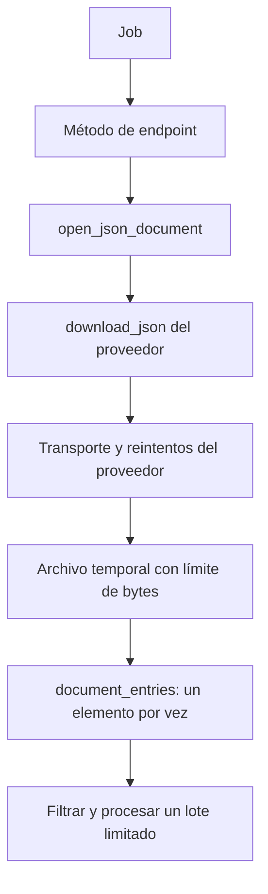

# Documentos JSON grandes: diseño y uso

Los métodos de endpoint expresan qué datos necesita el job. El transporte de
cada proveedor ejecuta HTTP, autentica, aplica esperas y reintenta. La pieza
compartida administra un documento temporal y lo recorre de manera incremental.



## Contratos y responsabilidades

- `request_json` en SofaScore y los métodos `get_*` de OddsPapi devuelven objetos
  Python para los consumidores que necesitan una respuesta materializada.
- `download_json(endpoint, document, params)` escribe una respuesta completa en
  `JsonDocument`, sin decodificar todo el JSON. Devuelve `None` al completar o
  lanza un error. `JsonDownloader` describe este pequeño contrato sin exigir
  herencia, una biblioteca HTTP concreta ni un esquema del proveedor.
- `open_json_document` crea el archivo en `data/runtime`, invoca ese contrato y
  cierra el archivo al salir del contexto, también ante errores.
- `document_entries` produce elementos de una colección específica. Admite un
  arreglo raíz (`""`), un campo o rutas alternativas. Los controles de paginación
  se solicitan expresamente; el parser no conoce nombres de proveedores.

En cada cliente, una sola implementación interna maneja HTTP y los reintentos
para ambos modos de consumo. Esa implementación devuelve una respuesta HTTP;
el método público decide si decodifica o descarga. `request_json` ya no devuelve
un archivo dependiendo de un argumento opcional.

SofaScore usa `content_callback` de `curl_cffi`. Su adaptador convierte un fallo
del escritor en la señal de aborto de libcurl y luego propaga la causa original.
OddsPapi usa `requests` con `stream=True` e `iter_content`; consume el cuerpo
antes de terminar el slot de cooldown y siempre cierra la respuesta y completa
el lease de API key. Los errores HTTP se leen con un límite de 64 KiB y se
decodifican una sola vez para conservar las reglas de credenciales y reintentos.
Las claves no aparecen en los logs.

## Endpoints y procesamiento

Daily discovery usa `open_scheduled_tournaments`, `open_scheduled_events` y
`open_scheduled_odds`. Las rutas quedan en el cliente; el job mantiene la
política de admisión y persistencia. Cada intento HTTP se registra a nivel INFO
con `✈️`, el endpoint y, en SofaScore, el número de intento.

OddsPapi fixture discovery usa `iter_fixtures`, que acepta los mismos parámetros
de consulta que `get_fixtures`. Lee el arreglo raíz o los contenedores históricos
`fixtures`, `data` e `items`. Descarta y cuenta en el log los miembros que no sean
objetos. Un documento malformado o sin una colección reconocida produce un error
en lugar de simular una respuesta vacía. El 404 `FIXTURE_NOT_FOUND` sigue siendo
un resultado vacío válido.

El job filtra, deduplica y entrega grupos de como máximo `chunk_size` fixtures al
procesador existente. Los IDs vistos viven en el SQLite temporal de
`DiscoveryRunStore`, con su caché limitada. No se retienen listas de toda la
respuesta ni un conjunto creciente de IDs en Python. Las métricas p50/p95 se
calculan y registran por lote; el resumen del deporte mantiene solo contadores.

## Límites, fallos y memoria

Los límites existentes en `JobExecutionSettings` se comparten entre proveedores:
128 MiB por respuesta, 2 MiB por elemento/token y profundidad máxima 128 por
defecto. La descarga comprueba el presupuesto de ejecución en cada fragmento;
el parser lo comprueba en cada lectura y elemento entregado. Los fragmentos de transporte y lectura
son de hasta 64 KiB. Estos límites se configuran en
`infrastructure/settings/job_execution.py`.

Cada reintento borra el cuerpo parcial anterior. La descarga completa ocurre
antes del procesamiento del documento; el parseo y la persistencia sí avanzan
por lotes. Si aparece JSON truncado después de confirmar algunos lotes, el
deporte queda fallido y los lotes confirmados se conservan. El reintento usa los
escritores idempotentes existentes. Incluso con `max_fixtures_per_sport`, se
termina de leer el documento actual para detectar un final inválido. Una
deferral de ejecución se propaga al ejecutor en lugar de confundirse con un
error ordinario del proveedor.

La memoria depende del lote, del elemento y de los buffers/cachés limitados. El
tamaño completo de la respuesta y los IDs deduplicados consumen espacio temporal
en disco. El límite de respuesta sigue aplicándose: streaming no permite
descargas sin límite. Los caminos `get_*` que materializan respuestas continúan
disponibles y no ofrecen esta garantía de memoria.

## Verificación reproducible

`scripts/benchmarks/discovery_memory.py` compara lectura materializada con
incremental y deduplicación en disco. Puede usar un JSON de fixtures real como
plantilla, asignando IDs distintos para aumentar el volumen:

```powershell
python scripts/benchmarks/discovery_memory.py --fixture-sample "ruta/al/ejemplo.json" --count 10000 --mode materialized
python scripts/benchmarks/discovery_memory.py --fixture-sample "ruta/al/ejemplo.json" --count 10000 --mode incremental
```

El benchmark mide el componente de lectura y almacenamiento temporal en un
proceso nuevo. No es una estimación de memoria de toda la aplicación ni del
servidor de base de datos. El tiempo reportado incluye el costo de `tracemalloc`;
el objetivo del streaming es acotar memoria, y el parseo incremental y el disco
pueden aumentar el tiempo de CPU frente a la decodificación completa.
