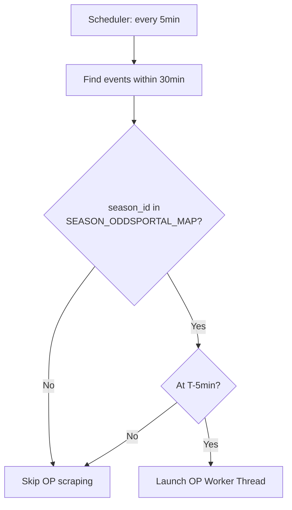
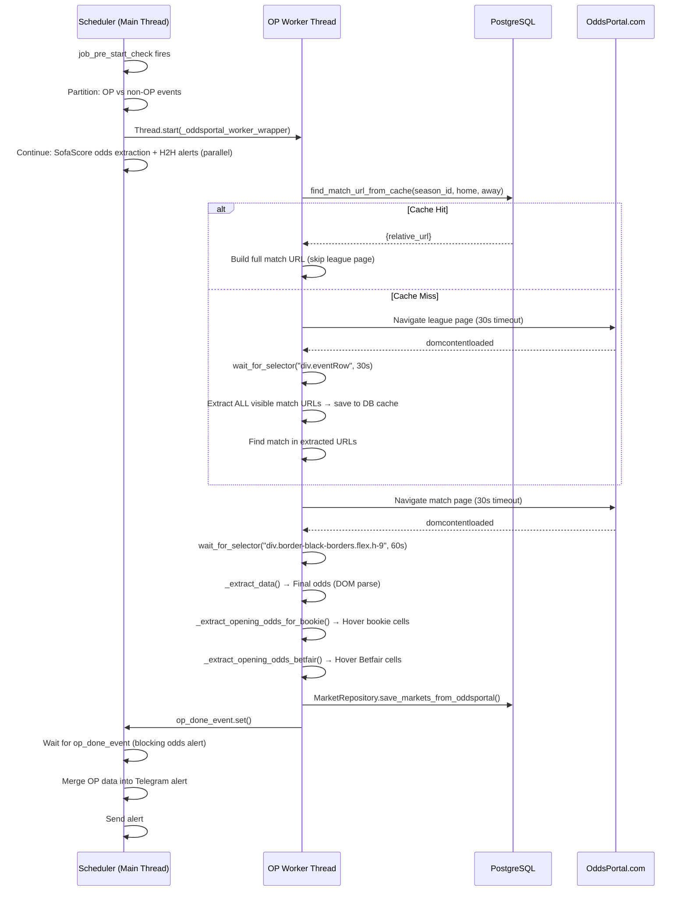
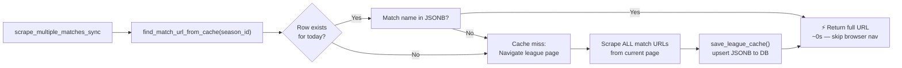
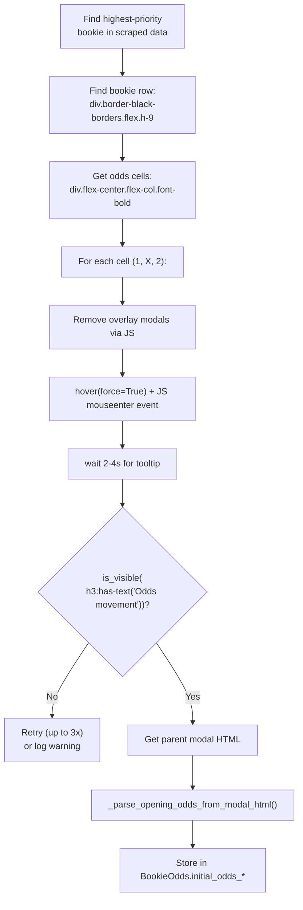

# OddsPortal Scraping — Complete Technical Guide

> **Purpose**: This is the canonical reference for the OddsPortal scraping subsystem. It explains *why* the system exists, *when* it is triggered, *how* it works end-to-end, and *what* to do when things go wrong.

---

## Table of Contents
1. [Why OddsPortal?](#1-why-oddsportal)
2. [Files Involved](#2-files-involved)
3. [Data Structures](#3-data-structures)
4. [What Triggers the Scraper](#4-what-triggers-the-scraper)
5. [Full Operational Flow](#5-full-operational-flow)
6. [League URL Cache](#6-league-url-cache)
7. [Match Page Extraction](#7-match-page-extraction)
8. [Opening Odds via Hover](#8-opening-odds-via-hover)
9. [Configuration Reference](#9-configuration-reference)
10. [Libraries Used](#10-libraries-used)
11. [Testing](#11-testing)
12. [Edge Cases & Troubleshooting](#12-edge-cases--troubleshooting)
13. [Performance Summary](#13-performance-summary)

---

## 1. Why OddsPortal?

Our main data source (SofaScore API) provides final odds, but **does not provide opening/historical odds**. OddsPortal tracks odds changes over time and exposes them through a hover tooltip on their frontend. This allows us to extract the **opening odds** for key bookmakers, which is critical for detecting odds movements and generating high-quality alerts.

We only scrape OddsPortal for **tracked leagues** (configured in `oddsportal_config.py`). It runs exclusively at the **5-minute pre-start mark**.

---

## 2. Files Involved

| File | Role |
|---|---|
| `scheduler.py` | Triggers the scraper via `_run_oddsportal_batch` and `_oddsportal_worker_wrapper` |
| `oddsportal_scraper.py` | Core browser automation and odds extraction logic |
| `oddsportal_config.py` | Maps `season_id` → OddsPortal URL, team aliases, bookie priority |
| `models.py` | Defines `OddsPortalLeagueCache` DB table |
| `repository.py` | `OddsPortalCacheRepository` — save/get/cleanup cache |
| `test_oddsportal_process.py` | Isolation test for a single event |
| `.env` | Must have `PROXY_ENABLED=true` and `PROXY_*` vars |

---

## 3. Data Structures

All structures are defined as Python `@dataclass` in `oddsportal_scraper.py`:

```python
# Per-bookmaker odds
BookieOdds:
  name: str
  odds_1, odds_x, odds_2: str           # Final odds (e.g. "1.85")
  initial_odds_1, initial_odds_x, initial_odds_2: Optional[str]  # Opening odds via hover

# Betfair Exchange (Back and Lay)
BetfairExchangeOdds:
  back_1, back_x, back_2: str           # Final Back odds
  lay_1, lay_x, lay_2: str             # Final Lay odds
  initial_back_1 ... initial_lay_2: Optional[str]  # Opening odds via hover

# Full match output
MatchOddsData:
  home_team, away_team: str
  bookie_odds: List[BookieOdds]
  betfair: Optional[BetfairExchangeOdds]
  extraction_time_ms: float
```

---

## 4. What Triggers the Scraper

The scraper is **not always running**. It only fires when all of the following are true:

1. `job_pre_start_check` runs (every 5 minutes, at exact minute marks).
2. An event is found **within 30 minutes of kickoff**.
3. The event's `season_id` is present in `SEASON_ODDSPORTAL_MAP` (i.e. it's a tracked league).
4. `_should_extract_odds_for_event` returns `True` — this only happens when `minutes_until_start == 5`.



> [!IMPORTANT]
> OddsPortal scraping is now restricted to the 5-minute window to maximise data completeness while conserving resources. SofaScore odds are still extracted at both 30min and 5min.

---

## 5. Full Operational Flow



### Key Design Decisions

- **Worker runs in a background thread**, never the main thread. `scrape_multiple_matches_sync` spins up its own `asyncio` event loop via `loop.run_until_complete()`.
- **Main thread waits** for the worker only once, immediately before sending the odds alert. H2H and dual-process evaluations run concurrently.
- **One browser instance** is reused for all matches in the batch, minimising startup overhead.

---

## 6. League URL Cache

Navigating to a league page costs ~9–14 seconds (even with `domcontentloaded`). To avoid this for every event in the same league, we cache all visible match URLs after the first navigation.

### DB Table: `oddsportal_league_cache`

| Column | Type | Notes |
|---|---|---|
| `season_id` | `INTEGER` (PK) | One row per tracked league |
| `cached_date` | `TIMESTAMP` | Set to midnight of the current day |
| `match_urls` | `JSONB` | `{ "/hockey/usa/nhl/home-away-XXXX/": "Home Team Away Team" }` |
| `created_at` | `TIMESTAMP` | Last write time |

### Cache Hit vs Miss



### Team Name Matching

Both cache lookup and live league scan use the same normalisation + alias strategy:

1. **Normalise**: strip common suffixes (`fc`, `cf`, `ud`), lowercase.
2. **Alias**: check `TEAM_ALIASES` in `oddsportal_config.py` (e.g. `"Manchester United"` → `"Manchester Utd"`).
3. **Substring match**: home AND away names (or their aliases) must both be present in the row's display text.
4. **Slug guard**: URL must contain a hyphen (rejects plain league URLs).

### Daily Cleanup

Every day at **05:01**, `job_daily_discovery` calls:
```python
OddsPortalCacheRepository.cleanup_old_caches()
```
This deletes any rows where `cached_date < today`. The cache resets fresh each day.

---

## 7. Match Page Extraction

After navigating to the match page, `scrape_match()` runs these steps in order:

1. **`domcontentloaded`** — proceeds as soon as HTML is parsed (30s max timeout). It does not wait for ads/JS bundles.
2. **`wait_for_selector("div.border-black-borders.flex.h-9", 60s)`** — waits strictly for the exact class format used when the bookmaker data actually injects into the UI, ensuring it doesn't fire early on skeleton loaders. Max 60 seconds wait.
3. **Cookie/Consent banner dismissal** — tries multiple selectors (`#onetrust-accept-btn-handler`, `button:has-text('I Accept')`, etc.).
4. **`window.scrollTo(0, 500)`** — triggers any lazy-loaded elements.
5. **`_extract_data()`** — JavaScript-based DOM parse for final odds.
6. **`_extract_opening_odds_for_bookie()`** — hover-based for priority bookie.
7. **`_extract_opening_odds_betfair()`** — hover-based for Betfair exchange.

---

## 8. Opening Odds via Hover

OddsPortal does not expose opening odds in the DOM directly. They appear in a **Vue.js tooltip** triggered by mouse hover. We simulate this with Playwright.

### Bookie Opening Odds Flow



### Betfair Hover Flow

Same pattern, but targets the Betfair exchange row and processes **4 cells**: Back 1, Back 2, Lay 1, Lay 2. (X/draw cells are skipped for non-football sports.)

---

## 9. Configuration Reference

### `SEASON_ODDSPORTAL_MAP` (oddsportal_config.py)

Maps SofaScore `season_id` to the OddsPortal URL components.

### `TEAM_ALIASES` (oddsportal_config.py)

Corrects naming mismatches between SofaScore and OddsPortal.

### `PRIORITY_BOOKIES` (oddsportal_config.py)

The scraper iterates this list and uses the **first bookie found** for opening odds extraction.

---

## 10. Libraries Used

| Library | Purpose |
|---|---|
| `playwright` (async) | Headless Chromium browser automation |
| `asyncio` | Async/await framework for browser operations |
| `threading` | OP worker runs in a background thread |
| `SQLAlchemy` | ORM for database operations |
| `python-dotenv` | Load `.env` variables |

---

## Technical Extraction Details

### DOM Selectors & Elements

The scraper targets specific elements within the OddsPortal React/Vue-based frontend. Since selectors can change, we use a mix of semantic classes and data attributes:

- **League Page**:
  - `div.eventRow`: The container for a single match row.
  - `a[href]`: Links within the row, used to extract match slugs.
- **Match Page (Bookies)**:
  - `div.border-black-borders.flex.h-9`: The standard desktop row for bookmakers.
  - `img[alt]`: The bookmaker's logo (used to identify the bookie).
  - `a[title]`: The bookmaker's link title (fallback for identification).
- **Match Page (Odds Cells)**:
  - `div.flex-center.flex-col.font-bold`: The inner container of an odds cell that triggers the tooltip.
  - `div[data-testid='odd-container']`: The standard test ID for odds containers.
- **Betfair Exchange**:
  - `div[data-testid='betting-exchanges-section']`: The specific section for exchange markets.
- **Tooltips (Hover)**:
  - `h3:has-text('Odds movement')`: The header identifying the active tooltip modal.
  - `div.font-bold`: Within the modal, we look for this tag to extract the "Opening odds" value.

### Data Points Extracted

1.  **Current Odds**: Scraped directly from the text content of the odds cells on page load.
2.  **Opening Odds**: Extracted by simulating a hover event on each odds cell, waiting for the "Odds movement" tooltip, and parsing the historical start price.
3.  **Trend**: Calculated by comparing the opening odds vs. current odds.
4.  **Betfair Depth**: Extracts both **Back** and **Lay** prices to visualize the exchange gap.

### Database Integration

Data is mapped from the `MatchOddsData` dataclass into the SQLAlchemy models via `MarketRepository`:

- **`Market` table**: 
  - `market_name`: "Full time"
  - `market_group`: "1X2"
  - `choice_group`: `None` (Standard), "Back" or "Lay" (Betfair).
- **`MarketChoice` table**:
  - `choice_name`: "1", "X", or "2".
  - `initial_odds`: Populated with the **Opening Odds** from the tooltip.
  - `current_odds`: Populated with the **Current Odds** visible on the row.
  - `change`: Integer flag (`1` for rise, `-1` for drop).

### Usage in Alerts

The extracted data is consumed by `odds_alert.py` to enrich Telegram notifications:

- **Logic**: When an event alert is generated, the system checks if OddsPortal data exists in the DB for that `event_id`.
- **Display**: A dedicated `📊 ODDSPORTAL ODDS` section is appended to the message.
- **Format**: `Bookie: Opening → Current [Trend]`.
- **Purpose**: Provides immediate visual context on how the market has moved since opening, helping users spot value or dropping odds before kickoff.

---

## 11. Testing

### Isolation Test: `test_oddsportal_process.py`

```bash
python test_oddsportal_process.py <EVENT_ID>
```

Saves full debug info (screenshots, HTML, JSON) to `debug_<slug>/`.

---

## 12. Edge Cases & Troubleshooting

- **Proxy not active**: Ensure `.env` is correct.
- **Team alias missing**: Add to `TEAM_ALIASES`.
- **Navigation Timeout**: Increase timeout in `oddsportal_scraper.py`.

---

## 13. Performance Summary

- **Cache hit**: ~50s total (skips ~14s league nav).
- **Cache miss**: ~65s total.
