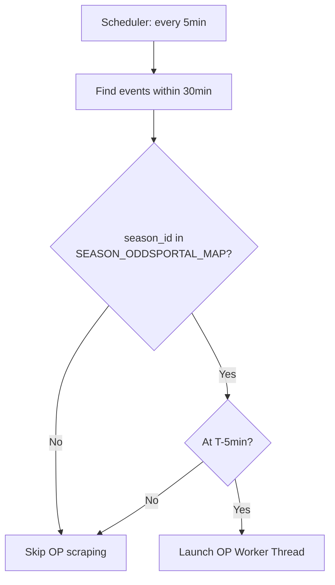
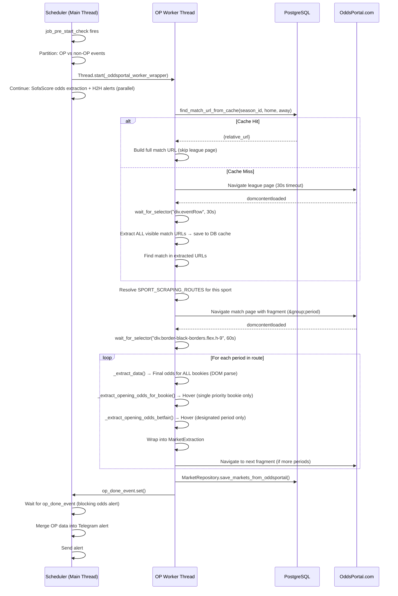
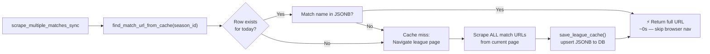
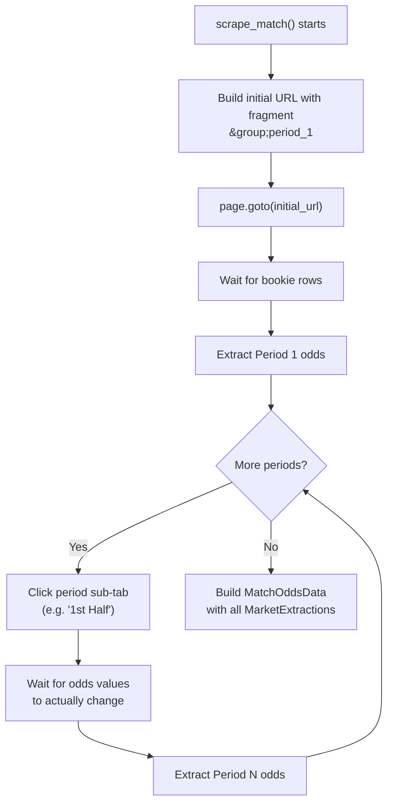
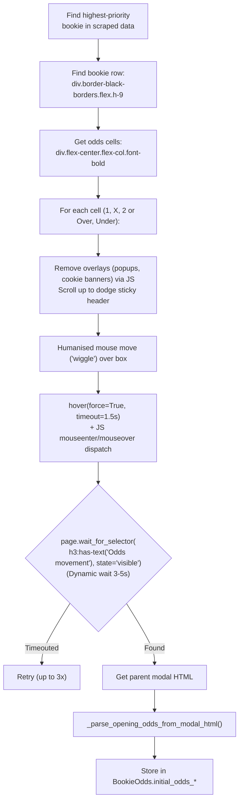

# OddsPortal Scraping — Complete Technical Guide

> **Purpose**: This is the canonical reference for the OddsPortal scraping subsystem. It explains *why* the system exists, *when* it is triggered, *how* it works end-to-end, and *what* to do when things go wrong.

---

## Table of Contents
1. [Why OddsPortal?](#1-why-oddsportal)
2. [Files Involved](#2-files-involved)
3. [Data Structures](#3-data-structures)
4. [What Triggers the Scraper](#4-what-triggers-the-scraper)
5. [Full Operational Flow](#5-full-operational-flow)
6. [League URL Cache](#6-league-url-cache)
7. [Match Page Extraction](#7-match-page-extraction)
8. [Sport-Specific Scraping Routes](#8-sport-specific-scraping-routes)
9. [Fragment Navigation](#9-fragment-navigation)
10. [Opening Odds via Hover](#10-opening-odds-via-hover)
11. [Configuration Reference](#11-configuration-reference)
12. [Libraries Used](#12-libraries-used)
13. [Testing](#13-testing)
14. [Edge Cases & Troubleshooting](#14-edge-cases--troubleshooting)
15. [Performance Summary](#15-performance-summary)

---

## 1. Why OddsPortal?

Our main data source (SofaScore API) provides opening and final odds, but we need odds from **more bookies**. OddsPortal tracks odds changes over time and exposes them through a hover tooltip on their frontend. This allows us to extract the **opening odds** for key bookmakers, which is critical for detecting odds movements and generating high-quality alerts. We store the **final odds for all available bookmakers** on the page, but only perform hovers for the top-priority ones to conserve time.

We only scrape OddsPortal for **tracked leagues** (configured in `oddsportal_config.py`). It runs exclusively at the **5-minute pre-start mark**.

---

## 2. Files Involved

| File | Role |
|---|---|
| `scheduler.py` | Triggers the scraper via `_run_oddsportal_batch` and `_oddsportal_worker_wrapper` |
| `oddsportal_scraper.py` | Core browser automation and odds extraction logic |
| `oddsportal_config.py` | Maps `season_id` → OddsPortal URL, team aliases, bookie priority, **sport scraping routes** |
| `models.py` | Defines `OddsPortalLeagueCache` DB table |
| `repository.py` | `MarketRepository.save_markets_from_oddsportal()` — saves per-period data with correct metadata |
| `test_oddsportal_process.py` | Isolation test for a single event |
| `.env` | Must have `PROXY_ENABLED=true` and `PROXY_*` vars |

---

## 3. Data Structures

All structures are defined as Python `@dataclass` in `oddsportal_scraper.py`:

```python
# Per-bookmaker odds
BookieOdds:
  name: str
  odds_1, odds_x, odds_2: str           # Final odds (e.g. "1.85")
  initial_odds_1, initial_odds_x, initial_odds_2: Optional[str]  # Opening odds via hover

# Betfair Exchange (Back and Lay)
BetfairExchangeOdds:
  back_1, back_x, back_2: str           # Final Back odds
  lay_1, lay_x, lay_2: str             # Final Lay odds
  initial_back_1 ... initial_lay_2: Optional[str]  # Opening odds via hover

# One period's extraction (e.g. Full-time 1X2, or 1st Half 1X2)
MarketExtraction:
  market_group: str    # DB value, e.g. "1X2", "Home/Away"
  market_period: str   # DB value, e.g. "Full-time", "1st half"
  market_name: str     # DB value, e.g. "Full time", "1st half"
  bookie_odds: List[BookieOdds]
  betfair: Optional[BetfairExchangeOdds]

# Full match output — wraps multiple period extractions
MatchOddsData:
  home_team, away_team: str
  sport: str
  extractions: List[MarketExtraction]   # One per scraped period
  extraction_time_ms: float
  bookie_odds: List[BookieOdds]          # Legacy compat: = extractions[0].bookie_odds
  betfair: Optional[BetfairExchangeOdds] # Legacy compat: = extractions[0].betfair
```

---

## 4. What Triggers the Scraper

The scraper is **not always running**. It only fires when all of the following are true:

1. `job_pre_start_check` runs (every 5 minutes, at exact minute marks).
2. An event is found **within 30 minutes of kickoff**.
3. The event's `season_id` is present in `SEASON_ODDSPORTAL_MAP` (i.e. it's a tracked league).
4. `_should_extract_odds_for_event` returns `True` — this only happens when `minutes_until_start == 5`.



> [!IMPORTANT]
> OddsPortal scraping is now restricted to the 5-minute window to maximise data completeness while conserving resources. SofaScore odds are still extracted at both 30min and 5min.

---

## 5. Full Operational Flow



### Key Design Decisions

- **Worker runs in a background thread**, never the main thread. `scrape_multiple_matches_sync` spins up its own `asyncio` event loop via `loop.run_until_complete()`.
- **Main thread waits** for the worker only once, immediately before sending the odds alert. H2H and dual-process evaluations run concurrently.
- **One browser instance** is reused for all matches in the batch, minimising startup overhead.

---

## 6. League URL Cache

Navigating to a league page costs ~9–14 seconds (even with `domcontentloaded`). To avoid this for every event in the same league, we cache all visible match URLs after the first navigation.

### DB Table: `oddsportal_league_cache`

| Column | Type | Notes |
|---|---|---|
| `season_id` | `INTEGER` (PK) | One row per tracked league |
| `cached_date` | `TIMESTAMP` | Set to midnight of the current day |
| `match_urls` | `JSONB` | `{ "/hockey/usa/nhl/home-away-XXXX/": "Home Team Away Team" }` |
| `created_at` | `TIMESTAMP` | Last write time |

### Cache Hit vs Miss



### Team Name Matching

Both cache lookup and live league scan use the same normalisation + alias strategy:

1. **Normalise**: Uses `_normalize_match_text` to strip accents, common noise (`fc`, `cf`, `ud`, etc.), and all non-alphanumeric characters while collapsing whitespace.
2. **Alias**: Check `TEAM_ALIASES` in `oddsportal_config.py` (e.g. `"Manchester United"` → `"Manchester Utd"`).
3. **Substring match**: Home AND away names (or their aliases) must both be present in the row's normalized display text.
4. **Path Depth Guard**: URL must have at least **4 path segments** (e.g., `/football/england/premier-league/wolves-liverpool-WAZj1LUs/`). This ensures league-level URLs and navigation links are filtered out during both population and retrieval.
5. **League URL Guard**: Explicitly rejects any URL that matches the current base league path.

### Daily Cleanup

Every day at **05:01**, `job_daily_discovery` calls:
```python
OddsPortalCacheRepository.cleanup_old_caches()
```
This deletes any rows where `cached_date < today`. The cache resets fresh each day.

---

## 7. Match Page Extraction

After navigating to the match page, `scrape_match()` runs these steps in order:

1. **`domcontentloaded`** — proceeds as soon as HTML is parsed (30s max timeout). It does not wait for ads/JS bundles.
2. **`wait_for_selector("div.border-black-borders.flex.h-9", 60s)`** — waits strictly for the exact class format used when the bookmaker data actually injects into the UI, ensuring it doesn't fire early on skeleton loaders. Max 60 seconds wait.
3. **Cookie/Consent banner dismissal** — tries multiple selectors (`#onetrust-accept-btn-handler`, `button:has-text('I Accept')`, etc.).
4. **`window.scrollTo(0, 500)`** — triggers any lazy-loaded elements.
5. **Multi-period extraction loop** — iterates through configured periods via fragment navigation.

> [!NOTE]
> If a timeout occurs during `wait_for_selector`, the scraper automatically captures a screenshot and the HTML source to the specified `debug_dir` for investigation.

---

## 8. Sport-Specific Scraping Routes

Each sport has a configured **scraping route** in `SPORT_SCRAPING_ROUTES` (`oddsportal_config.py`). The route defines a **`groups`** list, where each group specifies:

- **`group_key`**: Which OP_GROUPS key to use, mapping to the tab text (e.g. `"1X2"` for football, `"OVER_UNDER"`)
- **`periods`**: A list of `(period_key, db_market_period, db_market_name)` tuples to scrape *within* this group
- **`db_market_group`**: The DB column value (e.g. `"1X2"`, `"Home/Away"`, `"Over/Under"`)
- **`has_draw`**: Whether the group features a draw/X column
- **`betfair_period_index`**: Which period index gets Betfair hover extraction (usually `0` for the first period of the main group, `None` otherwise)
- **`extract_fn`**: Which extraction function string identifier to dispatch to (e.g. `"standard"`, `"over_under"`)

### Example Routes

| Sport | Groups | Periods | Draw? | Extract Fn |
|---|---|---|---|---|
| Football | 1X2 <br> Over/Under | • Full Time, 1st Half <br> • Full Time | ✅ <br> ❌ | standard <br> over_under |
| Basketball | Home/Away | • Full Time (inc. OT) | ❌ | standard |
| Hockey | Home/Away | • Full Time (inc. OT) | ✅ | standard |
| American Football | Home/Away | • Full Time (inc. OT), 1st Half | ❌ | standard |

### Route Fallback

If `sport` is `None` or not found in `SPORT_SCRAPING_ROUTES`, the scraper falls back to **legacy mode**: a single extraction with no fragment navigation, hardcoded to `1X2 / Full-time`.

---

## 9. Fragment Navigation

OddsPortal uses **URL fragment identifiers** to switch between market groups and periods on a match page without a full page reload.

### URL Format

```
https://www.oddsportal.com/football/.../match-slug/#1X2;2
                                                    ^^^^  ^
                                                    group  period
```

### Fragment Stripping

The scraper handles URL fragments robustly. Before navigation, any existing fragment (or trailing slash) is stripped from the base URL before appending the desired market group and period identifier. This prevents malformed URLs (e.g. `.../#.../#...`) if the input contains stale cache data.

### Fragment Constants

Defined in `oddsportal_config.py`:

```python
OP_GROUPS = {
    "1X2": "1X2",
    "HOME_AWAY": "home-away",
    "OVER_UNDER": "over-under",
    "ASIAN_HANDICAP": "ah"
}

OP_PERIODS = {
    "FT_INC_OT": 1,    # Full Time including Overtime
    "FULL_TIME": 2,     # Full Time (regulation only)
    "1ST_HALF": 3,      # 1st Half
    "2ND_HALF": 4,      # 2nd Half
    "1ST_PERIOD": 5,    # 1st Period (hockey)
    "2ND_PERIOD": 6,    # 2nd Period (hockey)
    "3RD_PERIOD": 7,    # 3rd Period (hockey)
    "1ST_QUARTER": 8,   # 1st Quarter (NBA)
    "2ND_QUARTER": 9,   # 2nd Quarter (NBA)
    "3RD_QUARTER": 10,  # 3rd Quarter (NBA)
    "4TH_QUARTER": 11,  # 4rd Quarter (NBA)
}
```

### Navigation Flow



The first period is loaded with the initial `page.goto()`. Subsequent groups and periods are loaded by **clicking the tabs directly in the UI**:
- **Market Groups** (`"1X2"`, `"Over/Under"`): Clicked via the `ul.visible-links.odds-tabs li` tabs.
- **Periods** (`"1st Half"`, `"Full Time"`): Clicked via the sub-tabs within `data-testid="kickoff-events-nav"`.

The scraper snapshots a reference odds value (either a standard odds cell or an O/U cell) before clicking and waits (up to 10s) for the value to change, ensuring the SPA has finished re-rendering.

> [!IMPORTANT]
> OddsPortal is a Vue.js SPA. Using `page.goto()` with a fragment URL (`#group;period`) performs a full page reload but the SPA may re-render with its default state before processing the hash. Clicking the tab directly triggers the SPA's internal router, which reliably updates the odds table.

---

## 9b. Match Page HTML Structure (event-container)

The main container on a match page is `event-container`. It does **not** change when the fragment changes — only its child elements update.

### Structure Overview

```text
event-container (stable parent)
├── flex flex-col (tabs section — does NOT change between fragments)
│   ├── div.mt-3.flex.gap-2.bg-gray-light (Pre-match vs In-Play selector ⬅ ONLY APPEARS IF EVENT STARTED)
│   │   └── div[data-testid="kickoff-events-nav"]
│   │       ├── a (e.g. "Pre-match Odds")
│   │       └── a (e.g. "In-Play Odds")
│   │
│   ├── hide-menu (mobile market group tabs, e.g. "1X2", "Over/Under")
│   ├── tabs (desktop market group tabs)
│   │   └── ul.visible-links.odds-tabs (clickable market group tabs)
│   │       ├── li[data-testid="navigation-active-tab"] (e.g. "1X2")
│   │       └── li[data-testid="navigation-inactive-tab"] (e.g. "Over/Under")
│   │
│   ├── div[data-testid="bookies-filter-nav"] (All/Classic/Crypto filter)
│   │
│   └── div.mt-2.flex.w-auto.gap-2 (period sub-tabs ⬅ KEY FOR PERIOD NAVIGATION)
│       └── div[data-testid="kickoff-events-nav"]
│           ├── div[data-testid="sub-nav-active-tab"] (e.g. "Full Time")
│           └── div[data-testid="sub-nav-inactive-tab"] (e.g. "1st Half")
│
├── min-md:px-[10px] (odds table + betfair section)
│
│   =============================================================================
│   [SUPPORTED MARKET GROUPS: 1X2, Home/Away]
│   These have the standard row/column structure for match winner outcomes.
│   -----------------------------------------------------------------------------
│   ├── <unnamed div> (odds table)
│   │   ├── div[data-testid="bookmaker-table-header-line"] (column headers)
│   │   └── div.border-black-borders.flex.h-9 × N (one row per bookie)
│   │       ├── bookie info (logo img[alt], name a[title])
│   │       ├── div.odds-cell[data-testid="odd-container"] × [2 or 3] (odds values)
│   │       └── div[data-testid="payout-container"] (payout %)
│   │
│   └── div[data-testid="betting-exchanges-section"] (Betfair — not always present)
│       └── div[data-testid="odd-container"] (Back/Lay odds containers)
│
│   =============================================================================
│   [SUPPORTED MARKET GROUPS: Over/Under]
│   These have a different HTML structure with collapsed rows containing accordion data
│   for various lines (e.g. 2.5, 3.5). The scraper calculates the absolute difference
│   between Over and Under for each row to pick the closest to 50/50 probability,
│   then clicks that row to expand it, revealing bookmaker odds for that specific line.
│   │
│   ├── div[data-testid="over-under-collapsed-row"] (clickable line row e.g. "Total +2.5")
│   │   ├── p (Over odds)
│   │   └── p (Under odds)
│   │
│   └── div[data-testid="bookmaker-table-header-line"] (revealed upon click)
│       └── div.border-black-borders.flex.h-9 × N (one row per bookie)
│           ├── bookie info
│           ├── div.odds-cell (Over)
│           ├── div.odds-cell (Under)
│           └── payout %
│
│   =============================================================================
│   [SUPPORTED MARKET GROUPS: Asian Handicap]
│   Follows the same accordion expansion logic and HTML test IDs as Over/Under.
│   The main difference is the text labels (AH / Asian Handicap) and the columns (1, 2).
│   =============================================================================
```

### Key Selectors Reference (found in every market group and period)

| Element | Selector | Notes |
|---|---|---|
| **Market group tabs** | `ul.visible-links.odds-tabs li` | "1X2", "Over/Under", etc. |
| **Active market group** | `li[data-testid="navigation-active-tab"]` | Has `active-odds` class |
| **Period sub-tabs wrapper** | `div[data-testid="kickoff-events-nav"]` | Multiple can exist! (e.g., Pre-match/In-play vs periods). Scraper must iterate through all to find the period. |
| **Active period tab** | `div[data-testid="sub-nav-active-tab"]` | Currently selected period |
| **Inactive period tab** | `div[data-testid="sub-nav-inactive-tab"]` | Clickable to switch period |

### Odds table values and structure change between market groups, market periods only change odds values.
> Scraper must change scraping method to handle the changing structure between market_groups when dealing with bookie rows, bookie names, odds cells, odds value links and pay out

| Element | Selector | Notes |
|---|---|---|
| **Bookie row** | `div.border-black-borders.flex.h-9` | One row per bookmaker |
| **Bookie name** | `a[title]` or `img[alt]` inside bookie row | Used for identification |
| **Odds cell** | `div.odds-cell[data-testid="odd-container"]` | Contains the odds value |
| **Odds value link** | `a.odds-link` inside odds cell | The numeric odds text |
| **Payout** | `div[data-testid="payout-container"]` | e.g. "94.7%" |

### Betfair section ###
> Betfair Section appears just once per match. It usually is avaiable in the primary route set in the scraping routes

| Element | Selector | Notes |
|---|---|---|
| **Betfair section** | `div[data-testid="betting-exchanges-section"]` | Exchange odds |
| **Table header** | `div[data-testid="bookmaker-table-header-line"]` | Column labels |

### Behavior When Switching

| Action | Table Structure | Odds Values | Selectors |
|---|---|---|---|
| **Switch period** (same group) | ❌ No change | ✅ Values change | ❌ Same selectors |
| **Switch market group** | ✅ Structure changes | ✅ Values change | ⚠️ May change |

### Reference HTML Files

These files contain isolated sections of the match page for reference:
- `event-container.html` — full event-container parent
- `market_groups_and_periods_section.html` — tabs section (groups + periods)
- `odds_betfair_and_extra.html` — odds table + betfair section

---

## 10. Opening Odds via Hover

OddsPortal does not expose opening odds in the DOM directly. They appear in a **Vue.js tooltip** triggered by mouse hover. We simulate this with Playwright.

> [!IMPORTANT]
> To maintain performance, we **store all bookies' final odds** directly from the DOM, but we only **hover over a single bookie** (the highest priority available) and **Betfair Exchange** (if available) per period. Opening odds for all other bookies remain `null`.

### Hover Mechanics & Optimizations

Because OddsPortal relies on Vue.js to dynamically attach the tooltip to the DOM, naïve hover attempts fail ~10% of the time due to race conditions or UI overlaps. We mitigate this through three specific mechanisms:

1. **Scroll-and-Bump**: Playwright's `scroll_into_view_if_needed()` often aligns cells beneath OddsPortal's sticky top header. We immediately follow it with `window.scrollBy(0, -150)` to bump the page down and guarantee visibility.
2. **Humanized Mouse Wiggle**: Rather than instantly teleporting the cursor to the dead-center of the element, the cursor is moved just outside the element's bounding box and then pulled inside. This reliably triggers DOM `mouseenter` repaints.
3. **Dynamic Wait Polling**: Instead of hard-sleeping for 3-4 seconds per cell, the scraper dynamically polls for `h3:has-text('Odds movement')` with `state="visible"`. If the tooltip renders in 100ms, extraction proceeds immediately, saving vast amounts of time per match.

### Bookie Opening Odds Flow



### Over/Under Specifics

Over/Under market groups require a separate extraction method (`_extract_data_over_under`) due to their unique HTML structure.

1. **Calculate the closest margin**: The DOM lists all available lines (e.g. +1.5, +2.5, +3). The script parses all `data-testid="over-under-collapsed-row"` elements, extracting the `Over` and `Under` probabilities for each.
2. **Click to Expand**: The row with the minimum absolute difference `abs(Over - Under)` is selected (closest to 50/50) and clicked.
3. **Wait for DOM**: The scraper waits for `div[data-testid="bookmaker-table-header-line"]` to appear under the clicked row.
4. **Extract & Save**: Only the visible bookmaker rows within that expanded block are extracted. The handicap (e.g. "2.5") is saved in the database as the `choice_group`, and the odds are categorized as "Over" and "Under" in `choice_name`.

### Betfair Hover Flow

Same pattern, but targets the Betfair exchange row and processes **4 cells**: Back 1, Back 2, Lay 1, Lay 2. (X/draw cells are skipped for non-football sports.) Betfair hover only runs on the **designated period** (controlled by `betfair_period_index` in the route config).

---

## 11. Configuration Reference

### `SEASON_ODDSPORTAL_MAP` (oddsportal_config.py)

Maps SofaScore `season_id` to the OddsPortal URL components. Each entry now includes a `sport` key used to resolve the scraping route.

### `SPORT_SCRAPING_ROUTES` (oddsportal_config.py)

Maps each sport string to its scraping configuration (group, periods, draw flag, Betfair index). See [Section 8](#8-sport-specific-scraping-routes).

### `OP_GROUPS` / `OP_PERIODS` (oddsportal_config.py)

Fragment identifier constants used in URL construction for navigating between market groups and periods.

### `TEAM_ALIASES` (oddsportal_config.py)

Corrects naming mismatches between SofaScore and OddsPortal.

### `PRIORITY_BOOKIES` (oddsportal_config.py)

The scraper iterates this list and uses the **first bookie found** for opening odds extraction.

---

## 12. Libraries Used

| Library | Purpose |
|---|---|
| `playwright` (async) | Headless Chromium browser automation |
| `asyncio` | Async/await framework for browser operations |
| `threading` | OP worker runs in a background thread |
| `SQLAlchemy` | ORM for database operations |
| `python-dotenv` | Load `.env` variables |

### Browser & Anti-Detection

The scraper implement several measures to avoid detection, especially when running in **headless mode** (standard for scheduler jobs):
- **User-Agent Rotation**: Randomized choosing from modern, legitimate browser strings.
- **Deep Property Mocking**: Overwrites `navigator.webdriver` and mocks `navigator.platform` (set to `Win32`) and `window.chrome` to mimic a real visitor.
- **Stealth Scripts**: Injects standard evasions for permissions, languages, and plugins.

---

## Technical Extraction Details

### DOM Selectors & Elements

The scraper targets specific elements within the OddsPortal React/Vue-based frontend. Since selectors can change, we use a mix of semantic classes and data attributes:

- **League Page**:
  - `div.eventRow`: The container for a single match row.
  - `a[href]`: Links within the row, used to extract match slugs.
- **Match Page (Bookies)**:
  - `div.border-black-borders.flex.h-9`: The standard desktop row for bookmakers.
  - `img[alt]`: The bookmaker's logo (used to identify the bookie).
  - `a[title]`: The bookmaker's link title (fallback for identification).
- **Match Page (Odds Cells)**:
  - `div.flex-center.flex-col.font-bold`: The inner container of an odds cell that triggers the tooltip.
  - `div[data-testid='odd-container']`: The standard test ID for odds containers.
- **Betfair Exchange**:
  - `div[data-testid='betting-exchanges-section']`: The specific section for exchange markets.
- **Tooltips (Hover)**:
  - `h3:has-text('Odds movement')`: The header identifying the active tooltip modal.
  - `div.font-bold`: Within the modal, we look for this tag to extract the "Opening odds" value.

### Data Points Extracted

1.  **Current Odds**: Scraped directly from the text content of the odds cells for **all available bookmakers** on page load.
2.  **Opening Odds**: Extracted by simulating a hover event on the cells of the **top-priority bookie** (and Betfair), waiting for the "Odds movement" tooltip, and parsing the historical start price. All other bookies have this value set to `null`.
3.  **Trend**: Calculated by comparing the opening odds vs. current odds.
4.  **Betfair Depth**: Extracts both **Back** and **Lay** prices to visualize the exchange gap.

### Database Integration

Data is mapped from the `MatchOddsData` (via its `extractions` list) dataclass into the SQLAlchemy models via `MarketRepository.save_markets_from_oddsportal()`:

- **`Market` table**: 
  - `market_name`: From `MarketExtraction.market_name` (e.g. "Full time", "1st half")
  - `market_group`: From `MarketExtraction.market_group` (e.g. "1X2", "Home/Away")
  - `market_period`: From `MarketExtraction.market_period` (e.g. "Full-time", "1st half")
  - `choice_group`: `None` (Standard), "Back" or "Lay" (Betfair).
- **`MarketChoice` table**:
  - `choice_name`: "1", "X", or "2".
  - `initial_odds`: Populated with the **Opening Odds** from the tooltip.
  - `current_odds`: Populated with the **Current Odds** visible on the row.
  - `change`: Integer flag (`1` for rise, `-1` for drop).

### Usage in Alerts

The extracted data is consumed by `odds_alert.py` to enrich Telegram notifications:

- **Logic**: When an event alert is generated, the system checks if OddsPortal data exists in the DB for that `event_id`.
- **Display**: A dedicated `📊 ODDSPORTAL ODDS` section is appended to the message.
- **Format**: `Bookie: Opening → Current [Trend]`.
- **Purpose**: Provides immediate visual context on how the market has moved since opening, helping users spot value or dropping odds before kickoff.

---

## 13. Testing

### Isolation Test: `test_oddsportal_process.py`

```bash
python test_oddsportal_process.py <EVENT_ID>
```

Saves full debug info (screenshots, HTML, JSON) to `debug_<slug>/`. The JSON output now includes per-period extraction data:

```json
{
    "home_team": "...",
    "away_team": "...",
    "sport": "football",
    "extractions": [
        {
            "market_group": "1X2",
            "market_period": "Full-time",
            "market_name": "Full time",
            "bookies": [...],
            "betfair": {...}
        }
    ]
}
```

---

## 14. Edge Cases & Troubleshooting

- **Proxy not active**: Ensure `.env` is correct.
- **Team alias missing**: Add to `TEAM_ALIASES`.
- **Fragment not loading**: If a period's fragment yield no bookie rows within 30s, that period is skipped.
- **Headless Timeout**: If the scraper times out in headless mode, check the `oddsportal_debug/` folder for `match_load_failure.png` to see if a security check or "Access Denied" page was served.

---

## 15. Performance Summary

- **Cache hit, single period**: ~50s total (skips ~14s league nav).
- **Cache miss, single period**: ~65s total.
- **Multi-period (e.g. 3 periods)**: Add ~15–25s per additional period (fragment nav + extraction + hover).
