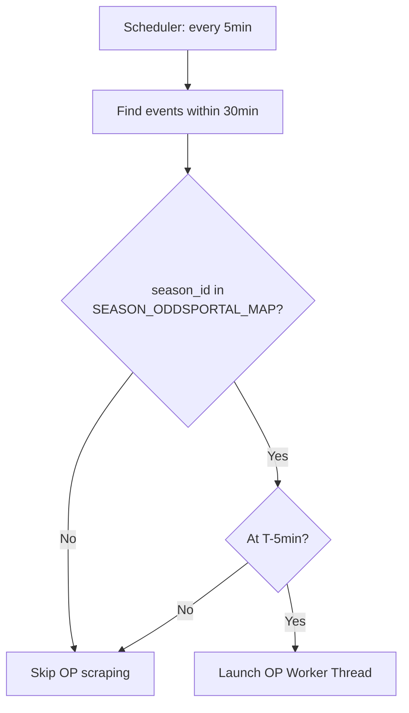
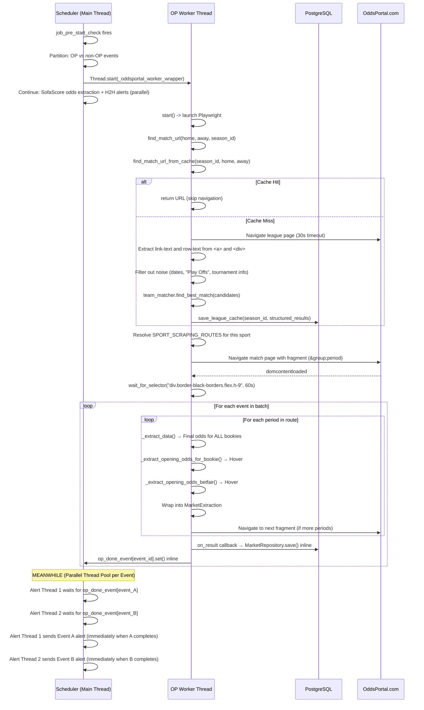
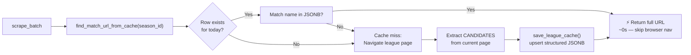
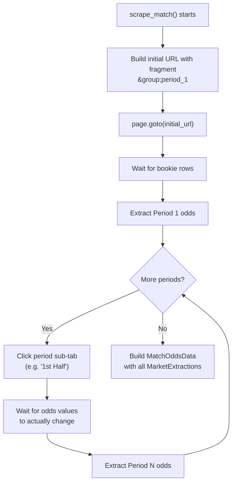
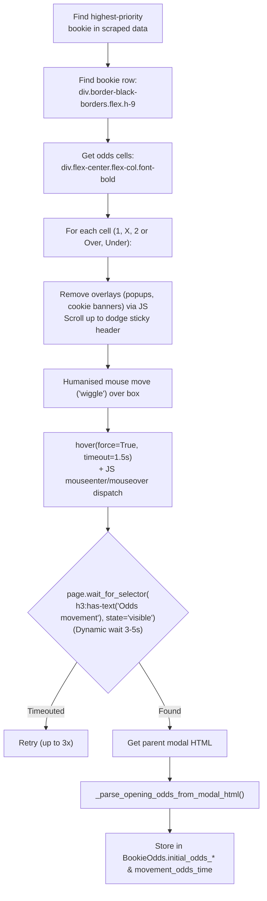

# OddsPortal Scraping — Complete Technical Guide

> **Purpose**: This is the canonical reference for the OddsPortal scraping subsystem. It explains *why* the system exists, *when* it is triggered, *how* it works end-to-end, and *what* to do when things go wrong.

---

## Table of Contents
1. [Why OddsPortal?](#1-why-oddsportal)
2. [Files Involved](#2-files-involved)
3. [Data Structures](#3-data-structures)
4. [What Triggers the Scraper](#4-what-triggers-the-scraper)
5. [Full Operational Flow](#5-full-operational-flow)
6. [League URL Cache](#6-league-url-cache)
7. [Match Page Extraction](#7-match-page-extraction)
8. [Sport-Specific Scraping Routes](#8-sport-specific-scraping-routes)
9. [Fragment Navigation](#9-fragment-navigation)
10. [Opening Odds via Hover](#10-opening-odds-via-hover)
11. [Concurrency & Parallelism](#11-concurrency--parallelism)
12. [Dedicated Logging](#12-dedicated-logging)
13. [Configuration Reference](#13-configuration-reference)
14. [Libraries Used](#14-libraries-used)
15. [Testing](#15-testing)
16. [Edge Cases & Troubleshooting](#16-edge-cases--troubleshooting)
17. [Performance Summary](#17-performance-summary)

---

## 1. Why OddsPortal?

Our main data source (SofaScore API) provides opening and final odds, but we need odds from **more bookies**. OddsPortal tracks odds changes over time and exposes them through a hover tooltip on their frontend. This allows us to extract the **opening odds** for key bookmakers, which is critical for detecting odds movements and generating high-quality alerts. We store the **final odds for all available bookmakers** on the page, but only perform hovers for the top-priority ones to conserve time.

We only scrape OddsPortal for **tracked leagues** (configured in `oddsportal_config.py`). It runs exclusively at the **5-minute pre-start mark**.

---

## 2. Files Involved

| File | Role |
|---|---|
| `scheduler.py` | Triggers the scraper via `_run_oddsportal_batch` and `_oddsportal_worker_wrapper` |
| `oddsportal_scraper.py` | Core browser automation and odds extraction logic |
| `team_matcher.py` | **Entity Resolution Engine**: Robust normalization and scoring (Jaccard, Aliases, etc.) |
| `oddsportal_config.py` | Maps `season_id` → OddsPortal URL, team aliases, bookie priority, **sport scraping routes** |
| `models.py` | Defines `OddsPortalLeagueCache` DB table |
| `repository.py` | `MarketRepository.save_markets_from_oddsportal()` — saves per-period data with correct metadata |
| `tests/test_oddsportal_scheduler_sim.py` | **Scheduler Simulation & Parallel Test**: Replicates the full scheduler flow, including parallel scraping and caching |
| `.env` | Must have `PROXY_ENABLED=true` and concurrency toggles (`ODDSPORTAL_PARALLEL_BROWSERS`) |
| `logs/oddsportal/` | Dedicated directory for OddsPortal-only logs, mirrored by month/week |

---

## 3. Data Structures

All structures are defined as Python `@dataclass` in `oddsportal_scraper.py`:

```python
# Per-bookmaker odds
BookieOdds:
  name: str
  odds_1, odds_x, odds_2: str           # Final odds (e.g. "1.85")
  initial_odds_1, initial_odds_x, initial_odds_2: Optional[str]  # Opening odds via hover
  movement_odds_time: Optional[str]     # Timestamp of the odds movement (extracted from hover)

# Betfair Exchange (Back and Lay)
BetfairExchangeOdds:
  back_1, back_x, back_2: str           # Final Back odds
  lay_1, lay_x, lay_2: str             # Final Lay odds
  initial_back_1 ... initial_lay_2: Optional[str]  # Opening odds via hover
  movement_odds_time: Optional[str]     # Timestamp of the odds movement (extracted from hover)

# One period's extraction (e.g. Full-time 1X2, or 1st Half 1X2)
MarketExtraction:
  market_group: str    # DB value, e.g. "1X2", "Home/Away"
  market_period: str   # DB value, e.g. "Full-time", "1st half"
  market_name: str     # DB value, e.g. "Full time", "1st half"
  bookie_odds: List[BookieOdds]
  betfair: Optional[BetfairExchangeOdds]

# Full match output — wraps multiple period extractions
MatchOddsData:
  home_team, away_team: str
  sport: str
  extractions: List[MarketExtraction]   # One per scraped period
  extraction_time_ms: float
  bookie_odds: List[BookieOdds]          # Legacy compat: = extractions[0].bookie_odds
  betfair: Optional[BetfairExchangeOdds] # Legacy compat: = extractions[0].betfair
```

---

## 4. What Triggers the Scraper

The scraper is **not always running**. It only fires when all of the following are true:

1. `job_pre_start_check` runs (every 5 minutes, at exact minute marks).
2. An event is found **within 30 minutes of kickoff**.
3. The event's `season_id` is present in `SEASON_ODDSPORTAL_MAP` (i.e. it's a tracked league).
4. `_should_extract_odds_for_event` returns `True` — this only happens when `minutes_until_start == 5`.



> [!IMPORTANT]
> OddsPortal scraping is now restricted to the 5-minute window to maximise data completeness while conserving resources. SofaScore odds are still extracted at both 30min and 5min.

---

## 5. Full Operational Flow



### Key Design Decisions (Redesigned Parallel Dispatcher)

- **Worker runs in a background thread**. `scrape_multiple_matches_parallel_sync` spins up its own `asyncio` event loops across multiple workers.
- **Decoupled Cache Seeding**: The dispatcher identifies events without a cached `match_url` and groups them by league. Instead of having one "main" event scrape the match AND seed the cache, it now creates a lightweight `resolver_seed` task.
- **Immediate Sibling Release**: As soon as the `resolver_seed` task finishes navigating to the league page and "warming" the cache, ALL pending siblings in that group are immediately moved to the `ready_event_queue` to be scraped in parallel by any available worker.
- **Improved Concurrency**: The original event that triggered the seed is also re-enqueued as a normal event once the cache is warm. This avoids bottlenecks where siblings waited for a full match extraction before starting.
- **Immediate Inline Saving (Callback)**: The scraper accepts an `on_result` callback. As soon as a single match finishes scraping, it is persisted to the DB and its specific `threading.Event` is signalled.
- **One browser instance per worker** is reused for multiple matches/seeds, but each real event gets its own fresh `BrowserContext` to prevent state contamination.

---

## 6. League URL Cache & Entity Resolution

Navigating to a league page costs ~9–14 seconds (even with `domcontentloaded`). To avoid this for every event in the same league, we cache all visible match URLs after the first navigation.

### DB Table: `oddsportal_league_cache`

| Column | Type | Notes |
|---|---|---|
| `season_id` | `INTEGER` (PK) | One row per tracked league |
| `cached_date` | `TIMESTAMP` | Set to midnight of the current day |
| `match_urls` | `JSONB` | Structured payload of matches found |
| `created_at` | `TIMESTAMP` | Last write time |

### Cache Hit vs Miss



### 6.1 Entity Resolution Pipeline (find_match_url)

Finding a match URL on a league page is not a simple string search. It is an **Entity Resolution** problem.

1.  **Extraction (Candidate Generation)**:
    -   The scraper extracts **all** event rows (`div.eventRow`).
    -   For each row, it attempts to extract a `home`, `away`, and `href` pair.
    -   Priority 1: Extract from link text (`<a>`). This is clean (e.g., "Team A - Team B").
    -   Priority 2: Fallback to full row text (`innerText`) if links are ambiguous.
    -   Result: A list of `Candidate` dicts: `[ {home: "...", away: "...", href: "...", raw_text: "..."}, ... ]`.

2.  **Scoring (TeamMatcher)**:
    -   The `TeamMatcher` class (in `team_matcher.py`) receives the SofaScore names and the list of candidates.
    -   It computes a score (0.0 to 100.0) for every candidate using:
        -   **Normalization**: Strips accents, lowers case, removes institutional noise (FC, SC, etc.).
        -   **Alias Lookup**: Checks `TEAM_ALIASES` in `oddsportal_config.py` (supports list aliases).
        -   **Jaccard Token Similarity**: Intersection vs. Union of name tokens.
        -   **Containment Bonus**: Boosts scores if one name is a subset (e.g., "Lulea" in "Lulea Hockey").
        -   **Fuzzy Fallback**: Uses `SequenceMatcher` for character-level similarity.

3.  **Selection**:
    -   The candidate with the highest score is selected if it meets the **threshold (>= 80)**.

### 6.2 Structured Caching (The Rationale)

Previously, the system stored cache entries as simple strings: `"Team A vs Team B"`. This caused **information degradation**. Upon reading the cache later, the system had to try and re-parse those names using regex, which was fragile if team names contained hyphens or "vs".

**Now**, we store a structured dictionary:
```json
{
  "/football/mexico/liga-mx/puebla-queretaro/abcdef/": {
    "home": "Puebla",
    "away": "Queretaro",
    "raw_text": "22:00 Puebla - Queretaro 2.10 3.20 3.50"
  }
}
```
**Benefits:**
-   **No Redundant Parsing**: We preserve the perfect extraction we had in memory.
-   **TeamMatcher Consistency**: The cache reader can feed the `home/away` fields directly into the `TeamMatcher`, ensuring identical scoring logic for both live-scraped and cached events.
-   **Robustness**: Handles names with special characters or complex layouts.

### 6.3 Cache Backward Compatibility

The `find_match_url_from_cache` method is designed to handle both formats:
-   **Dict**: (New) Uses `home`/`away` fields directly.
-   **String**: (Legacy) Attempts a robust multi-separator regex split to recover names.

Every day at **05:01**, `job_daily_discovery` calls `cleanup_old_caches()` to reset the cache.

---

## 7. Match Page Extraction

After navigating to the match page, `scrape_match()` runs these steps in order:

1. **Immediate Network Failure Check** — Detects catastrophic navigation failures (e.g., `net::ERR_TIMED_OUT`, `net::ERR_CONNECTION_REFUSED`) during the initial `page.goto()`. If the network connection fails completely, the scraper returns `None` immediately without waiting for a browser-side timeout.
2. **Fast Fail Check #1 (Title)** — Quickly checks the page title for known Cloudflare blocks (`"Access Denied"`, `"Just a moment..."`, `"Cloudflare"`). If blocked, returns `None` instantly.
3. **Fast Fail Check #2 (MutationObserver)** — An event-driven listener (browser-side `MutationObserver` with a 15s timer) is injected to watch the `event-container` div. If the container remains empty (`<!---->`) for 15s, it signals Python to fail fast. If real content appears, the timer is cancelled.
4. **Smart Wait Race** — The scraper races a 60s `wait_for_selector("div.border-black-borders.flex.h-9")` against the Fast Fail event. This ensures we either succeed as soon as data appears or fail as soon as we know it won't (usually within 15-18s total).
5. **Cookie/Consent banner dismissal** — tries multiple selectors (`#onetrust-accept-btn-handler`, `button:has-text('I Accept')`, etc.).
6. **`window.scrollTo(0, 500)`** — triggers any lazy-loaded elements.
7. **Multi-period extraction loop** — iterates through configured periods via fragment navigation.

> [!NOTE]
> If a timeout occurs during `wait_for_selector`, the scraper automatically captures a screenshot and the HTML source to the specified `debug_dir` for investigation.

---

## 8. Sport-Specific Scraping Routes

Each sport has a configured **scraping route** in `SPORT_SCRAPING_ROUTES` (`oddsportal_config.py`). The route defines a **`groups`** list, where each group specifies:

- **`group_key`**: Which OP_GROUPS key to use, mapping to the tab text (e.g. `"1X2"` for football, `"OVER_UNDER"`)
- **`periods`**: A list of `(period_key, db_market_period, db_market_name)` tuples to scrape *within* this group
- **`db_market_group`**: The DB column value (e.g. `"1X2"`, `"Home/Away"`, `"Over/Under"`)
- **`has_draw`**: Whether the group features a draw/X column
- **`betfair_period_index`**: Which period index gets Betfair hover extraction (usually `0` for the first period of the main group, `None` otherwise)
- **`extract_fn`**: Which extraction function string identifier to dispatch to (e.g. `"standard"`, `"over_under"`)

### Example Routes

| Sport | Groups | Periods | Draw? | Extract Fn |
|---|---|---|---|---|
| Football | 1X2 <br> Over/Under <br> Asian Handicap | • Full Time, 1st Half <br> • Full Time, 1st Half <br> • Full Time, 1st Half | ✅ <br> ❌ <br> ❌ | standard <br> over_under <br> asian_handicap |
| Basketball | Home/Away <br> Over/Under <br> Asian Handicap | • Full Time (inc. OT), 1st Half <br> • Full Time (inc. OT), 1st Half <br> • Full Time (inc. OT), 1st Half | ❌ <br> ❌ <br> ❌ | standard <br> over_under <br> asian_handicap |
| Hockey | Home/Away <br> Over/Under <br> Asian Handicap | • Full Time (inc. OT), 1st Half <br> • Full Time (inc. OT), 1st Half <br> • Full Time (inc. OT), 1st Half | ❌ <br> ❌ <br> ❌ | standard <br> over_under <br> asian_handicap |
| American Football | Home/Away | • Full Time (inc. OT), 1st Half | ❌ | standard |

### Route Fallback

If `sport` is `None` or not found in `SPORT_SCRAPING_ROUTES`, the scraper falls back to **legacy mode**: a single extraction with no fragment navigation, hardcoded to `1X2 / Full-time`.

---

## 9. Fragment Navigation

OddsPortal uses **URL fragment identifiers** to switch between market groups and periods on a match page without a full page reload.

### URL Format

```
https://www.oddsportal.com/football/.../match-slug/#1X2;2
                                                    ^^^^  ^
                                                    group  period
```

### Fragment Stripping

The scraper handles URL fragments robustly. Before navigation, any existing fragment (or trailing slash) is stripped from the base URL before appending the desired market group and period identifier. This prevents malformed URLs (e.g. `.../#.../#...`) if the input contains stale cache data.

### Fragment Constants

Defined in `oddsportal_config.py`:

```python
OP_GROUPS = {
    "1X2": "1X2",
    "HOME_AWAY": "home-away",
    "OVER_UNDER": "over-under",
    "ASIAN_HANDICAP": "ah"
}

OP_PERIODS = {
    "FT_INC_OT": 1,    # Full Time including Overtime
    "FULL_TIME": 2,     # Full Time (regulation only)
    "1ST_HALF": 3,      # 1st Half
    "2ND_HALF": 4,      # 2nd Half
    "1ST_PERIOD": 5,    # 1st Period (hockey)
    "2ND_PERIOD": 6,    # 2nd Period (hockey)
    "3RD_PERIOD": 7,    # 3rd Period (hockey)
    "1ST_QUARTER": 8,   # 1st Quarter (NBA)
    "2ND_QUARTER": 9,   # 2nd Quarter (NBA)
    "3RD_QUARTER": 10,  # 3rd Quarter (NBA)
    "4TH_QUARTER": 11,  # 4rd Quarter (NBA)
}
```

### Navigation Flow



The first period is loaded with the initial `page.goto()`. Subsequent groups and periods are loaded by **clicking the tabs directly in the UI**:
- **Market Groups** (`"1X2"`, `"Over/Under"`): Clicked via the `ul.visible-links.odds-tabs li` tabs.
- **Periods** (`"1st Half"`, `"Full Time"`): Clicked via the sub-tabs within `data-testid="kickoff-events-nav"`.

### Smart Wait for Render (Race Condition Fix)

OddsPortal is a complex SPA. Sometimes a tab click may be "received" but the table rendering is delayed, or a fragment fallback makes a tab appear "already active" before the previous data has cleared. To prevent extracting stale or empty data, the scraper implements a **Smart Wait**:

1.  **Reference Snapshot**: Before clicking, it captures a `ref_value` (the text of the first odds cell).
2.  **State Verification**: Even if the tab is detected as `active-odds` (already active), the scraper verifies that the table contains actual rows (e.g., `div.odds-cell` or `data-testid="over-under-collapsed-row"`).
3.  **Dynamic Change Detection**: It polls the table (up to `ODDSPORTAL_TAB_WAIT_TIMEOUT`, default 20s) until:
    - The value changes from `ref_value` to something new.
    - If `ref_value` was `None` (e.g. switching from Asian Handicap), it waits for the *first* visible data to render.
    - **Structural Fallback**: If odds values don't change across periods, it checks if the underlying DOM structures (`div.odds-cell`, `over-under-collapsed-row`) are fully present.
4.  **Page Reload Recovery**: If the click fails to trigger an update after the timeout, it initiates a full `page.goto()` to the target URL fragment as a last resort, clearing any poisoned SPA state.

> [!IMPORTANT]
> This "Smart Wait" ensures near 100% reliability for Over/Under and Asian Handicap extractions, which are highly sensitive to SPA rendering states.

---

## 9b. Match Page HTML Structure (event-container)

The main container on a match page is `event-container`. It does **not** change when the fragment changes — only its child elements update.

### Structure Overview

```text
event-container (stable parent)
├── flex flex-col (tabs section — does NOT change between fragments)
│   ├── div.mt-3.flex.gap-2.bg-gray-light (Pre-match vs In-Play selector ⬅ ONLY APPEARS IF EVENT STARTED)
│   │   └── div[data-testid="kickoff-events-nav"]
│   │       ├── a (e.g. "Pre-match Odds")
│   │       └── a (e.g. "In-Play Odds")
│   │
│   ├── hide-menu (mobile market group tabs, e.g. "1X2", "Over/Under")
│   ├── tabs (desktop market group tabs)
│   │   └── ul.visible-links.odds-tabs (clickable market group tabs)
│   │       ├── li[data-testid="navigation-active-tab"] (e.g. "1X2")
│   │       └── li[data-testid="navigation-inactive-tab"] (e.g. "Over/Under")
│   │
│   ├── div[data-testid="bookies-filter-nav"] (All/Classic/Crypto filter)
│   │
│   └── div.mt-2.flex.w-auto.gap-2 (period sub-tabs ⬅ KEY FOR PERIOD NAVIGATION)
│       └── div[data-testid="kickoff-events-nav"]
│           ├── div[data-testid="sub-nav-active-tab"] (e.g. "Full Time")
│           └── div[data-testid="sub-nav-inactive-tab"] (e.g. "1st Half")
│
├── min-md:px-[10px] (odds table + betfair section)
│
│   =============================================================================
│   [SUPPORTED MARKET GROUPS: 1X2, Home/Away]
│   These have the standard row/column structure for match winner outcomes.
│   -----------------------------------------------------------------------------
│   ├── <unnamed div> (odds table)
│   │   ├── div[data-testid="bookmaker-table-header-line"] (column headers)
│   │   └── div.border-black-borders.flex.h-9 × N (one row per bookie)
│   │       ├── bookie info (logo img[alt], name a[title])
│   │       ├── div.odds-cell[data-testid="odd-container"] × [2 or 3] (odds values)
│   │       └── div[data-testid="payout-container"] (payout %)
│   │
│   └── div[data-testid="betting-exchanges-section"] (Betfair — not always present)
│       └── div[data-testid="odd-container"] (Back/Lay odds containers)
│
│   =============================================================================
│   [SUPPORTED MARKET GROUPS: Over/Under]
│   These have a different HTML structure with collapsed rows containing accordion data
│   for various lines (e.g. 2.5, 3.5). The scraper calculates the absolute difference
│   between Over and Under for each row to pick the closest to 50/50 probability,
│   then clicks that row to expand it, revealing bookmaker odds for that specific line.
│   │
│   ├── div[data-testid="over-under-collapsed-row"] (clickable line row e.g. "Total +2.5")
│   │   ├── p (Over odds)
│   │   └── p (Under odds)
│   │
│   └── div[data-testid="bookmaker-table-header-line"] (revealed upon click)
│       └── div.border-black-borders.flex.h-9 × N (one row per bookie)
│           ├── bookie info
│           ├── div.odds-cell (Over)
│           ├── div.odds-cell (Under)
│           └── payout %
│
│   =============================================================================
│   [SUPPORTED MARKET GROUPS: Asian Handicap]
│   Follows the same accordion expansion logic and HTML test IDs as Over/Under.
│   The main difference is the text labels (AH / Asian Handicap) and the columns (1, 2).
│   =============================================================================
```

### Key Selectors Reference (found in every market group and period)

| Element | Selector | Notes |
|---|---|---|
| **Market group tabs** | `ul.visible-links.odds-tabs li` | "1X2", "Over/Under", etc. |
| **Active market group** | `li[data-testid="navigation-active-tab"]` | Has `active-odds` class |
| **Period sub-tabs wrapper** | `div[data-testid="kickoff-events-nav"]` | Multiple can exist! (e.g., Pre-match/In-play vs periods). Scraper must iterate through all to find the period. |
| **Active period tab** | `div[data-testid="sub-nav-active-tab"]` | Currently selected period |
| **Inactive period tab** | `div[data-testid="sub-nav-inactive-tab"]` | Clickable to switch period |

### Odds table values and structure change between market groups, market periods only change odds values.
> Scraper must change scraping method to handle the changing structure between market_groups when dealing with bookie rows, bookie names, odds cells, odds value links and pay out

| Element | Selector | Notes |
|---|---|---|
| **Bookie row** | `div.border-black-borders.flex.h-9` | One row per bookmaker |
| **Bookie name** | `a[title]` or `img[alt]` inside bookie row | Used for identification |
| **Odds cell** | `div.odds-cell[data-testid="odd-container"]` | Contains the odds value |
| **Odds value link** | `a.odds-link` inside odds cell | The numeric odds text |
| **Payout** | `div[data-testid="payout-container"]` | e.g. "94.7%" |

### Betfair section ###
> Betfair Section appears just once per match. It usually is avaiable in the primary route set in the scraping routes

| Element | Selector | Notes |
|---|---|---|
| **Betfair section** | `div[data-testid="betting-exchanges-section"]` | Exchange odds |
| **Table header** | `div[data-testid="bookmaker-table-header-line"]` | Column labels |

### Behavior When Switching

| Action | Table Structure | Odds Values | Selectors |
|---|---|---|---|
| **Switch period** (same group) | ❌ No change | ✅ Values change | ❌ Same selectors |
| **Switch market group** | ✅ Structure changes | ✅ Values change | ⚠️ May change |

### Reference HTML Files

These files contain isolated sections of the match page for reference:
- `event-container.html` — full event-container parent
- `market_groups_and_periods_section.html` — tabs section (groups + periods)
- `odds_betfair_and_extra.html` — odds table + betfair section

---

## 10. Opening Odds via Hover

OddsPortal does not expose opening odds in the DOM directly. They appear in a **Vue.js tooltip** triggered by mouse hover. We simulate this with Playwright.

> [!IMPORTANT]
> To maintain performance, we **store all bookies' final odds** directly from the DOM, but we only **hover over a single bookie** (the highest priority available) and **Betfair Exchange** (if available) per period. Opening odds for all other bookies remain `null`.

### Hover Mechanics & Optimizations

Because OddsPortal relies on Vue.js to dynamically attach the tooltip to the DOM, naïve hover attempts can fail due to race conditions or UI overlaps. We mitigate this through four specific mechanisms:

1. **Resource Blocking (Critical)**: By setting `ODDSPORTAL_BLOCK_RESOURCES=true`, the scraper intercepts and blocks heavy ad networks and tracking scripts. This prevents ad overlays from stealing Playwright's pointer events, ensuring near 100% hover success rates while significantly reducing bandwidth.
2. **Scroll-and-Bump**: Playwright's `scroll_into_view_if_needed()` often aligns cells beneath OddsPortal's sticky top header. We immediately follow it with `window.scrollBy(0, -150)` to bump the page down and guarantee visibility.
3. **Humanized Mouse Wiggle**: Rather than instantly teleporting the cursor to the dead-center of the element, the cursor is moved just outside the element's bounding box and then pulled inside. This reliably triggers DOM `mouseenter` repaints.
4. **Dynamic Wait Polling with Escalating Retry**: Instead of hard-sleeping for 3-4 seconds per cell, the scraper dynamically polls for `h3:has-text('Odds movement')` with `state="visible"`. If the tooltip fails to appear, the scraper resets the mouse to `(0, 0)` and retries up to 3 times with escalating timeouts (3s → 4s → 5s).
5. **Tooltip Detach Wait**: Between sequential hovers, the scraper waits for the previous tooltip to fully `detach` from the DOM. This prevented a common bug where Playwright would sometimes "see" the previous modal's HTML for the current cell.

### Bookie Opening Odds Flow



### Over/Under Specifics

Over/Under market groups require a separate extraction method (`_extract_data_over_under`) due to their unique HTML structure.

1. **Calculate the closest margin**: The DOM lists all available lines (e.g. +1.5, +2.5, +3). The script parses all `data-testid="over-under-collapsed-row"` elements, extracting the `Over` and `Under` probabilities for each.
2. **Click to Expand**: The row with the minimum absolute difference `abs(Over - Under)` is selected (closest to 50/50) and clicked.
3. **Wait for DOM**: The scraper waits for `div[data-testid="bookmaker-table-header-line"]` to appear under the clicked row.
4. **Extract & Save**: Only the visible bookmaker rows within that expanded block are extracted. The handicap (e.g. "2.5") is saved in the database as the `choice_group`, and the odds are categorized as "Over" and "Under" in `choice_name`.

### Betfair Hover Flow

Betfair extraction follows the same high-reliability pattern as standard bookies but with additional logic for exchange liquidity cells.

1. **Stabilization Pre-Wait**: Immediately after finding the `betting-exchanges-section`, the scraper waits **500ms**. This ensures the Vue.js components (especially the `X` / Draw column) have fully rendered before the scraper counts containers to determine if the market is 2-way or 3-way.
2. **Back & Lay Extraction**: Processes up to **6 cells** in 3-way markets (Back 1, Back X, Back 2, Lay 1, Lay X, Lay 2) or **4 cells** in 2-way markets.
3. **Unified Retry Pattern**: Each Betfair cell implements a 3-attempt retry loop with mouse resetting. If the "Odds movement" modal isn't found or isn't visible within the escalating timeout (3s/4s/5s), the mouse moves to `(0, 0)` to "reset" the hover state before the next attempt.
4. **Designated Period Limitation**: To conserve time and proxy bandwidth, Betfair hover only runs on the specific period designated by `betfair_period_index` in the route config (usually Full Time).

---

## 11. Concurrency & Parallelism

To handle multiple simultaneous events (e.g., Saturday at 18:00) without delaying alerts or exhausting resources, the system implements a hybrid concurrency solution.

### 11.1 Guard Lock (Timed Wait)
In `scheduler.py`, before launching a new OddsPortal worker, the system checks if a thread from the *previous* 5-minute cycle is still alive.
- **Wait**: It waits up to `ODDSPORTAL_PREVIOUS_CYCLE_TIMEOUT` (default 120s) for the old thread to `.join()`.
- **Success**: If it finishes, the new cycle starts cleanly.
- **Overlap**: If it times out, the new cycle proceeds anyway. This allows two cycles to briefly coexist rather than skipping a full cycle.

### 11.2 Parallel Browsers & Worker Roles
The worker can split a batch of matches across multiple independent browser instances using `scrape_multiple_matches_parallel_sync`.
- **Distribution**: Tasks are assigned to browsers using a **role-based priority** queue. 
- **Roles**:
    - `resolver_seed`: Lightweight tasks that only navigate to a league page to warm the cache. These are prioritized to unlock pending siblings.
    - `ready_event`: Standard scraping tasks for events that already have a resolved `match_url`.
- **Isolation**: Each worker runs in its own `ThreadPoolExecutor` thread with a dedicated `asyncio` loop and Playwright instance.
- **Context Handling**: Each real event scrape uses a **fresh `BrowserContext`** within the worker's browser instance to ensure zero state/cookie leakage between events. Seed tasks use the default context for speed.

### 11.3 Parallel Dispatcher Logic (Seeding Decoupled)
The dispatcher implements a "barrier" pattern for events with unknown URLs:
1. All events for the same league without a cached URL are grouped into `pending_tasks`.
2. A single `resolver_seed` task is dispatched to one worker.
3. While seeding is in progress, other workers process already-resolved `ready_event` tasks.
4. Once `resolver_seed` completes, it calls `_release_group_after_seed()` which clears the barrier, moving all `pending_tasks` to the `ready_event_queue`.
5. This ensures that a 10-event league doesn't wait for the first event to finish a 60s scrape before the other 9 start.

---

## 12. Dedicated Logging

Since OddsPortal logs are verbose, they are routed to a dedicated directory for cleaner debugging while still appearing in the main log.

- **Path**: `logs/oddsportal/{MM_MonthName}/week_{N}/oddsportal.log`
- **Structure**: Mirrors the main application's monthly/weekly rotating structure.
- **Routing**: Handled in `main.py` via a second `_WeeklyRotatingFileHandler` attached to the `oddsportal_scraper` logger.
- **Console**: All OddsPortal logs still print to stdout/console in real-time.

---

## 13. Configuration Reference

### `SEASON_ODDSPORTAL_MAP` (oddsportal_config.py)

Maps SofaScore `season_id` to the OddsPortal URL components. Each entry now includes a `sport` key used to resolve the scraping route.

### `SPORT_SCRAPING_ROUTES` (oddsportal_config.py)

Maps each sport string to its scraping configuration (group, periods, draw flag, Betfair index). See [Section 8](#8-sport-specific-scraping-routes).

### `OP_GROUPS` / `OP_PERIODS` (oddsportal_config.py)

Fragment identifier constants used in URL construction for navigating between market groups and periods.

### `TEAM_ALIASES` (oddsportal_config.py)

Corrects naming mismatches between SofaScore and OddsPortal.

### `PRIORITY_BOOKIES` (oddsportal_config.py)

The scraper iterates this list and uses the **first bookie found** for opening odds extraction.

### Environment Variables (.env)

| Variable | Default | Description |
|---|---|---|
| `ODDSPORTAL_PARALLEL_BROWSERS` | `1` | Number of concurrent browser instances to use. |
| `ODDSPORTAL_PREVIOUS_CYCLE_TIMEOUT` | `120` | Max seconds to wait for a lagging previous cycle. |
| `ODDSPORTAL_TAB_WAIT_TIMEOUT` | `20` | Max seconds to poll for table changes after clicking a tab. |
| `ODDSPORTAL_BLOCK_RESOURCES` | `true` | Set to `false` if page rendering fails. |

---

## 14. Libraries Used

| Library | Purpose |
|---|---|
| `playwright` (async) | Headless Chromium browser automation |
| `asyncio` | Async/await framework for browser operations |
| `threading` | OP worker runs in a background thread |
| `SQLAlchemy` | ORM for database operations |
| `python-dotenv` | Load `.env` variables |

### Browser & Anti-Detection

The scraper implement several measures to avoid detection, especially when running in **headless mode** (standard for scheduler jobs):
- **User-Agent Rotation**: Randomized choosing from modern, legitimate browser strings.
- **Deep Property Mocking**: Overwrites `navigator.webdriver` and mocks `navigator.platform` (set to `Win32`) and `window.chrome` to mimic a real visitor.
- **Stealth Scripts**: Injects standard evasions for permissions, languages, and plugins.

---

## Technical Extraction Details

### DOM Selectors & Elements

The scraper targets specific elements within the OddsPortal React/Vue-based frontend. Since selectors can change, we use a mix of semantic classes and data attributes:

- **League Page**:
  - `div.eventRow`: The container for a single match row.
  - `a[href]`: Links within the row, used to extract match slugs.
- **Match Page (Bookies)**:
  - `div.border-black-borders.flex.h-9`: The standard desktop row for bookmakers.
  - `img[alt]`: The bookmaker's logo (used to identify the bookie).
  - `a[title]`: The bookmaker's link title (fallback for identification).
- **Match Page (Odds Cells)**:
  - `div.flex-center.flex-col.font-bold`: The inner container of an odds cell that triggers the tooltip.
  - `div[data-testid='odd-container']`: The standard test ID for odds containers.
- **Betfair Exchange**:
  - `div[data-testid='betting-exchanges-section']`: The specific section for exchange markets.
- **Tooltips (Hover)**:
  - `h3:has-text('Odds movement')`: The header identifying the active tooltip modal.
  - `div.font-bold`: Within the modal, we look for this tag to extract the "Opening odds" value.

### Data Points Extracted

1.  **Current Odds**: Scraped directly from the text content of the odds cells for **all available bookmakers** on page load.
2.  **Opening Odds**: Extracted by simulating a hover event on the cells of the **top-priority bookie** (and Betfair), waiting for the "Odds movement" tooltip, and parsing the historical start price. All other bookies have this value set to `null`.
3.  **Odds Movement Time**: While hovering for opening odds, the system also extracts the top timestamp (`movement_odds_time`) which indicates the time of the final/current odds value update. This is passed strictly **in-memory** through a cache dict in `scheduler.py`, completely bypassing the database schema to avoid migrations.
4.  **Trend**: Calculated by comparing the opening odds vs. current odds.
5.  **Betfair Depth**: Extracts both **Back** and **Lay** prices to visualize the exchange gap.

### Database Integration

Data is mapped from the `MatchOddsData` (via its `extractions` list) dataclass into the SQLAlchemy models via `MarketRepository.save_markets_from_oddsportal()`:

- **`Market` table**: 
  - `market_name`: From `MarketExtraction.market_name` (e.g. "Full time", "1st half")
  - `market_group`: From `MarketExtraction.market_group` (e.g. "1X2", "Home/Away")
  - `market_period`: From `MarketExtraction.market_period` (e.g. "Full-time", "1st half")
  - `choice_group`: `None` (Standard), "Back" or "Lay" (Betfair).
- **`MarketChoice` table**:
  - `choice_name`: "1", "X", or "2".
  - `initial_odds`: Populated with the **Opening Odds** from the tooltip.
  - `current_odds`: Populated with the **Current Odds** visible on the row.
  - `change`: Integer flag (`1` for rise, `-1` for drop).

### Usage in Alerts

The extracted data is consumed by `odds_alert.py` to enrich Telegram notifications:

- **Logic**: When an event alert is generated, the system checks if OddsPortal data exists in the DB for that `event_id` and references the memory cache `op_data_cache` in the scheduler to retrieve the `movement_odds_time`.
- **Display**: A dedicated `📊 ODDSPORTAL ODDS` section is appended to the message.
- **Format**: `Bookie: Opening → Current [Trend]` alongside an inline `🕒 HH:MM` extracted from the memory structure timestamp.
- **Purpose**: Provides immediate visual context on how the market has moved since opening, helping users spot value or dropping odds before kickoff.

---

## 15. Testing

### 15.1 Scheduler Simulation: `tests/test_oddsportal_scheduler_sim.py`

This is the primary test file for verifying the OddsPortal scraping subsystem. Unlike simple isolation tests, it simulates the **exact flow** of the `scheduler.py` job, including:
- **Parallel Dispatching**: Launches multiple browser instances if multiple `event_id`s are passed.
- **URL Caching**: Leverages and seeds the `OddsPortalLeagueCache`.
- **Detailed Timing Logs**: Captures precise timestamps for every scraper action (navigating, waiting, hovering, extracting).
- **Execution Flow**: Mimics the pre-start check logic (event selection, sport route resolution).

```bash
# Run simulation for multiple events in headless mode
python tests/test_oddsportal_scheduler_sim.py 14198633 14198634 --headless
```

### 15.2 Enhanced Debugging Artifacts

When `debug_dir` is active (always enabled in the simulation test), the scraper generates structured artifacts for troubleshooting:

1.  **Per-Event Folders**: Instead of a shared root, each event is isolated in its own directory named `debug_[home-team]-vs-[away-team]/`.
2.  **Modal HTML Captures**: During hover extraction, the scraper saves the raw HTML of the "Odds movement" tooltip for both standard bookmakers and Betfair:
    -   `modal_[BookieName]_[OddKey].html` (e.g., `modal_bet365_1.html`)
    -   `modal_Betfair_[OddKey].html` (e.g., `modal_Betfair_back_1.html`)
3.  **Full Page State**: Includes the standard `.png` screenshot and `.html` source on terminal failures.
4.  **JSON Payload**: The final extracted `MatchOddsData` is saved as a JSON file for data validation.

---

## 16. Edge Cases & Troubleshooting

- **Proxy not active**: Ensure `.env` is correct.
- **Network Navigation Failure**: Handled by **Immediate Network Failure Check**. If the browser returns `ERR_TIMED_OUT` or similar, the scraper fails fast instantly to avoid wasting time on a dead connection.
- **Proxy Blocked / Cloudflare Banned**: Handled by **Fast Fail Check #1**. Detects blocks via page title, kills the browser, and triggers a **Session-Aware Retry**.
- **SPA Render Failure (Empty Container)**: Handled by **Fast Fail Check #2**. Sometimes the page loads but the Vue.js app fails to hydrate/render the odds table. A `MutationObserver` detects this state and triggers a fast fail after 15s of empty content, avoiding the full 60s timeout.
- **Tab Switching Failure**: If the SPA router hangs and the odds table doesn't update after clicking a tab within the timeout, the scraper triggers a **Page Reload Recovery** by performing a full navigation to the specific fragment URL (e.g. `#over-under;2`). This breaks cascading failures where one timed-out tab prevents all subsequent tabs from loading.
- **Already Active" Race Condition**: Fixed by the **Smart Wait** mechanism. Prevents extraction from starting immediately after a fragment change if the table rows haven't rendered yet, even if the tab UI shows as "active".
- **Session-Aware Retry**: Implemented in `scrape_multiple_matches_sync`. When a scrape fails, the scraper calls `await self.stop()` and `await self.start()`. This generates a fresh `_session_id` and restarts the Playwright process, which forces a new TCP connection and a clean proxy IP from the rotation endpoint (e.g., Webshare).
- **Headless Timeout**: If the scraper times out waiting for rows without hitting Fast Fail, it still triggers the Session-Aware Retry to seamlessly attempt the extraction once more with a new IP.
- **Legacy Duplication Cleanup**: The scraper module was refactored from ~8,000 lines down to **2,523 lines**, removing three complete copies of the class that were causing maintenance overhead and regex bugs.
- **Universal Logging**: The entire subsystem (Scraper and Matcher) has been migrated to use the standard Python `logging` library (`logging.getLogger(__name__)`) for better integration with the system-wide weekly rotating loggers.

---

## 17. Performance Summary

- **Cache hit, single period**: ~50s total (skips ~14s league nav).
- **Cache miss, single period**: ~65s total.
- **Multi-period (e.g. 3 periods)**: Add ~15–25s per additional period (fragment nav + extraction + hover).
