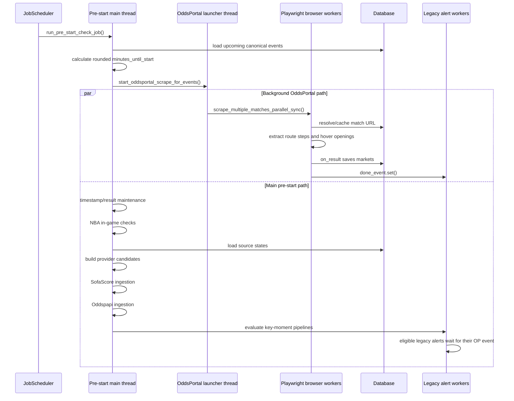

# OddsPortal scraping: verified end-to-end flow

> Canonical implementation guide for the OddsPortal path started by the pre-start job.
>
> Last verified against the repository: **2026-08-04**.
>
> Scope: the production path beginning at `modules/jobs/pre_start_check_job/run_pre_start_check_job.py`, through Playwright extraction, persistence, and alert synchronization. Statements below describe the code as it exists; they do not describe an intended or older architecture.

## 1. Runtime summary

OddsPortal is a supplemental provider. The pre-start job starts it in parallel with maintenance and the SofaScore/Oddspapi ingestion phases. It is not the component that decides the normal provider key moments.

An event is selected for OddsPortal only when all of these conditions are true:

1. `Config.ODDSPORTAL_SCRAPING_ENABLED` is true.
2. The event is returned by `EventRepository.get_events_starting_soon()`.
3. Its canonical `competition_id` exists in `ODDSPORTAL_COMPETITION_ROUTES`.
4. Its pre-calculated `minutes_until_start` is exactly `-5`.

`-5` means approximately five minutes after the stored start time. The value is calculated with Python `round()`, so it is a rounded minute bucket, not a precise elapsed-time comparison.

The current local/template environments differ:

- `.env`: `ODDSPORTAL_SCRAPING_ENABLED=true` (local, ignored by Git)
- `.env.prod`: `ODDSPORTAL_SCRAPING_ENABLED=false`
- `.env.example`: `ODDSPORTAL_SCRAPING_ENABLED=false`

The fallback in `Config` is `true` only when the variable is absent. Therefore, verify the effective environment instead of assuming the code default is active.

## 2. Source map

| File | Current responsibility |
|---|---|
| `infrastructure/scheduler/job_scheduler.py` | Registers the pre-start schedule, runs it once at startup, exposes the manual run, and owns `_active_op_thread`. |
| `modules/jobs/pre_start_check_job/run_pre_start_check_job.py` | Top-level pre-start orchestration. Starts OddsPortal selection before maintenance and provider ingestion. |
| `modules/jobs/pre_start_check_job/oddsportal_worker.py` | Selects OddsPortal candidates, creates per-event synchronization state, launches the background thread, builds scraper tasks, persists callback results, and signals completion. |
| `modules/jobs/pre_start_check_job/alert_pipeline.py` | Legacy alert-side synchronization with the per-event OddsPortal state. |
| `modules/jobs/pre_start_check_job/key_moment_evaluation.py` | Passes the shared OddsPortal context into the legacy alert and pillar entry points. |
| `modules/oddsportal/oddsportal_config.py` | Canonical competition-to-provider routes, aliases, bookmaker identity matching, and route exports. |
| `modules/oddsportal/oddsportal_routes.py` | Market/period fragments and sport-specific extraction steps. |
| `modules/oddsportal/scraping_settings.py` | Versioned package policy for language/domain, bookmakers, hover, Betfair, Playwright behavior, timeouts, and diagnostics. |
| `modules/oddsportal/oddsportal_dispatcher.py` | Synchronous wrappers, per-browser sequential batches, multi-browser distribution, and attempt recovery. |
| `modules/oddsportal/scraper_impl.py` | Composes `OddsPortalScraper` from the browser, lookup, render, data, hover, resume, attempt, and page-state mixins. |
| `modules/oddsportal/scraper_browser.py` | Chromium lifecycle, proxy launch options, contexts, request interception, anti-detection setup, and cache-busting navigation. |
| `modules/oddsportal/scraper_lookup.py` | DB-cache lookup, live league-page discovery, date filtering, team matching, and cache replacement. |
| `modules/oddsportal/scraper_attempt.py` | One resumable match extraction attempt across all configured route steps. |
| `modules/oddsportal/scraper_render.py` | Market-group/period tab switching and strict stale-content checks. |
| `modules/oddsportal/scraper_data.py` | Current-odds extraction for standard, Over/Under, Asian Handicap, and Betfair layouts. |
| `modules/oddsportal/scraper_hover.py` | Unified regular/Betfair hover interaction and opening-odds block parser. |
| `shared/odds_utils.py` | Automatic decimal/fractional detection and canonical decimal normalization. |
| `modules/oddsportal/scraper_resume.py` | Resume-state normalization and partial `MatchOddsData` recovery. |
| `modules/oddsportal/scraper_page_state.py` | Failure classification and debug artifacts. |
| `modules/oddsportal/dataclasses.py` | Scraper result and recovery data structures. `models.py` only re-exports most of them. |
| `modules/oddsportal/team_matcher.py` | Normalization, aliases, fuzzy scoring, direct/reversed matching, and ambiguity rejection. |
| `infrastructure/persistence/repositories/oddsportal_cache_repository.py` | One league-cache row per `season_id`. |
| `infrastructure/persistence/repositories/market_repository.py` | Resolves bookies and saves OddsPortal markets/choices/snapshots. |
| `infrastructure/persistence/models.py` | Defines `OddsPortalLeagueCache` and the normal market tables. |

There is no active root `scheduler.py` or root `oddsportal_scraper.py` in this repository. References to those files are legacy references.

## 3. Scheduler and pre-start entry point

### 3.1 Scheduled service

`JobScheduler._setup_pre_start_jobs()` registers `job_pre_start_check` at every exact minute mark implied by `POLL_INTERVAL_MINUTES`. With the usual value `5`, those marks are `:00`, `:05`, `:10`, and so on.

`JobScheduler.start()` also runs one immediate pre-start check before starting the scheduler thread. That ordering avoids an immediate startup run overlapping the first scheduled run in the same scheduler instance.

The scheduler loop itself calls due jobs serially. The OddsPortal browser work is parallel only because the pre-start job launches its own background thread.

### 3.2 Manual command

```bash
python main.py pre-start
```

The manual path calls `run_job_pre_start_check_now()`. After the synchronous pre-start phases return, it joins the current `_active_op_thread` without a timeout so the process does not exit while the non-daemon OddsPortal worker is still running.

### 3.3 Event query and timing bucket

`run_pre_start_check_job()` first optionally restricts all pre-start work to the canonical tracked-competition allowlist when `PRE_START_TRACKED_COMPETITIONS_ONLY=true`.

It then calls:

```python
scheduler.event_repo.get_events_starting_soon(
    Config.PRE_START_WINDOW_MINUTES,
    competition_ids=tracked_competition_ids,
)
```

The SQL time interval is:

```text
[current local naive minute - 5 minutes, current time + PRE_START_WINDOW_MINUTES]
```

The lower boundary is built from `datetime.now().replace(second=0, microsecond=0) - 5 minutes`. Consequently, the query includes recently started events only near the five-minute boundary; it is not an unrestricted post-start query.

For every returned event, the job calculates once:

```python
round((start_time - get_local_now_aware()).total_seconds() / 60)
```

That same timing dictionary is passed to OddsPortal selection and later reused by the provider/evaluation planning.

## 4. Exact orchestration from `run_pre_start_check_job.py`


```mermaid
sequenceDiagram
    participant JS as JobScheduler
    participant PS as Pre-start main thread
    participant OP as OddsPortal launcher thread
    participant BR as Playwright browser workers
    participant DB as Database
    participant AL as Legacy alert workers

    JS->>PS: run_pre_start_check_job()
    PS->>DB: load upcoming canonical events
    PS->>PS: calculate rounded minutes_until_start
    PS->>OP: start_oddsportal_scrape_for_events()
    par Background OddsPortal path
        OP->>BR: scrape_multiple_matches_parallel_sync()
        BR->>DB: resolve/cache match URL
        BR->>BR: extract route steps and hover openings
        BR->>DB: on_result saves markets
        BR->>AL: done_event.set()
    and Main pre-start path
        PS->>PS: timestamp/result maintenance
        PS->>PS: NBA in-game checks
        PS->>DB: load source states
        PS->>PS: build provider candidates
        PS->>PS: SofaScore ingestion
        PS->>PS: Oddspapi ingestion
        PS->>AL: evaluate key-moment pipelines
        AL->>AL: eligible legacy alerts wait for their OP event
    end
```

The real order is:

1. Resolve the optional canonical competition filter.
2. Load upcoming events.
3. Calculate `minutes_until_start` once per event.
4. Call `start_oddsportal_scrape_for_events()` immediately.
5. Run recently-started timestamp correction and result-freshness maintenance.
6. Run in-game checks.
7. If events remain, load provider source states and build the normal pre-start candidate plan.
8. Ingest SofaScore and Oddspapi odds.
9. Evaluate the enabled legacy-alert and pillar pipelines.

OddsPortal is therefore launched before timestamp maintenance. If maintenance later removes or reschedules an event, an already-selected OddsPortal task is not cancelled.

If no upcoming events remain after maintenance, the main pre-start function returns, but an already-launched OddsPortal worker continues independently.

## 5. Candidate selection and shared synchronization state

`build_oddsportal_scrape_candidates()` does not reuse `should_extract_odds_for_event()`. It applies its own narrow rule:

```python
Config.ODDSPORTAL_SCRAPING_ENABLED
and competition_id in ODDSPORTAL_COMPETITION_ROUTES
and pre_calculated_timings[event_id] == -5
```

Important consequences:

- Eligibility is based on canonical `competition_id`, not `season_id`.
- A missing `season_id` does not prevent selection. It disables the DB-cache shortcut for that task, but live league discovery can still run.
- `ENABLE_ODDS_EXTRACTION` does not gate OddsPortal candidate selection.
- `PRE_START_ODDS_MOMENTS` does not directly gate selection; `-5` is hard-coded in the OddsPortal worker. In normal operation `-5` should also remain in `PRE_START_ODDS_MOMENTS` so downstream key-moment evaluation and provider odds remain aligned.
- `PRE_START_TRACKED_COMPETITIONS_ONLY` can filter the event out earlier at the SQL query, even if it has an OddsPortal route.

For each selected event, `create_oddsportal_scrape_state()` creates:

```python
{
    "started_event": threading.Event(),
    "done_event": threading.Event(),
    "started_at_monotonic": None,
    "done_at_monotonic": None,
}
```

`OddsPortalScrapeContext` carries three shared objects into evaluation:

- `event_states`: synchronization state keyed by canonical event ID.
- `event_ids`: the selected IDs.
- `data_cache`: in-memory `MatchOddsData` keyed by event ID.

## 6. Cycle-level thread behavior

`start_oddsportal_scrape_thread()` starts one non-daemon thread named `oddsportal_worker_launcher` when candidates exist.

Before starting browser work, the new launcher checks the previous `scheduler._active_op_thread`:

1. If no previous thread is alive, start the new scrape cycle.
2. If it is alive, join it for at most `ODDSPORTAL_PREVIOUS_CYCLE_TIMEOUT` seconds.
3. If it finishes, start the new cycle.
4. If it is still alive, abort the new cycle and set every new candidate's `done_event` so alert workers are not left blocked by that aborted cycle.

This guard prevents two OddsPortal cycles from being intentionally activated by the same scheduler instance. It does not terminate the old thread.

The worker's outer `finally` also sets `done_event` for every event that did not receive a normal callback. This covers dispatcher crashes and chunk-level failures.

When the toggle is false or there are no candidates, no new thread is launched and `_active_op_thread` is set to `None`.

That assignment also clears the scheduler's reference when an older worker is still alive. A later cycle can therefore lose the previous-cycle guard and start another worker. The guard is reliable only while `_active_op_thread` still points to the older thread; it is not a global process lock.

## 7. Task construction and browser distribution

`scrape_oddsportal_batch()` converts candidates to tasks containing:

```text
event_id
league_url
home_team
away_team
season_id
competition_id
sport
_oddsportal_resume_state
_oddsportal_partial_match_data
```

The league URL is built as:

```text
https://www.{Config.ODDSPORTAL_DOMAIN}/{sport}/{country}/{league}/
```

One local calendar date from `get_current_date()` is calculated for the batch and passed to every browser worker so all cache date decisions in that batch use the same reference date.

### 7.1 Current parallel dispatcher

`scrape_multiple_matches_parallel_sync()` has two modes:

- If `num_browsers <= 1` or there is only one task, it calls one sequential `scrape_multiple_matches_sync()` batch.
- Otherwise it distributes tasks into at most `ODDSPORTAL_PARALLEL_BROWSERS` chunks and runs one `scrape_multiple_matches_sync()` per non-empty chunk in a `ThreadPoolExecutor`.

The distribution is “season-aware” only in this specific sense:

1. Tasks are grouped by `season_id`.
2. The first task from each season, plus tasks without a season, are assigned to the currently smallest chunks.
3. All remaining tasks are then assigned to the currently smallest chunks.

Each chunk owns one Chromium browser and processes its tasks sequentially, with a one-second pause between tasks. Different chunks run concurrently.

There is **no active resolver-seed queue, condition-based sibling release, or dedicated cache-warming phase** in the current dispatcher. Sibling tasks from the same season can be assigned to different chunks and can independently miss the cache while another browser is still warming it.

### 7.2 Per-browser and per-event lifecycle

For each chunk, `scrape_multiple_matches_sync()`:

1. Creates one `OddsPortalScraper` using the package-configured `browser.debug_dir`.
2. Starts one headless Chromium browser.
3. Processes assigned events sequentially.
4. Stops Playwright and Chromium in `finally`.

For each extraction attempt, `scrape_match_attempt()` normally creates and later closes a fresh `BrowserContext` when `scraping_settings.py` sets `browser.fresh_context_per_event=True`. Because recovery can call `scrape_match_attempt()` multiple times, “fresh per event” is effectively fresh per attempt in the current implementation.

`on_task_started` is invoked immediately before the first `scrape_match_attempt()`, after match-URL resolution. Time spent waiting for or navigating the league page is therefore still represented as “queued” to the alert pipeline.

## 8. Chromium, proxy, and network behavior

`OddsPortalScraper.start()` launches Playwright Chromium headlessly with anti-automation-related arguments. A browser context uses:

- a randomized desktop user agent;
- viewport `1920 x 1080`;
- locale `en-US`;
- timezone `America/Mexico_City`;
- JavaScript enabled;
- optional HTTPS-error ignoring;
- optional service-worker blocking;
- an init script that masks `navigator.webdriver` and supplies common browser properties.

If package setting `browser.block_resources=True`, request interception:

- blocks image and media requests;
- blocks several analytics, consent, ad, and survey domains;
- adds cache-busting parameters/headers to selected OddsPortal `xhr`/`fetch` requests.

Match-page navigation additionally appends `_t=<timestamp>` before the URL fragment and temporarily sets no-cache headers.

If package setting `browser.clear_state_before_navigation=True`, each attempt clears cookies and makes best-effort attempts to clear local/session storage, Cache Storage, and service-worker registrations before opening the match page.

### Proxy facts

- `PROXY_ENABLED=true` is optional, not an eligibility requirement.
- When enabled and fully configured, the proxy is attached at Chromium launch through `ProxyIdentityManager`.
- OddsPortal defaults to sticky proxy mode; Decodo rotating mode is coerced to sticky.
- `PROXY_ROTATE_ON_ODDSPORTAL_BROWSER_RESTART` is read by the manager, but current dispatcher restart calls use `scraper.start()` without `rotate_proxy_session=True`. Do not assume those restarts explicitly mint a new proxy session from this flag alone.

## 9. Competition routing

`ODDSPORTAL_COMPETITION_ROUTES` is provider routing, separate from the business tracked-competition allowlist.

| `competition_id` | Sport | Country | League slug |
|---:|---|---|---|
| 176 | basketball | usa | nba |
| 318 | football | brazil | serie-a |
| 129 | baseball | usa | mlb |
| 167 | football | spain | laliga |
| 88 | football | italy | serie-a |
| 168 | football | england | premier-league |
| 50 | football | saudi-arabia | saudi-professional-league |
| 171 | football | germany | bundesliga |

Adding a sport route to `SPORT_SCRAPING_ROUTES` does not make events eligible by itself. A canonical competition route is also required.

`scraping_settings.py` field `ui_language` selects the regional domain:

- `es` -> `cuotasahora.com`
- `en` -> `oddsportal.com`
- any other value is rejected at import time.

The language also selects candidate labels used to recognize group and period tabs. It does not change the browser context locale, which remains `en-US`.

## 10. Match URL resolution and league cache

### 10.1 Cache schema

`oddsportal_league_cache` stores one row per `season_id`:

| Column | Meaning |
|---|---|
| `season_id` | Primary key and cache scope. |
| `cached_date` | Local midnight when the row was last written. |
| `match_urls` | JSON object keyed by relative match URL. |
| `created_at` | Last write time. |

A structured entry is:

```json
{
  "/football/h2h/team-a/team-b/abc123/#row-id": {
    "home": "Team A",
    "away": "Team B",
    "raw_text": "...",
    "date": "31 Jul 2026"
  }
}
```

The repository accepts cache rows written in the last three calendar days, but `_load_cached_candidates()` only uses structured entries whose embedded match date parses as the batch date or a future date. Undated, stale, and legacy string entries are not returned as candidates.

The DB cache key is only `season_id`. Although lookup methods accept `league_url`, the active cache loader does not use it to further scope the row.

### 10.2 Resolution order

For each event, the sequential browser batch does:

1. If `season_id` exists, call `find_match_url_from_cache()`.
2. On miss, call `find_match_url()`. That function checks the cache again unless forced live.
3. On another miss, navigate the league page and extract live candidates.
4. Run `TeamMatcher.find_best_match(home, away, candidates)`.
5. Return the absolute match URL or `None`.

### 10.3 Live candidate extraction

The live league lookup:

- waits for `div[class*="empty:min-h-[80vh]"] div.eventRow`;
- tracks date headers from `[data-testid="date-header"]`;
- reads match links from `div.group.flex[data-testid="game-row"] > a[href]`;
- reads participant names from `div[data-testid="event-participants"] a[title]`;
- repairs missing row fragments with the `eventRow` ID when possible;
- removes `/inplay-odds` from match paths;
- accepts both modern `/{sport}/h2h/...` and legacy `/{sport}/{country}/...` paths;
- rejects wrong-sport, malformed, league-self, missing-team, stale, and undated candidates.

### 10.4 Team matching

`TeamMatcher`:

1. strips diacritics, punctuation, casing, and repeated spaces;
2. removes configured institutional tokens;
3. checks explicit aliases;
4. combines token Jaccard, containment, and `SequenceMatcher` scores;
5. scores direct and reversed home/away ordering;
6. requires a best combined score of at least `150/200`;
7. rejects direct/reversed ambiguity when the winning orientation is less than 20 points better.

The extra `>= 80` check in `find_match_url_from_cache()` is redundant after the matcher's `150` combined-score threshold; the matcher is the effective gate.

### 10.5 Quality-aware replacement

After live discovery, a new structured cache is compared with the existing row. Replacement uses the lexicographic key:

```text
(fresh_count, freshness_ratio, homogeneity, total_count)
```

The displayed score `fresh_count * homogeneity` is diagnostic; it is not the direct comparison key. A lower-quality new cache is rejected. An equal-or-better cache replaces the whole JSON object through an upsert.

The cleanup job runs every three days at `05:00` and removes rows older than the configured three-day retention boundary.

## 11. Sport routes and fragments

OddsPortal match URLs use a normalized fragment:

```text
{base_match_url}/#{optional_event_row_id}:{group};{period_code}
```

Active examples:

```text
.../#row-id:1X2;2
.../#row-id:home-away;1
```

Configured group fragments:

| Key | Fragment |
|---|---|
| `1X2` | `1X2` |
| `HOME_AWAY` | `home-away` |
| `OVER_UNDER` | `over-under` |
| `ASIAN_HANDICAP` | `ah` |

The active period codes are `1` for full time including overtime and `2` for regulation full time. Other fragment constants remain available for future route edits but are not active.

### 11.1 Active extraction plans

| Sport | Steps | Active group | Active period | Fragment |
|---|---:|---|---|---|
| football | 1 | 1X2 | regulation Full Time | `#1X2;2` |
| basketball | 1 | Home/Away | Full Time including OT | `#home-away;1` |
| baseball | 1 | Home/Away | Full Time including OT | `#home-away;1` |
| american-football | 1 | Home/Away | Full Time including OT | `#home-away;1` |
| hockey | 1 | Home/Away | Full Time including OT | `#home-away;1` |

No current competition mapping selects `american-football` or `hockey`, although their extraction plans exist.

The sole route step is loaded directly through its URL fragment. Tab-switching code remains available for future multi-step routes but is not exercised by the current plans.

## 12. Match-page readiness and extraction

### 12.1 Navigation and fast failure

The initial match navigation races two checks:

- a render wait using market-specific selectors;
- a JavaScript observer that reports empty shell, persistent skeleton, missing event container, or other partial states after `browser.fast_fail_empty_timeout_ms` from `scraping_settings.py`.

The scraper also detects:

- Playwright/network/TLS navigation failures;
- HTTP responses `>= 400`;
- common Cloudflare/access-denied titles;
- shell-without-data states, optionally followed by a shorter shell grace wait;
- missing or stale market content after group/period changes.

Failures create a structured `ScrapeAttemptResult` rather than silently returning a partial success.

### 12.2 Current odds

For standard tables, `_extract_data()` reads:

- teams from the match-page `h1`;
- bookmaker rows from `div.flex.h-9` containing `border-black-borders`;
- odds from `div.odds-cell`;
- bookie names from `a[title]` or `img[alt]`;
- payout text from the final row child;
- Betfair Back/Lay values from `[data-testid="betting-exchanges-section"]`.

Two-way and three-way layouts are handled separately.

The current routes do not invoke Over/Under or Asian Handicap extraction. Those implementations remain available; if re-enabled, the scraper:

1. examines collapsed line rows;
2. chooses the line whose two displayed prices have the smallest absolute difference;
3. expands that line;
4. reads bookies and the two prices from expanded rows;
5. stores the selected line as `handicap`/`choice_group` metadata.

This is a “closest prices” main-line heuristic, not a hard-coded totals or handicap value.

Every selected price is normalized at the Python extraction boundary by `normalize_odds_value()`. Decimal tokens remain decimal odds and fractional tokens such as `57/50` are converted with `1 + numerator / denominator`. The same normalization is used while comparing collapsed Over/Under and Asian Handicap rows, so fractional display mode does not corrupt main-line selection. No provider display-format configuration is required.

### 12.3 Opening odds via hover

Package fields `hover_names` and `hover_limit` are the single regular-bookmaker selection policy for extraction, hover, in-memory results, and persistence. Browser-side JavaScript scans row identities, resolves normalized exact aliases in configured priority order, and reads price cells only for the selected rows. Unlisted bookmaker prices never cross the browser boundary or enter `MatchOddsData`.

The current package policy selects, hovers, and persists at most one matching regular bookmaker from this tuple:

```text
bet365
```

It then hovers each two-way or three-way odds cell, re-resolving DOM handles between attempts. Each cell receives up to three hover attempts.

The tooltip parser recognizes both `Odds movement` and `Movimiento de cuotas`, but it deliberately ignores every movement-history row. The authoritative value for `initialOdds` is read exclusively from the dedicated lower block labeled `Opening odds`, `Cuotas de apertura`, or `Cuotas iniciales`. Its date is detected by content rather than CSS class and returned with the price. Decimal and fractional opening prices are normalized to decimal.

Each selected regular bookmaker is hovered independently. Betfair Exchange remains structurally separate: package fields `persist_betfair` and `hover_betfair` control current Back/Lay persistence and tooltip opening-block extraction. Betfair hover additionally requires a route step whose `betfair_enabled` is true and successfully extracted current exchange data; the sole current step enables it. Every standard extraction logs a Betfair status (`section_not_found`, `insufficient_containers`, `no_parseable_back_odds`, or `current_odds_extracted`) before the hover decision.

The parsed opening values are stored in `initial_odds_*` / `initial_back_*` / `initial_lay_*` and persisted through the `initialOdds` path. An opening date, when supplied, remains in the compatibility field `movement_odds_time`; no movement-history timestamp is substituted when the opening block omits one.

## 13. Result structures

The main dataclasses are defined in `modules/oddsportal/dataclasses.py`.

```text
BookieOdds
  name
  odds_1 / odds_x / odds_2
  payout
  initial_odds_1 / initial_odds_x / initial_odds_2 (Opening odds block values)
  movement_odds_time (compatibility name; Opening odds date when available)
  handicap

BetfairExchangeOdds
  current Back/Lay 1/X/2 values and volumes
  payout
  hovered Back/Lay 1/X/2 Opening odds block values (field names use `initial_*`)
  movement_odds_time (compatibility name; Opening odds date when available)
  handicap

MarketExtraction
  market_group
  market_period
  market_name
  bookie_odds[]
  betfair

MatchOddsData
  match_url
  home_team / away_team
  sport
  extractions[]
  extraction_time_ms
  bookie_odds / betfair legacy projections of the first extraction

ScrapeAttemptResult
  data
  resume_state
  partial_match_data
  failed_reason
  failed_step_idx
```

## 14. Recovery and retry semantics

### 14.1 Step-level resume

`_scrape_task_with_recovery()` allows at most three `scrape_match_attempt()` calls for one resolved match URL. On a failed group/period step it carries forward:

- completed step keys;
- the next step index;
- failed group/period/reason;
- the fragment to resume;
- the partial `MatchOddsData` and already completed extractions.

If sport or route-step count changes, partial state is discarded as inconsistent.

If a failure produces no resume state, the loop stops early.

The helper contains an exact comparison for `failed_reason == "MATCH_RENDER_TIMEOUT"`. Most render-timeout reasons generated by the current attempt code include a classification suffix, such as `MATCH_RENDER_TIMEOUT_<classification>`, so those values do not satisfy that exact inner restart condition.

### 14.2 Full outer retry

If the first recovered task still returns no data, the sequential batch:

1. stops and starts the browser once;
2. resolves the match URL again;
3. runs another `_scrape_task_with_recovery()` sequence;
4. starts that outer retry with empty resume and partial-data fields.

Thus the outer retry can make up to three more attempts, but it does not preserve partial extractions from the first sequence.

The outer restart currently does not pass `rotate_proxy_session=True`.

### 14.3 Callback guarantees

For every event processed normally or caught by the per-event exception handler, `on_result(event_id, data_or_none)` is called. If a whole browser future crashes before its per-event callbacks, the cycle-level `finally` force-signals remaining event states.

## 15. Persistence

`_on_event_scraped()` performs persistence inline in the browser worker thread, before signaling `done_event`:

1. Put non-empty `MatchOddsData` in the shared in-memory `data_cache`.
2. Call `MarketRepository.save_markets_from_oddsportal(event_id, op_data)`.
3. Record the returned market count or `None` on callback-level failure.
4. Set `done_at_monotonic` and `done_event`.

`save_markets_from_oddsportal()` iterates every `MarketExtraction`. It falls back to the legacy match-level fields only when `extractions` is empty.

For normal bookmaker rows:

- Over/Under choices become `over` and `under`; other groups use `1`, optional `x`, and `2`.
- The selected handicap/total line becomes `choice_group`.
- Bookies are resolved through `BookieRepository.resolve_bookie_from_source(source="oddsportal", allow_create=False)`.
- A configured regular bookmaker is still skipped when it cannot be resolved to an existing DB bookie; persistence never auto-creates one.
- Market writes use the normal repository flow and create snapshots with source `oddsportal`.

Betfair Exchange is resolved using source name `Betfair Exchange` and slug `betfair-ex`. Back and Lay are saved as separate `choice_group` values, optionally suffixed by a handicap.

The returned `saved_count` counts saved market records, not raw bookmaker rows or individual choices.

## 16. Alert and pillar integration

### 16.1 Legacy alert synchronization

Only `EventAlertProcessor._sync_oddsportal_data()` waits for this scraper. The wait is attempted only when all of the following are true:

- the event evaluation payload is successful;
- a normalized event context was built;
- `odds_response` is truthy;
- the event ID was selected for OddsPortal;
- an OddsPortal state exists for it.

The wait has two phases:

1. While neither `started_event` nor `done_event` is set, poll every 250 ms for the browser worker to claim the event. This queue/URL-resolution phase has no configured timeout.
2. After `started_event`, wait only for the remainder of `ODDSPORTAL_ALERT_WAIT_TIMEOUT`, measured from `started_at_monotonic`.

After completion or timeout, the alert path queries `MarketRepository.get_external_markets_for_event()` to verify/read persisted external markets. It also returns the in-memory `MatchOddsData`, when present, so the formatter can add movement timestamps that are not read from the DB query.

`send_odds_alert()` itself only sends odds alerts at minutes `30` and `-5`. It appends the external-markets section when the event's `competition_id` has an OddsPortal route and external DB rows exist.

External rows are not guaranteed to be exclusively from OddsPortal: `get_external_markets_for_event()` returns all non-primary bookies and derives the displayed source from the latest choice snapshot.

### 16.2 Pillar pipeline

`key_moment_evaluation.py` passes the OddsPortal state/cache arguments to `evaluate_and_calculate_pillars_batch()`, but the current pillar implementation does not consume them. The pillar pipeline neither waits for OddsPortal nor reads `op_data_cache` through those parameters.

## 17. Configuration reference

### 17.1 Package-owned scraping policy

`modules/oddsportal/scraping_settings.py` is the single versioned source for provider behavior. It contains frozen dataclasses that validate invalid languages, negative limits, non-positive timeouts, and empty debug paths at import time.

| Package field | Default | Meaning |
|---|---:|---|
| `ui_language` | `en` | Selects `oddsportal.com` and English tab candidates; `es` selects `cuotasahora.com`. |
| `bookmakers.hover_names` | `("bet365",)` | Ordered allowlist shared by browser extraction, hover, memory, and persistence. |
| `bookmakers.hover_limit` | `1` | Per-step shared regular-bookmaker cap; `0` disables regular extraction, hover, and persistence. |
| `bookmakers.persist_betfair` | `true` | Include current Betfair Exchange Back/Lay data. |
| `bookmakers.hover_betfair` | `true` | Hover Betfair and parse its Opening odds block. |
| `browser.block_resources` | `true` | Enable image/media/tracker blocking and selected cache busting. |
| `browser.block_service_workers` | `true` | Block service workers in Playwright contexts. |
| `browser.clear_state_before_navigation` | `true` | Clear cookies/storage/cache state before match navigation. |
| `browser.ignore_https_errors` | `true` | Playwright context option. |
| `browser.fresh_context_per_event` | `true` | Create a fresh context for each extraction attempt. |
| `browser.match_goto_timeout_ms` | `30000` | Match navigation timeout. |
| `browser.fast_fail_empty_timeout_ms` | `15000` | Empty/skeleton observer threshold. |
| `browser.market_render_timeout_ms` | `60000` | Market render wait. |
| `browser.shell_grace_timeout_ms` | `8000` | Optional shell-without-data grace wait. |
| `browser.tab_wait_timeout_s` | `20` | Group/period tab validation loop. |
| `browser.league_goto_timeout_ms` | `21000` | League-page navigation timeout. |
| `browser.league_rows_timeout_ms` | `18000` | Scoped league-row wait. |
| `browser.session_restart_attempts` | `2` | Maximum session-aware attempts for a match batch item. |
| `browser.save_debug_on_goto_timeout` | `true` | Save qualifying navigation artifacts. |
| `browser.enable_shell_grace` | `true` | Enable the shell grace path. |
| `browser.debug_timing` | `false` | Print direct timing diagnostics. |
| `browser.debug_dir` | `oddsportal_debug` | Batch diagnostic artifact directory. |

Market groups and periods intentionally remain in `oddsportal_routes.py`, next to their fragment identifiers.

### 17.2 Environment-owned deployment controls

These remain environment-backed because they vary by machine, deployment, or integration SLA rather than changing scraper business behavior:

| Variable | Default | Meaning |
|---|---:|---|
| `ODDSPORTAL_SCRAPING_ENABLED` | `true` | Master deployment feature flag; templates set it to false. |
| `ODDSPORTAL_PARALLEL_BROWSERS` | `1` | Browser concurrency constrained by host RAM and task count. |
| `ODDSPORTAL_PREVIOUS_CYCLE_TIMEOUT` | `120` s | Cross-cycle worker coordination timeout. |
| `ODDSPORTAL_ALERT_WAIT_TIMEOUT` | `180` s | Alert-pipeline coordination SLA. |

### 17.3 Related pre-start variables

| Variable | Relationship |
|---|---|
| `POLL_INTERVAL_MINUTES` | Determines exact scheduler minute marks. Values should align with the hard-coded `-5` selection bucket. |
| `PRE_START_WINDOW_MINUTES` | Upper boundary of the event query. The repository independently includes approximately five minutes of recently started events. |
| `PRE_START_ODDS_MOMENTS` | Controls normal provider/evaluation key moments, not OddsPortal selection itself. |
| `PRE_START_TRACKED_COMPETITIONS_ONLY` | Can remove non-business-tracked events before OddsPortal selection. |
| `FILTER_PIPELINES_BY_TRACKED_COMPETITIONS` | Filters alert/pillar evaluation, not OddsPortal scraping. |
| `ENABLE_ODDS_EXTRACTION` | Controls normal provider extraction, not the OddsPortal worker. |
| `ENABLE_LEGACY_ALERT_PIPELINE` | Enables the only current consumer that waits for OddsPortal. |
| `ENABLE_PILLAR_PIPELINE` | Pillars currently do not synchronize with OddsPortal. |

### 17.4 Related proxy variables

The scraper uses the shared proxy configuration: `PROXY_ENABLED`, endpoint/credentials/provider/protocol, country/city, `PROXY_SESSION_DURATION_MINUTES`, `PROXY_MODE_ODDSPORTAL`, and safe-logging settings. Credentials must never be written to debug documentation or logs.

## 18. Logging and debug artifacts

Normal current OddsPortal modules use loggers such as `modules.oddsportal.scraper_attempt` and propagate to the root logger. The worker uses `modules.jobs.pre_start_check_job.oddsportal_worker`. These messages therefore appear in the normal application console and weekly `sofascore_odds.log` path.

`app/logging_setup.py` also attaches an OddsPortal-only filtered handler to the root logger. It accepts the real scraper package, worker, cache, and cleanup namespaces plus explicitly tagged selection, alert-synchronization, CLI-configuration, and OddsPortal persistence records. It rejects unrelated root, SofaScore, timing, repository, and alert records. The resulting weekly file is `logs/oddsportal/<month>/week_<n>/oddsportal.log`; records still also reach the main log and console.

The filter applies to records emitted after the process restarts with this logging configuration. Existing historical lines in an already-created weekly file are not rewritten or deleted.

Production batch calls pass the package-configured `browser.debug_dir` (default `oddsportal_debug`). On classified match-page failures, `_save_debug_artifacts()` writes an event subdirectory containing:

- full-page PNG;
- HTML with inline scripts/styles removed;
- extracted inline CSS and JavaScript when present;
- JSON manifest with URL, page state, classification, timeouts, proxy session label, and resume metadata.

The artifacts are diagnostic and may contain provider page content. Treat them as operational data.

## 19. Validation and tests

| Check | What it validates | Caveat |
|---|---|---|
| `pytest -q tests/test_oddsportal_tab_normalizer.py` | Spanish/English group and period tab normalization. | Pure unit test; no browser or DB. In this checkout, 7 of 8 test functions pass when invoked directly; the accent-normalization case fails because its source literal is mojibake (`prórroga`) while its expected value assumes correctly decoded `prórroga`. |
| `pytest -q tests/test_oddsportal_hover_parser.py` | Multi-entry regular/Betfair histories, localized title handling, fractional normalization, and movement-delta rejection. | Pure fixture-based unit tests; no browser or DB. |
| `pytest -q tests/test_oddsportal_logging.py` | Dedicated-log namespace filtering, rejection of unrelated application logs, and explicit tagging for mixed modules. | Pure logging unit tests; no browser or DB. |
| `pytest -q test_oddsportal_resume_recovery.py` | Resume semantics with scripted scraper attempts. | The final test references a legacy root `oddsportal_scraper` module that is absent, so the file is not currently a clean end-to-end suite without adjustment. |
| `python tests/test_oddsportal_scheduler_sim.py <event_id> [<event_id> ...] --headless` | Manual DB-backed multi-event scraper simulation and persistence. | It is an executable integration script, not pytest assertions; it hard-codes `cuotasahora.com` when building league URLs. |
| `python tests/test_oddsportal_process.py <event_id> --headless` | Legacy manual isolation/debug report. | It imports obsolete root `database` and `repository` modules and should not be considered runnable evidence for the current package without repair. |

For a faithful production-path check, prefer `python main.py pre-start` with a safe test database/event set and verify all of the following:

1. Effective toggle is true.
2. The event's canonical competition has an OddsPortal route.
3. Stored start time produces the rounded `-5` bucket.
4. Candidate log appears.
5. URL resolution reports cache hit or live league discovery.
6. `on_task_started` is logged.
7. Every route step completes or emits a classified failure artifact.
8. Persistence reports resolved/skipped bookies accurately.
9. `done_event` is signaled.
10. The legacy alert either receives the data or logs its timeout path.

## 20. Troubleshooting by stage

### No candidate selected

Check, in order:

1. effective `ODDSPORTAL_SCRAPING_ENABLED`;
2. whether the event is inside the repository query window;
3. canonical `competition_id`, not `season_id`;
4. presence in `ODDSPORTAL_COMPETITION_ROUTES`;
5. logged rounded `minutes_until_start` equals exactly `-5`;
6. earlier filtering by `PRE_START_TRACKED_COMPETITIONS_ONLY`.

### Candidate selected but never “started”

“Started” is signaled only after URL resolution. Inspect cache lookup and league-page logs. The alert queue phase has no timeout, so a stalled lookup is different from an extraction that exceeded `ODDSPORTAL_ALERT_WAIT_TIMEOUT`.

### Cache exists but misses

Inspect:

- embedded candidate date, not only row `cached_date`;
- structured `{home, away, date}` payload shape;
- team matcher score and direct/reversed ambiguity;
- whether the wrong `season_id` owns the row;
- provider domain/path changes.

### Match page opens but extraction fails

Use the JSON manifest classification first, then the screenshot and stripped HTML. Typical stages are navigation, shell/render race, group switch, period switch, empty period data, or hover-only failure.

A hover failure does not by itself fail the route step: visible current odds can still be persisted without opening odds. A group/period switch or empty period extraction does fail the attempt and activates resume recovery.

### Data scraped but absent from DB

Check bookie source resolution. Persistence uses `allow_create=False`; unrecognized bookies are intentionally skipped. Also distinguish zero saved markets from a callback exception: the worker log text historically says “markets/bookies,” but the returned number is markets saved.

### Alert lacks OddsPortal data

Check:

1. legacy alert pipeline is enabled;
2. the event payload has a truthy normal-provider `odds_response`;
3. the event was selected for OddsPortal in this cycle;
4. URL resolution/queue phase completed;
5. the per-event extraction completed within the post-claim wait budget;
6. at least one external bookie resolved and persisted;
7. the alert is at minute `-5` (or the independent allowed minute `30`).

## 21. Reliability boundaries and non-obvious facts

- OddsPortal selection is hard-coded at `-5`; changing `PRE_START_ODDS_MOMENTS` alone does not move it.
- `competition_id` controls provider routing; `season_id` controls only league-cache scope.
- Visible rows are read from the page, then the persistence allowlist/limit is applied. Hover has its own allowlist/limit but can only select from that retained set.
- Decimal and fractional display tokens are auto-detected and normalized to decimal; there is no runtime format toggle.
- Browser chunks are concurrent; events inside one chunk are sequential.
- Current dispatcher code does not implement the previously documented resolver-seed architecture.
- A no-candidate run clears `_active_op_thread`; it can lose the reference to an older worker that is still running.
- The main pre-start job does not join the scraper in scheduled mode; alert workers synchronize per event, and the scraper thread continues independently.
- Queue/URL-resolution waiting in the legacy alert pipeline is unbounded; the configured alert timeout starts only after `on_task_started`.
- The pillar pipeline currently ignores the OddsPortal synchronization arguments it receives.
- The dedicated OddsPortal file is a filtered projection of scraper-owned and explicitly tagged records; shared dependency logs are excluded unless their OddsPortal call site tags them.
- A browser restart does not currently request explicit proxy-session rotation.
- Debug artifacts and actual DB rows are stronger evidence of success than a non-empty scraper return alone.
