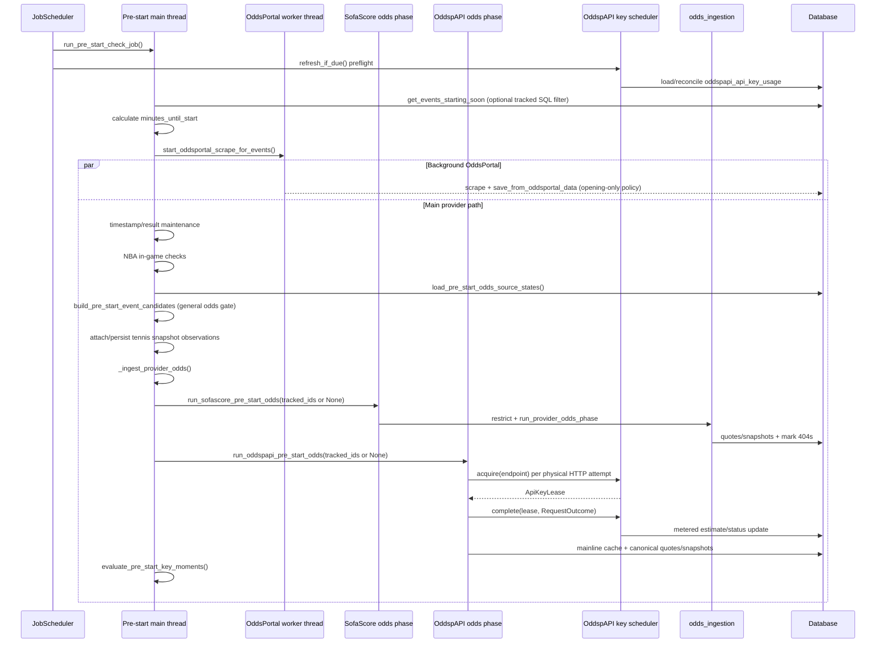
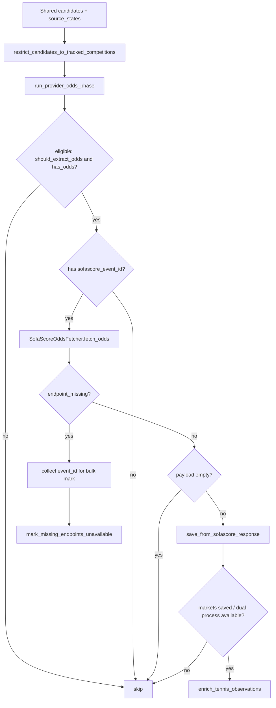
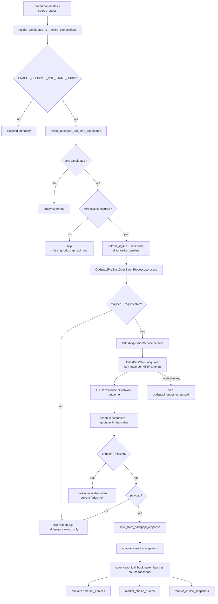
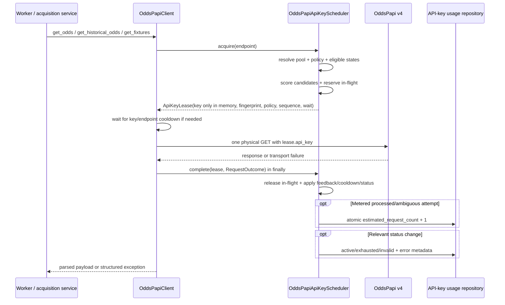
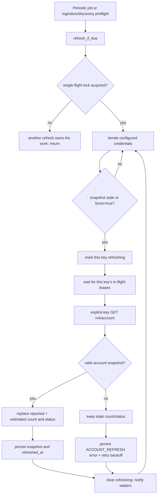

# Pre-start provider odds ingestion: verified end-to-end flow

> Canonical implementation guide for the provider odds path started by the pre-start job.
>
> Last verified against the repository: **2026-09-03**.
>
> Scope: SofaScore and OddspAPI odds acquisition/ingestion under `modules/jobs/pre_start_check_job/`, the shared orchestration contract in `modules/odds_ingestion/`, and the shared OddspAPI API-key/quota control plane under `modules/oddspapi/`. OddsPortal is a parallel opening-only path launched from the same job (see [`oddsportal_scraping.md`](oddsportal_scraping.md) if present).

## 1. Runtime summary

The pre-start job builds **one shared candidate plan**, then runs each provider phase independently against that plan. Shared timing eligibility is decided once by the job (`should_extract_odds`) and reused by every phase. With `ODDSPAPI_PRE_START_CLOSING_ONLY=false` (default), OddspAPI extracts `/odds` across positive key moments ($T-120, T-30, T-5$), while the dedicated $T-1$ job is disabled via `ENABLE_PRE_START_T_MINUS_ONE_JOB=false` and its closing snapshot is reconstructed at $T-0$ via `ENABLE_ODDSPAPI_HISTORICAL_AS_OF_PERSIST=true` (see §6.1).

An event reaches a provider HTTP request only when all of these are true:

1. It survives upcoming-event load (`TRACKED_COMPETITIONS_ONLY` optional SQL filter).
2. It survives recently-started maintenance filtering (rescheduled events dropped).
3. `build_pre_start_event_candidates()` includes it in `PreStartEventPlan.candidates`.
4. The general odds gate did not clear `should_extract_odds` for an untracked competition.
5. The provider-specific tracked-competition gate did not drop it from that phase's local list.
6. `should_extract_odds=True` and the provider's stored availability is not `has_odds=False`.
7. Provider-specific requestability holds (SofaScore external id, OddspAPI fixture mapping, API keys, mainline cache for live, etc.).

Provider phases share one call shape:

```python
run_<provider>_pre_start_odds(
    candidates,
    source_states,
    *,
    debug_mode=False,
    tracked_competition_ids=None,  # None = that provider gate is off
) -> ProviderOddsSummary
```

`_ingest_provider_odds` in `run_pre_start_check_job.py` calls SofaScore then OddspAPI, passing the in-memory tracked ID set only when that provider's gate is on. Each phase is wrapped in `try/except`; one crash does not cancel the other.

Acquisition (HTTP shape, workers, historical/exchange branching) stays provider-specific. Canonical DB writes all go through `MarketOddsIngestionService` → `MarketRepository.save_canonical_bookmaker_batches`.

OddspAPI now has a second, independent persistence path for **API-account usage state**. It does not contain event odds. Every normal `OddsPapiClient()` obtains a short-lived API-key lease from one process-wide scheduler; the scheduler tracks quota estimates in memory and reconciles them with PostgreSQL plus `/v4/account`. This control plane decides **which credential may perform a physical request**. The existing acquisition/adapter/repository path still decides **what an odds response means and what market data is stored**.

## 2. Source map

| File | Current responsibility |
|---|---|
| `modules/jobs/pre_start_check_job/run_pre_start_check_job.py` | Top-level orchestration. Loads events, launches OddsPortal, maintenance, builds the candidate plan, runs provider phases, then key-moment evaluation. |
| `modules/jobs/pre_start_check_job/run_t_minus_one_odds_job.py` | Closing-minute lane. Reuses `run_pre_start_odds_moments` with `key_moments=(PRE_START_CLOSING_ODDS_MINUTE,)`, timestamp correction off, no alert/pillar evaluation. |
| `modules/jobs/pre_start_check_job/odds_source_state.py` | Bulk load of SofaScore + OddspAPI mapping/availability (`has_odds`, external IDs). |
| `modules/jobs/pre_start_check_job/event_candidate_builder.py` | Shared `PreStartEventPlan`. Sets `should_extract_odds`. Applies the **general** tracked-competition odds gate. |
| `modules/jobs/pre_start_check_job/timing.py` | Key-moment timing + optional timestamp correction used by the candidate builder. |
| `modules/odds_ingestion/provider_odds_phase.py` | Shared contract: eligibility, `restrict_candidates_to_tracked_competitions`, `ProviderOddsSummary`, `run_provider_odds_phase`, 404 marking. |
| `modules/odds_ingestion/market_odds_ingestion_service.py` | Canonical persist (`save_from_sofascore_response`, `save_from_oddspapi_response`, `save_from_oddsportal_data`). |
| `modules/odds_ingestion/adapters/sofascore_market_adapter.py` | SofaScore payload → markets/choices (`mainLine=True`, `sourceMarketId` from catalog `marketId`). |
| `modules/odds_ingestion/adapters/oddspapi_market_adapter.py` | OddspAPI payload → markets/choices (`mainLine` from API/cache, exchange quotes). |
| `modules/odds_ingestion/adapters/oddsportal_market_adapter.py` | OddsPortal scrape → canonical DTOs (`mainLine=True`). |
| `modules/odds_ingestion/canonical_market_normalizer.py` | SofaScore canonical keys/choice names; keeps `mainLine` / `sourceMarketId`. |
| `modules/odds_ingestion/fetch_result.py` | Provider-neutral `OddsFetchResult` (`SUCCESS` / empty / `ENDPOINT_NOT_FOUND`). |
| `modules/jobs/pre_start_check_job/providers/sofascore/odds_phase.py` | SofaScore entrypoint. |
| `modules/jobs/pre_start_check_job/providers/sofascore/tennis_observations.py` | Snapshot attach/persist plus SofaScore `on_ingested` tennis hook. |
| `modules/jobs/pre_start_check_job/providers/oddspapi/odds_phase.py` | OddspAPI entrypoint. |
| `modules/jobs/pre_start_check_job/providers/oddspapi/event_selector.py` | Selects OddspAPI candidates from the shared plan (`should_extract_odds`). |
| `modules/jobs/pre_start_check_job/providers/oddspapi/odds_batch_processor.py` | Per-event skip reasons, acquire, ingest, 404 bookkeeping. |
| `modules/jobs/pre_start_check_job/providers/oddspapi/odds_acquisition_service.py` | `/odds` vs `/historical-odds`, mainline cache write, optional exchange historical. |
| `modules/jobs/pre_start_check_job/providers/oddspapi/odds_fetcher.py` | HTTP adapter → `OddsFetchResult`; one scheduler-backed client may serve both `/odds` and `/historical-odds`. |
| `modules/jobs/pre_start_check_job/providers/oddspapi/exchange_historical_fetch_executor.py` | Outcome-scoped historical fan-out. Workers own HTTP sessions, not API keys; each request acquires a lease. |
| `modules/oddspapi/api_keys.py` | Reads/deduplicates configured paid/free pools and applies the hard four-worker bound. `api_key_for_slot` remains compatibility-only and has no productive caller. |
| `modules/oddspapi/api_key_inventory.py` | Converts configured secrets into endpoint-scoped `ApiKeyCredential` objects and SHA-256 fingerprints. |
| `modules/oddspapi/endpoint_policy.py` | Classifies endpoints as `METERED`, `FREE_QUOTA_GATED`, or `UNMETERED`; unknown endpoints default to metered. |
| `modules/oddspapi/api_key_scheduler.py` | Thread-safe key selection, in-flight reservations, cooldown/rate-limit state, response feedback, usage estimates, refresh coordination, and non-secret diagnostics. No HTTP and no SQLAlchemy. |
| `modules/oddspapi/account_usage.py` | Calls/parses `/v4/account` with one explicit key and produces a secret-free `AccountUsageSnapshot`. |
| `modules/oddspapi/runtime.py` | Lazy composition root for the process-wide inventory + repository + account service + scheduler singleton. |
| `modules/oddspapi/client.py` | Proxy-free endpoint facade. Acquires/releases one lease per physical attempt, performs retries/failover, and reports `RequestOutcome`. Explicit `api_key=` bypass remains for `/account`, tests, and diagnostics. |
| `modules/oddspapi/exceptions.py` | Transport exceptions, including `OddsPapiQuotaExhaustedError` when no eligible key remains. |
| `infrastructure/persistence/models.py` (`OddspapiApiKeyUsage`) | Durable non-secret account/quota state in `oddspapi_api_key_usage`. |
| `infrastructure/persistence/repositories/oddspapi_api_key_usage_repository.py` | SQLAlchemy adapter for usage snapshots/statuses and atomic PostgreSQL request increments. |
| `infrastructure/scheduler/job_scheduler.py` | Registers periodic account refresh and invokes the same due-check before pre-start, T-1, and fixture discovery. |
| `infrastructure/persistence/market_write_policy.py` | Per-source write ownership (OddsPortal opening-only). |
| `infrastructure/persistence/repositories/market/market_choice_quote_writer.py` | Upserts `market_choice_quotes` by `(choice_id, source, exchange_side, exchange_level)`. |
| `infrastructure/persistence/repositories/market/market_choice_snapshot_writer.py` | Appends ticks; copies lineage from the quote. |

### Package ownership

```text
modules/sofascore/          # domain client + identity (many jobs)
modules/oddspapi/           # client + API-key/quota control plane + matchers/normalizers
modules/odds_ingestion/     # canonical persistence + shared phase contract
modules/jobs/pre_start_check_job/
  providers/
    sofascore/              # this job's SofaScore odds phase
    oddspapi/               # this job's OddspAPI odds phase
  oddsportal_worker.py      # this job's OddsPortal opening scrape
```

`modules/jobs/oddspapi/fixture_discovery/` remains a separate event-discovery job and is not part of market-price persistence. It is nevertheless a consumer of the same scheduler: one reusable dynamic client replaces the former `sport_index -> key` assignment.

## 3. Exact orchestration from `run_pre_start_check_job.py`



Real order on the main thread in `run_pre_start_check_job`:

1. Optional SQL load filter via `TRACKED_COMPETITIONS_ONLY` → `_tracked_competition_ids()`.
2. Load upcoming events (`PRE_START_WINDOW_MINUTES`) and compute timings once.
3. Launch OddsPortal selection/worker immediately (parallel, non-blocking). Routed by `ODDSPORTAL_COMPETITION_ROUTES` at `ODDSPORTAL_OPENING_CAPTURE_MINUTES` (default 120).
4. Recently-started timestamp correction + intraday result freshness (each has its own tracked-competition gate).
5. In-game checks (NBA 4th quarter).
6. If no events remain after maintenance, return.
7. Count events at regular key moments (`regular_pre_start_moments()`, closing minute excluded — that lane is `run_t_minus_one_odds_job`).
8. `run_pre_start_odds_moments(...)`:
   1. Load provider source states once.
   2. Optionally split events for timestamp-correction-by-tracked-competition.
   3. Build the shared candidate plan (timing + **general** odds gate).
   4. Attach stored tennis observations, then persist snapshot observations.
   5. `_ingest_provider_odds` → SofaScore then OddspAPI.
   6. `evaluate_pre_start_key_moments` (alert/pillar pipelines; `FILTER_PIPELINES_BY_TRACKED_COMPETITIONS` is independent).

Closing minute (`PRE_START_CLOSING_ODDS_MINUTE`, default 1) is ingested by `run_t_minus_one_odds_job`, which calls the same `run_pre_start_odds_moments` with timestamp correction off and `evaluate_key_moments=False`.

## 4. Shared candidate plan, gates, and source state

### 4.1 Source state

`load_pre_start_odds_source_states(upcoming_events)` loads SofaScore and OddspAPI mappings in one query:

- external source event/fixture id
- `has_odds` availability flag
- optional `source_sport_id` (OddspAPI)

This result is shared by the candidate builder and every provider phase.

### 4.2 Candidate builder

`build_pre_start_event_candidates(...)` decides timing once through `should_extract_odds_for_event(...)` and produces candidate dicts containing at least:

- `event_id`
- `event_data` (includes `competition_id`)
- `minutes_until_start`
- `should_extract_odds`
- `sofascore_event_id` (when mapped)
- `metadata_snapshot`

If `ODDS_EXTRACTION_GENERAL_TRACKED_COMPETITIONS_ONLY` is on, the builder receives the in-memory tracked ID set and sets `should_extract_odds=False` for untracked competitions. Timestamp checks and key-moment evaluation still see the candidate.

Downstream phases may attach:

- `odds_response`
- `ingestion_result`
- `observations` (SofaScore tennis hook)

### 4.3 Tracked-competition odds gates

| Flag | Where it acts | Effect |
|---|---|---|
| `TRACKED_COMPETITIONS_ONLY` | Event load | SQL filter; if true, untracked events never enter the job. |
| `ODDS_EXTRACTION_GENERAL_TRACKED_COMPETITIONS_ONLY` | Candidate builder | Clears `should_extract_odds` (both providers skip via the shared flag). Alias: `ODDS_EXTRACTION_TRACKED_COMPETITIONS_ONLY`. |
| `ODDS_EXTRACTION_SOFASCORE_TRACKED_COMPETITIONS_ONLY` | SofaScore entrypoint | Local list filter; does not mutate the shared plan. |
| `ODDS_EXTRACTION_ODDSPAPI_TRACKED_COMPETITIONS_ONLY` | OddspAPI entrypoint | Same, OddspAPI only. |

The orchestrator builds `tracked_ids = set(tracked_competition_ids())` once when any of timestamp/general/sofascore/oddspapi gates need it, and passes that set (or `None`) into builder / phases. Provider filters use `candidate["event_data"]["competition_id"]`.

### 4.4 Shared eligibility helpers

From `modules/odds_ingestion/provider_odds_phase.py`:

| Helper | Meaning |
|---|---|
| `should_extract_odds(candidate)` | Timing/general-gate flag from the shared plan is true. |
| `restrict_candidates_to_tracked_competitions(...)` | Provider-local drop of untracked extractable events. `None` ids = gate off. |
| `is_eligible_for_source(...)` | Timing eligible and source `has_odds` is not false. |
| `select_candidates_for_source(...)` | Filter the plan to one source. |
| `mark_missing_endpoints_unavailable(...)` | Bulk persist confirmed 404s for one source. |
| `run_provider_odds_phase(...)` | Generic fetch → ingest → mark-unavailable loop. |

## 5. SofaScore provider phase

Entrypoint: `providers/sofascore/odds_phase.py` → `run_sofascore_pre_start_odds`.



Persist path:

1. `SofaScoreMarketAdapter.from_event_odds_response` — every choice `mainLine=True`; `sourceMarketId` prefers catalog `marketId`.
2. `CanonicalMarketNormalizer.normalize_sofascore_response`.
3. `MarketRepository.save_canonical_bookmaker_batches(event_id, [{bookie_id: 1, markets}], source="sofascore")`.
4. Quote upsert + snapshot append. SofaScore is a single-bookmaker source (`bookie_id=1`).

Confirmed 404s are batched once at the end for `source="sofascore"`.

## 6. OddspAPI provider phase

Entrypoint: `providers/oddspapi/odds_phase.py` → `run_oddspapi_pre_start_odds`.

This section is the full OddspAPI-only persist contract: what is fetched, what is kept, which tables are written, and what each column means.



### 6.0 API-key scheduler and request control plane

The scheduler is deliberately placed **below** pre-start acquisition and **above** the physical HTTP call. The job still decides *which event and endpoint are needed*. The scheduler decides *which credential should perform each individual attempt*. The adapter and repositories still decide *what the response means and what odds are persisted*.

This distinction is the most important mental model:

```text
event/timing decision
    -> acquisition plan (/odds or /historical-odds)
        -> HTTP attempt + API-key lease              [control plane]
            -> provider response
                -> normalization + canonical writes [odds data plane]
```

The worker is no longer the owner of a credential. A worker owns an HTTP session/connection pool; it borrows a credential immediately before a request and returns it immediately after that physical attempt finishes.

#### 6.0.1 One physical request, step by step



Exact lifecycle:

1. The provider code asks `OddsPapiClient` for an endpoint; it does not pass a key.
2. The client normalizes the endpoint and asks the shared scheduler for a lease.
3. `ApiKeyInventory` supplies the keys allowed for that endpoint.
4. `EndpointPolicyRegistry` supplies its quota behavior.
5. The scheduler excludes keys that are refreshing, exhausted, invalid, or known to have no active subscription. `unknown` remains eligible.
6. It selects the best candidate, increments the in-flight reservation, and returns `ApiKeyLease`.
7. The client honors `wait_seconds` plus the class-wide key/endpoint cooldown lock, then performs exactly one HTTP GET.
8. The client converts the result into `RequestOutcome` and calls `complete` in `finally`; a request cannot permanently leak an in-flight reservation.
9. The scheduler releases the reservation, applies cooldown/rate-limit feedback, updates the in-memory estimate/status, and persists only the durable fields that changed.
10. A transient retry starts again at step 2 and may receive a different key.
11. A successful body is JSON-decoded once. Large odds payloads are not decoded once for scheduler feedback and again for ingestion.
12. Only after HTTP succeeds does the existing OddsPapi reader/adapter/canonical persistence path run.

#### 6.0.2 New files and SRP boundaries

| Component | Owns | Explicitly does **not** own |
|---|---|---|
| `api_keys.py` | Environment-level paid/free pool rules, de-duplication, hard worker cap. | Runtime usage, HTTP, database state. |
| `api_key_inventory.py` | Endpoint pool membership, `ApiKeyCredential`, full SHA-256 fingerprint, 10-character log id. | Selection fairness, request execution, persistence. |
| `endpoint_policy.py` | Endpoint normalization and quota classification. | Credentials, retries, HTTP. |
| `api_key_scheduler.py` | Selection, leases, in-flight counters, cooldown readiness, response feedback, refresh coordination, in-memory diagnostics. | HTTP calls and SQLAlchemy. It depends on protocols/services. |
| `account_usage.py` | `/account` response validation and conversion to `AccountUsageSnapshot`. | Scheduling decisions and database writes. |
| `runtime.py` | Lazy construction of one shared scheduler and its concrete dependencies. | Domain rules; it is the composition root, not a service with business logic. |
| `client.py` | Endpoint parameters, proxy-free session, physical attempts, retry/failover, lease acquire/complete. | Key fairness formula and PostgreSQL. |
| `oddspapi_api_key_usage_repository.py` | SQLAlchemy mapping between scheduler DTOs and PostgreSQL; atomic increments. | Raw API keys, HTTP, selection policy. |
| `OddspapiApiKeyUsage` model | Durable schema only. | Runtime behavior. |
| `odds_batch_processor.py` | Event-level concurrency/skip/ingest orchestration. | Permanent worker-key assignment. |
| `exchange_historical_fetch_executor.py` | Bounded fan-out and one client session per worker. | Choosing a credential for that worker/request. |

This is SRP in practical terms: a change in endpoint quota semantics belongs in `endpoint_policy.py`; a change in balancing belongs in `api_key_scheduler.py`; a change in HTTP retry behavior belongs in `client.py`; a schema/SQL optimization belongs in the repository. None requires editing all four layers.

The design also applies dependency inversion. `OddsPapiApiKeyScheduler` knows the `ApiKeyUsageStore` protocol and `OddspapiAccountUsageService` behavior, but it does not import SQLAlchemy. `runtime.py` wires the abstract scheduler to the concrete PostgreSQL repository at the application boundary.

#### 6.0.3 Runtime construction and restart behavior

`get_oddspapi_key_scheduler()` in `runtime.py` is a lazy, double-checked singleton protected by `_runtime_lock`:

1. Importing `OddsPapiClient` does not connect to PostgreSQL.
2. The first normal client/preflight request constructs `ApiKeyInventory` and `OddsPapiApiKeyScheduler`.
3. When `ENABLE_ODDSPAPI_ACCOUNT_USAGE_REFRESH=true`, runtime also injects `OddspapiApiKeyUsageRepository` and `OddspapiAccountUsageService`.
4. Scheduler construction loads persisted rows for only the currently configured fingerprints.
5. In-flight counters, assignment sequence, cooldown monotonic clocks, and diagnostics start fresh after a process restart; quota estimate/status/account TTL survive through PostgreSQL.

When `ENABLE_ODDSPAPI_ACCOUNT_USAGE_REFRESH=false`, runtime intentionally creates a memory-only scheduler: no account service, no usage repository load, and no durable request estimates. Explicit `OddsPapiClient(api_key=...)` always bypasses dynamic scheduling; this compatibility path is used by the account service, tests, and diagnostics.

The singleton is **process-wide, not cluster-wide**. Threads in one Python process share exact live in-flight/utilization state. Separate containers/processes keep independent in-memory schedulers; PostgreSQL atomically preserves their combined durable increments, but one process does not subscribe to another process's live increments. Cross-process selection therefore converges on the next `/account` reconciliation/restart rather than being a distributed real-time lease system.

#### 6.0.4 Inventory rules and endpoint policies

| Endpoint | Credential pool | Policy | Estimated quota increment? | Available after account quota exhaustion? |
|---|---|---|---|---|
| `/v4/odds` | `ODDSPAPI_PAID_KEY` exclusively when present; otherwise all configured free/legacy keys. | `METERED` | Yes, when processed or transport outcome is ambiguous. | No. |
| `/v4/fixtures`, `/v4/fixture`, other known/unknown endpoints | Free keys; paid fallback only if no free key exists. | `METERED` by default | Yes. | No. |
| `/v4/historical-odds` | Free keys; paid fallback only if no free key exists. | `FREE_QUOTA_GATED` | No. | No: free request, but the account itself is quota-gated. |
| `/v4/account` | Every configured key. | `UNMETERED` | No. | Yes. In production refresh it is called through an explicit-key client. |

An unknown endpoint is intentionally `METERED`. Conservatively over-accounting a newly added billable endpoint is safer than silently spending quota without tracking it.

`api_key_for_slot()` still exists as a small compatibility utility, but no productive module calls it. Productive selection is always request-scoped through `scheduler.acquire(endpoint)`.

#### 6.0.5 Eligibility, utilization, catch-up, and round-robin

Persistent statuses are:

| Status | Eligible for `/odds`, fixtures, historical? | Meaning |
|---|---|---|
| `unknown` | Yes | No authoritative account snapshot yet; fail-open with local estimates. |
| `active` | Yes | `/account` reports remaining quota. |
| `exhausted` | No | Reported/estimated limit reached or `REQUEST_LIMIT_EXCEEDED`. |
| `invalid` | No | HTTP 401 or an invalid/unauthorized key error. |
| `no_active_subscription` | No | `/account` could not select the current or sole active subscription. |

For `METERED` endpoints the primary score is:

```text
(estimated_request_count + metered_requests_in_flight) / request_limit
```

The in-flight reservation is part of the score. Four concurrent threads therefore do not all observe the same minimum and select the same key. If account limits differ, the scheduler equalizes **percentage consumed**, not absolute request count.

Tie-break order is: normalized utilization, whether that endpoint already has work in flight, cooldown delay, then least-recently-assigned sequence. This produces stable round-robin after utilization converges.

For a key without `request_limit`, the denominator is inferred from the largest known eligible limit in that selection pool (or `1` if every key is unknown). It starts with zero utilization but each estimated request raises its score; a failed `/account` call cannot grant permanent priority to a new key.

Example with equal limits and reported counts `241, 136, 80, 0`:

1. The fourth key receives requests until it reaches approximately `80`.
2. The third and fourth keys alternate until both approach `136`.
3. The second, third, and fourth keys share work until they approach `241`.
4. All four then rotate at nearly equal utilization.

For `historical-odds`, quota count is not the score. Selection prefers: no request already in flight for that key/endpoint, lower endpoint in-flight count, earlier cooldown readiness, then least recently assigned. Exhausted/invalid/no-subscription keys are still excluded.

A temporary generic 429 blocks only `(fingerprint, endpoint)` until `Retry-After` (minimum one second). If another unblocked key exists, it is preferred. If every key is blocked, the lease uses the earliest unblock time as `wait_seconds`.

#### 6.0.6 Completion, accounting, and failover semantics

| Physical outcome | Metered estimate | Key state / retry effect |
|---|---|---|
| 2xx processed | `+1` | Normal success. |
| Normal 4xx or 5xx received | `+1` | Counts because the endpoint processed the request; configured transient statuses may retry. |
| Network exception | `+1` conservatively | The client cannot know whether the server processed it; transient retry budget applies. |
| `REQUEST_LIMIT_EXCEEDED` | No increment | Mark `exhausted`; immediately try another eligible credential without consuming normal transient retry budget. |
| HTTP 401 / invalid/unauthorized key | No increment | Mark `invalid`; immediately try another eligible credential. |
| Generic temporary 429 | `+1` for metered endpoints; none for historical | Block only that key/endpoint until `Retry-After`; transient retry may use another key. |
| Any `historical-odds` response/network failure | No quota increment | Release lease, apply cooldown/status feedback as applicable. |
| `account` | No quota increment | Explicit-key call used to refresh authoritative state. |

Every transient physical attempt gets a fresh lease. `ODDSPAPI_MAX_RETRIES` limits transport/temporary HTTP retries; quota/auth failover is tracked separately so discovering one exhausted key does not consume the ordinary retry allowance. If no eligible key remains, `acquire` raises `OddsPapiQuotaExhaustedError`. The pre-start batch converts that into an event skip with `skip_reason=oddspapi_quota_exhausted`, rather than reporting a generic HTTP failure.

`OddsPapiClient._execute_http_attempt()` always calls `complete()` in `finally`. The lease is released before the odds payload is returned to the reader/adapter. The API key is removed from logged params, response error text is redacted, and logs use only `key_id=<first 10 fingerprint characters>`.

Cooldown is enforced per `(full fingerprint, normalized endpoint)` by class-wide locks and completion timestamps. Current product values are `account=1.0`, `odds=0.5`, `historical-odds=5.0`, and `fixtures=2.0` seconds. Different keys may proceed concurrently; two sessions cannot bypass the cooldown for the same key/endpoint.

The control plane intentionally uses two kinds of clock. Durable timestamps and TTL comparisons (`subscription_valid_*`, `account_refreshed_at`, `last_error_at`, and `updated_at`) follow the repository-wide database convention through `shared/timezone_utils.py`: current values come from `get_local_now()`, provider UTC values pass through `convert_utc_to_local()`, and PostgreSQL stores the resulting `Config.TIMEZONE` wall-clock value without `tzinfo`. Cooldown and `Retry-After` waits continue to use `time.monotonic()` because they measure elapsed duration, not civil time; changing the OS clock or timezone therefore cannot make a cooldown negative or unexpectedly longer.

#### 6.0.7 `/account` refresh lifecycle



Refresh triggers all call the same due-check:

- A periodic `JobScheduler` task every `ODDSPAPI_ACCOUNT_USAGE_REFRESH_HOURS` (default/local value `24`).
- Preflight before the normal pre-start job.
- Preflight before the isolated T-1 job.
- Preflight inside the OddspAPI phase, which also protects direct/manual phase invocation.
- Preflight before scheduled and direct fixture discovery.

These overlapping entrypoints do not imply duplicate account HTTP calls inside one process. Persisted `account_refreshed_at` enforces the TTL across restarts, and `_refresh_lock` is non-blocking single-flight inside the process. There is no PostgreSQL advisory lock around account refresh itself, so two separate processes that simultaneously load the same stale snapshot may each perform the free `/account` reconciliation.

Keys refresh one at a time. The selected key is temporarily removed from allocation, its existing in-flight leases drain, and `/account` is fetched with `OddsPapiClient(api_key=...)`. Other keys remain eligible, so refreshing one account does not stop the whole pool. If `/odds` has one dedicated paid key and it is refreshing, `acquire` waits on the condition instead of incorrectly declaring global quota exhaustion.

`OddspapiAccountUsageService` validates that any echoed `api_key` matches the requested secret, selects `current_subscription_id` or the sole `is_active=true` subscription, validates non-negative counters/a positive limit, and emits only a fingerprint plus subscription/quota metadata. It never returns or persists the raw key, email, or full account payload.

On success, authoritative `request_count` replaces both `reported_request_count` and `estimated_request_count`. On failure, stale status/count remain usable, the error is stored as `ACCOUNT_REFRESH_<ExceptionType>`, and another refresh is suppressed for `ODDSPAPI_ACCOUNT_USAGE_REFRESH_RETRY_MINUTES` (default/local value `60`). Ingestion is therefore fail-open for observability failures, but fail-closed for known exhausted/invalid accounts.

#### 6.0.8 PostgreSQL usage state

With `ENABLE_ODDSPAPI_ACCOUNT_USAGE_REFRESH=true`, the scheduler persists only durable facts:

- Every metered attempt that may have been processed.
- Every successful `/account` snapshot.
- Exhausted/invalid/no-subscription and refresh-failure state changes.

It does **not** persist historical assignments, in-flight reservations, cooldown monotonic timestamps, least-recently-assigned sequence, assignment counters, or diagnostic counters.

`OddspapiApiKeyUsageRepository.increment_estimated_usage()` uses PostgreSQL `INSERT ... ON CONFLICT DO UPDATE` with `estimated_request_count = COALESCE(estimated_request_count, 0) + 1`. This is one atomic database statement, so concurrent application instances cannot overwrite each other's increments. The non-PostgreSQL path uses atomic `UPDATE` plus a process lock only for the rare first insert, which keeps SQLite tests deterministic.

The table normally has one row per configured key and uses only the fingerprint primary key; no secondary index is necessary. Full column semantics are documented in §6.5.

#### 6.0.9 Workers, sessions, and memory

`ODDSPAPI_PRE_START_WORKERS=4` is a maximum, not a command to always create four threads. `parallel_worker_count()` applies:

```text
min(4, configured_max_workers, work_items, eligible_keys_for_endpoint)
```

- Serial pre-start reuses one client/session (`slot 0`) across events; it no longer creates one client per event to rotate keys.
- Parallel event ingestion creates one client/session per worker. Every event request still obtains a dynamic lease.
- If a dedicated paid key is the only `/odds` credential, positive-minute `/odds` remains serial even when four workers are configured.
- Exchange historical planning remains per event. For eight selected outcomes and four healthy keys, the executor creates four session-owning workers, stripes the outcomes into four chunks, and each physical historical request leases a key. Expected distribution after cooldown/load balancing is approximately two requests per key.
- At most four large HTTP responses are in flight concurrently. A successful response is JSON-decoded once; the scheduler receives only status/error metadata, never a copy of the odds payload.
- Threads share process memory; they are not processes and do not clone the full application. Four workers add four request stacks/sessions and up to four concurrent response bodies, not four copies of the database or Python runtime.
- Fixture discovery remains sequential across sports/chunks with one reusable HTTP session, but each `/fixtures` call can receive a different scheduler-selected key. The former `sport_index` bias is gone.

#### 6.0.10 Observability and secret handling

The scheduler maintains in-memory counters keyed by the short fingerprint id:

- `assignment_counts`: lease assignments.
- `diagnostic_counts`: `<key_id>:quota_exhausted`, `<key_id>:invalid`, and `<key_id>:rate_limited`.

`run_oddspapi_pre_start_odds` records counter snapshots before/after its batch and logs only the delta as `api_key_assignments` and `api_key_diagnostics`. Account refresh logs `reported`, `estimated`, `limit`, `remaining`, and status per short key id.

These counters are process-local operational diagnostics, not a billing ledger. If another OddspAPI workflow overlaps the phase in the same process, its leases may also appear in the before/after delta. Durable quota/account fields in PostgreSQL and authoritative `/account` counts remain the source for quota state.

Security invariants:

- The raw key exists only in configured secrets and process memory (`ApiKeyCredential` / `ApiKeyLease`).
- PostgreSQL stores the full SHA-256 fingerprint, never the key.
- Logs/exceptions use a 10-character fingerprint id and redact the request key from response text.
- `/account` email and full JSON payload are never persisted.
- Scheduler persistence failures are logged and ingestion continues from memory; account refresh failures preserve stale estimates.

### 6.1 Which moments actually fetch (this is the gate)

Configured key moments are `PRE_START_ODDS_MOMENTS` (default `[120, 30, 5, 1, 0]`). The main pre-start job runs `regular_pre_start_moments()` (`120, 30, 5, 0`).

- **Minute 1 ($T-1$)**: The dedicated critical lane (`run_t_minus_one_odds_job`) is disabled by default via `ENABLE_PRE_START_T_MINUS_ONE_JOB=false`. Minute `1` remains in `PRE_START_ODDS_MOMENTS` so that when the event reaches $T-0$, the live historical as-of engine reconstructs and persists the $T-1$ closing snapshot automatically.
- **Positive moments ($T-120, T-30, T-5$)**: `ODDSPAPI_PRE_START_CLOSING_ONLY` (default `false`) controls positive-minute `/odds` acquisition.

| Flag | T-120 / T-30 / T-5 (main job) | T-1 (critical job) | T-0 / live (`minutes <= 0`) |
|---|---|---|---|
| `false` (Config default) | `/odds` via `_acquire_pre_start` at each positive moment | Skipped when `ENABLE_PRE_START_T_MINUS_ONE_JOB=false` | `/historical-odds` via `_acquire_live` + reconstructs $T-1$ and reconciles $T-120/30/5$ |
| `true` | **no request** (`oddspapi_closing_only`) | `/odds` via `_acquire_pre_start` (if T-1 job enabled) | `/historical-odds` via `_acquire_live` |

With `ODDSPAPI_PRE_START_CLOSING_ONLY=false` and `ENABLE_PRE_START_T_MINUS_ONE_JOB=false`:
1. OddspAPI fetches `/odds` in live at $T-120, T-30, T-5$, populating `oddspapi_mainline_outcome_cache` and persisting canonical quotes and snapshots.
2. $T-1$ is skipped in real time.
3. At $T-0$, OddspAPI calls `/v4/historical-odds` and `ENABLE_ODDSPAPI_HISTORICAL_AS_OF_PERSIST=true` reconstructs historical observations. When `ENABLE_ODDSPAPI_SIGNIFICANT_CHANGE_SNAPSHOTS=true` and an explicit kickoff is available, each sanitized series uses the adaptive significant-change detector. A series with at least `significant_change_min_history_hours` of history emits only selected changes at or above `significant_change_min_magnitude_pct`; its initial anchor is not emitted. A series below that boundary falls back to the configured moments `[120, 30, 5, 1, 0]` and selects the last valid price in force at each moment. Opening and current canonical prices are preserved separately in both strategies. Deduplication uses `source_collected_at` (the bookmaker's price-change timestamp), so repeated executions do not reinsert the same moment observation.

HTTP `/odds` is **not** filtered by market key. The client sends `fixtureId`, `bookmakers`, `oddsFormat=decimal`, `language`, `verbosity=3`. Which markets survive later is mapping + persist policy. `ODDSPAPI_DEFAULT_MARKET_KEYS` is a discovery default, not this persist allowlist.

### 6.1.1 What `_acquire_pre_start` does when a positive-minute request is allowed

Used at T-1 when `CLOSING_ONLY` is on; used at T-120/T-30/T-5/T-1 when the flag is off.

1. Call `/odds` for regular + exchange bookmakers (`ODDSPAPI_PRE_START_BOOKMAKERS` + `ODDSPAPI_PRE_START_EXCHANGE_BOOKMAKERS`; local env uses `pinnacle,bet365` and `betfair-ex`).
2. Select one complete active line per bookmaker/canonical market/period using `modules/odds_ingestion/oddspapi_line_selection.py`, then cache its outcomes in `oddspapi_mainline_outcome_cache`. Non-line markets retain their provider flags. Live `/historical-odds` has no `mainLine` flag and uses this cached selection without ranking lines again.
3. Opening merge from `/historical-odds` for **regular** bookmakers only runs if `minutes_until_start >= 120` (and the opening span is ≥ 60 minutes). With `CLOSING_ONLY=true` this branch **never runs**, because T-120 never requests. Max 3 regular slugs (API limit).
4. Optional exchange historical fan-out only at the opening moment (default T-120), **skipped for tracked competitions** (those openings come from OddsPortal). Same consequence: with `CLOSING_ONLY=true` this fan-out does not run. Caps: 8 outcomes/event, 40 exchange historical requests/run. Exchange historical requires `betfair-ex` alone plus one `outcome_id` per request.

### 6.1.2 What `_acquire_live` does at `minutes <= 0`

Independent of `CLOSING_ONLY` (the skip does not apply to live).

1. Refuse the request if the event has no mainline cache (`missing_mainline_cache`).
2. Call `/historical-odds` only (no live `/odds`).
3. When `ODDSPAPI_PRE_START_FILTER_POST_KICKOFF_TICKS=true` (default), convert the canonical event start (stored as Mexico-local naive time despite the legacy `start_time_utc` name) to UTC and pass it as the inclusive historical-current cutoff. Opening/current normalization ignores every tick with `createdAt > kickoff`. With the toggle disabled, no cutoff is passed and selection returns to the unbounded latest tick.
4. Ingest with `use_mainline_cache=True` so choices can be tagged `mainLine` from cache.
5. If `ENABLE_ODDSPAPI_HISTORICAL_AS_OF_PERSIST` is on (default `true`), historical observations travel as `momentQuotes`. With significant-change mode enabled, a series with sufficient history uses only detector-selected changes; a series without sufficient history uses the configured fixed moments. If the flag is enabled without an explicit kickoff, the reader logs the reason and keeps the classic fixed-moment path. In `MarketRepository.save_canonical_bookmaker_batches`, snapshot deduplication checks `_existing_moment_snapshot_source_keys`: if a snapshot exists at that theoretical moment and its `source_collected_at` matches the bookmaker's `createdAt`, it is skipped; if the bookmaker changed the price, a new snapshot row is recorded.

There are two deliberately named historical flows:

- **Classic historical opening-enrichment flow**: used by non-live moments such as T−5 when `opening_historical_moments` contains that minute. It calls `/historical-odds` after `/odds` and uses the historical response to merge `initialPrice`; the current price remains the value returned by `/odds`. It does not run the significant-change detector.
- **Significant-change historical as-of flow**: used by the live historical lane at T−0 and later when the feature flag and kickoff are available. It can also be selected at configured non-live moments through `significant_change_forced_moments`; those forced moments first prime the mainline cache with `/odds` and then call `/historical-odds`. The historical response supplies opening and latest pre-kickoff canonical prices and produces dynamic `momentQuotes` or the per-series fixed-moment fallback.

The reader itself still normalizes every historical payload to opening plus latest pre-cutoff price. The distinction above describes how acquisition consumes that normalized result: classic enrichment uses it as an opening donor, while the live as-of flow uses it as the complete canonical response and attaches historical observations.

### 6.1.3 Historical significant-change strategy and fallback

`OddspapiHistoricalOddsReader` performs two independent reductions for every bookmaker/market/outcome/player series:

1. The normalizer keeps the canonical opening and latest valid pre-kickoff prices. These become `initialDecimalValue` and `decimalValue`, and are persisted as the ordinary opening/current snapshots.
2. The as-of reduction produces `momentQuotes`. With `ENABLE_ODDSPAPI_SIGNIFICANT_CHANGE_SNAPSHOTS=true`, the reader sanitizes each ordered series once (valid timestamp, finite price strictly greater than `significant_change_min_price`, active unless explicitly inactive, and `createdAt <= kickoff`).

For a sanitized series whose span from its first valid tick to kickoff is at least `significant_change_min_history_hours`, `OddspapiHistoricalOddsChangeDetector` starts from the first price as an adaptive anchor and returns **only** changes whose absolute movement from the current anchor reaches `significant_change_min_magnitude_pct`. A selected change moves the anchor forward. The initial anchor is not a `momentQuote`. Candidates before `kickoff - significant_change_flash_reversal_minutes` must survive the complete reversal window; candidates in the closing window are replaced by the latest valid tick through kickoff and are emitted only when that tick is significant. No post-kickoff tick is used.

If the series has no valid ticks, its as-of selection is empty. If its history span is shorter than the configured minimum, the detector returns control to `OddspapiHistoricalOddsAsOf`, which uses the configured non-negative moments (currently `[120, 30, 5, 1, 0]`) and selects the last valid price in force at each theoretical target. This fallback is intentionally not a change detector: it can emit repeated prices at several moments. It applies per series, so one response may contain dynamic `momentQuotes` for long series and fixed-moment fallback quotes for short series.

`as_of_quotes` therefore contains detector-selected changes for sufficient series, or fallback moment observations for short series. It does not replace the normalized opening/current fields. The adapter attaches these values under `momentQuotes`; the repository persists ordinary opening/current snapshots and the attached moment snapshots independently.

If a simulator or an ingestion mode must use significant-change reconstruction at a non-live key moment, add that integer minute to `significant_change_forced_moments`. The candidate keeps its `is_live` timing classification, while acquisition receives an explicit `force_significant_changes` strategy flag. The forced strategy first calls `/odds` to refresh `oddspapi_mainline_outcome_cache`, then calls `/historical-odds` with the kickoff and detector options; the historical response supplies opening, current, and `momentQuotes`. The existing shadow/persistence flags still decide whether `momentQuotes` are attached or written. An empty tuple preserves live-only activation. A configured forced moment without kickoff is logged and falls back to the normal non-live route.

Other OddspAPI skips: `ENABLE_ODDSPAPI_PRE_START_ODDS`, missing API key, missing fixture mapping, `has_odds=False`, `max_events`, 404 / empty payload, tracked-competition provider gate.

### 6.2 What is persisted (and what is not)

OddspAPI pre-start now writes two independent families of state:

1. **Request/account control state** in `oddspapi_api_key_usage`, updated after a metered physical attempt, account refresh, or relevant key-status change—even if no market payload is ultimately ingested.
2. **Canonical event-odds state** through the existing adapter/repository path after a usable response is normalized.

It does **not** write prices onto `market_choices.initial_odds` / `current_odds` (those columns are frozen).

| Artifact | Table | When |
|---|---|---|
| API-key usage/control state | `oddspapi_api_key_usage` | Metered attempt, `/account` refresh, or relevant status/error change. No raw key or event id. |
| Canonical market shell | `markets` | Every mapped, complete market that survives adapter + bookie resolve. |
| Canonical choice identity | `market_choices` | One row per `(market_id, choice_name)`. Name comes from `market_outcome_source_mappings.canonical_choice_name` (`1`/`x`/`2`, `over`/`under`, etc.). |
| Current price instrument | `market_choice_quotes` | One row per `(choice_id, source='oddspapi', exchange_side, exchange_level)`. |
| Price ticks | `market_choice_snapshots` | Ordinary opening/current ticks; exchange back/lay ticks; detector-selected significant changes or configured-moment fallback `momentQuotes`. |
| Mainline lookup for live | `oddspapi_mainline_outcome_cache` | On successful `/odds` only. Not a price table. |
| 404 bookkeeping | `event_source_mappings.has_odds=false` | Confirmed missing `/odds` endpoint (not live historical 404s). |

Not persisted as OddspAPI prices:

- Unmapped source markets / outcomes (diagnostics only).
- Markets with `marketActive=false`.
- Incomplete markets (mapped market whose expected choices are not all present).
- Quotes with empty/`null` `price`.
- Non-selected current lines, regardless of `ODDSPAPI_PRE_START_PERSIST_MAIN_LINE_ONLY`. For non-line/historical observations, that flag still drops choices whose resolved `mainLine` is not true.
- Inactive player ticks when `ODDSPAPI_PRE_START_REQUIRE_ACTIVE_QUOTES=true` (local env is `false`, so inactive ticks **are** eligible).
- Post-kickoff ticks when `ODDSPAPI_PRE_START_FILTER_POST_KICKOFF_TICKS=true` (default and local env). Setting it to `false` restores latest-tick selection without a kickoff cutoff.
- Bookmakers without a pre-existing `bookie_source_mappings` row (`allow_create=False`).
- Extra Betfair depth: adapter keeps only top-of-book **back** + best **lay**.

### 6.3 Market limits: mapping catalog, not a hardcoded 1X2 list

Pre-start persist does **not** hardcode “only 1X2 / Over-Under / AH”. `OddspapiPreStartSettings.allowed_market_keys` is empty, so `filter_normalized_oddspapi_response` is a no-op.

The real allowlist is the catalog in `market_source_mappings` where `source='oddspapi'`. A payload market survives only if:

1. `(source, source_sport_id, source_market_id)` resolves to a canonical key (`1x2_full_time`, `over_under_full_time`, `asian_handicap_full_time`, `home_away_full_time`, …).
2. Line markets (`requires_choice_group`) have a handicap that becomes `markets.choice_group` (e.g. `"2.5"`). Missing handicap → skip.
3. Every expected mapped outcome for that market is present after filtering. Missing `x` on a 1X2 market drops the **whole** market (`skipped_incomplete_markets`).
4. Optional extra filters (all empty in product settings today): `allowed_market_keys` / `allowed_market_groups` / `allowed_market_periods`.

Exchange historical **planning** is narrower: `exchange_market_keys` in `settings.py` (1X2 / O-U / AH, with and without overtime). That only limits which Betfair outcomes get extra `/historical-odds` calls, not what `/odds` may persist.

`MARKETS_DUAL_PROCESS` / `PERIODS_DUAL_PROCESS` do **not** filter OddspAPI writes. They only affect the dual-process **read** view (and that view currently prefers SofaScore quotes).

### 6.3.1 Current line selection and reconciliation

The pure ingestion policy `oddspapi_line_selection.py` owns selection for `/odds`
markets with `requires_choice_group=True`. The adapter, mainline cache extractor,
and mainline-only exchange historical request planner use the same decision.
Selection is independent per bookmaker, canonical market and period; it does not
force different bookmakers to share a line.

1. Require a finite line and the complete catalog-defined set of choices (at least
   two). Reject ambiguous choices, explicitly inactive markets/players, and prices
   that are not finite decimal odds greater than one. This current-line requirement
   applies even when `REQUIRE_ACTIVE_QUOTES=false` allows suspended observations
   for non-line or historical markets.
2. Prefer candidates whose **every choice** has provider `mainLine=true`.
   If none qualify, a complete valid active alternative can be selected.
3. Minimize `max(prices) - min(prices)` using Decimal at source precision. This is
   the absolute difference for two choices and the largest pairwise separation
   for three choices.
4. On a price-gap tie, maximize normalized liquidity:
   `base_limit = limit * min(1, price - 1)` for each choice;
   `line_base_limit = median(base_limits)`;
   `consistency = min(base_limits) / max(base_limits)`;
   `effective_base_limit = line_base_limit * consistency`.
   Do not sum limits. Any missing, negative, boolean or non-finite limit makes the
   entire line's liquidity unavailable; available liquidity wins over unavailable.
   All-zero limits give effective liquidity zero, without division by zero.
5. Remaining exact ties use ascending numeric line, then source market ID for a
   stable result independent of JSON iteration order.

Only the selected current line reaches persistence, with `mainLine=true` on all
choices; the input payload and provider prices/limits remain unchanged. Diagnostics
record the original mainline flag, price gap, normalized liquidity and discarded
candidates. Historical ingestion retains the cached line even if subsequent prices
would favor a different one.

`MarketRepository` reconciles superseded quote flags once per batch using indexed
in-memory state, including newly created choices. It demotes other lines only when
the incoming family has one selected line, without additional SQL lookups or deleting
market rows/history. A previously demoted line can become mainline again on a normal
ingest; fill-only backfills cannot overwrite the current selection. Existing duplicates
are reconciled on the next successful ingest for that family, not by a database migration.

P2/P3 still reject ambiguous required snapshots. Their `EXTRACTION` logs report
each period independently with `required`, `blocks_profile`, `missing_only`,
`invalid` and `ambiguous`. P2 explicitly labels the full-time spread requirement as
`AH OR Handicap`. Optional first-half/exchange absence is not reported as a profile
blocker; persisted aggregate diagnostic fields retain their existing contract.

### 6.4 Adapter field mapping (payload → persist dict)

`OddspapiMarketAdapter.from_odds_response` turns one fixture payload into bookmaker batches. Per choice:

| Adapter field | Source in OddsPapi payload | Becomes |
|---|---|---|
| `name` | catalog `canonical_choice_name` | `market_choices.choice_name` |
| `decimalValue` | `player.price` rounded to 3 dp; when the post-kickoff filter is enabled, historical live reads first restrict candidates to `createdAt <= kickoff` | quote `current_odds` + current snapshot `odds_value` |
| `initialDecimalValue` | `player.initialPrice` (from `/odds` or merged `/historical-odds`) | quote `initial_odds` + opening snapshot |
| `initialChangedAt` | `player.initialChangedAt` (UTC, converted) | quote `initial_captured_at` + opening snapshot `source_collected_at` |
| `changedAt` | `player.changedAt` | current snapshot `source_collected_at` |
| `mainLine` | Current selected line → true; otherwise provider flag or historical cache membership | quote `main_line` |
| `sourceMarketId` | OddsPapi market id | quote `source_market_id` |
| `sourceOutcomeId` | OddsPapi outcome id | quote `source_outcome_id` |
| `bookmakerOutcomeId` | `player.bookmakerOutcomeId` | quote `bookmaker_outcome_id` |
| `limit` / `initialLimit` | stake/size | quote `source_limit`; snapshot `source_limit` / `exchange_size` |
| `exchangeQuotes` | derived top back + best lay | extra quote rows `exchange_side=back\|lay` |
| `momentQuotes` | live as-of reconstruction | extra snapshot rows on the primary quote |

Identity of a `markets` row: `(event_id, bookie_id, market_name, market_period, choice_group, is_live)`. Prices never live there.

### 6.5 Tables and columns involved in OddspAPI ingest

#### `oddspapi_api_key_usage` (request/account control plane)

This table is independent of canonical events and odds. Its row identity is the configured key's full SHA-256 fingerprint; there is normally one row per configured credential. It has no secondary indexes and never stores the raw API key, account email, or `/account` payload.

| Column | Meaning |
|---|---|
| `key_fingerprint` | 64-character SHA-256 hex digest; primary key and durable scheduler identity. |
| `subscription_id` | Subscription selected from `/account`, if one can be selected. |
| `subscription_valid_from` / `subscription_valid_until` | Provider subscription validity timestamps converted to the configured local database timezone. |
| `request_limit` | Authoritative allowance reported by `/account`. |
| `reported_request_count` | Last authoritative provider counter. Changes only on successful account refresh. |
| `estimated_request_count` | Scheduler's durable working counter. Reset to `reported_request_count` on refresh, then atomically incremented for metered attempts. |
| `status` | `unknown`, `active`, `exhausted`, `invalid`, or `no_active_subscription`. |
| `account_refreshed_at` | Configured-local TTL anchor used by periodic/preflight refreshes and preserved across restart. |
| `last_error_code` / `last_error_at` | Latest quota/auth/status or `ACCOUNT_REFRESH_*` failure metadata; timestamp uses configured local database time. No response payload. |
| `updated_at` | Last durable row change in configured local database time. |

Important distinction: `reported_request_count` answers “what OddsPapi last told us”; `estimated_request_count` answers “what the scheduler should use now, including requests sent since that report”. Balancing always uses the estimate.

#### `event_source_mappings` (read + 404 write)

Lookup before fetch: `source='oddspapi'`, `source_event_id` = fixture id, `source_sport_id`, `has_odds`.

| Column | Meaning for this flow |
|---|---|
| `event_id` | Canonical `events.id`. |
| `source` | `oddspapi`. |
| `source_event_id` | OddsPapi `fixtureId`. |
| `source_sport_id` | OddsPapi sport id; used to resolve market mappings. |
| `has_odds` | If `false`, pre-start skips the fixture (`oddspapi_odds_unavailable`). Set `false` after confirmed `/odds` 404. |

#### `bookies` / `bookie_source_mappings` (read only)

Ingest resolves `pinnacle` / `bet365` / `betfair-ex` to an existing `bookies.bookie_id`. Unmapped slugs are skipped; new bookies are not created.

#### `market_source_mappings` / `market_outcome_source_mappings` (read only)

Catalog that translates OddsPapi market/outcome ids into canonical names. Unmapped ids never become `markets` / `market_choices` rows.

| Column | Meaning |
|---|---|
| `source` | `oddspapi`. |
| `source_sport_id` | Sport-scoped mapping (same market id can differ by sport). |
| `source_market_id` | OddsPapi market id. |
| `canonical_market_key` | e.g. `1x2_full_time`. |
| `canonical_market_name` / `_group` / `_period` | Written onto `markets`. |
| `source_handicap` | When required, becomes `markets.choice_group`. |
| `canonical_choice_name` (outcome table) | Written onto `market_choices.choice_name`. |

#### `oddspapi_mainline_outcome_cache` (write on `/odds`)

| Column | Value stored | Meaning |
|---|---|---|
| `event_id` | canonical event | Who owns the cache. |
| `fixture_id` | OddsPapi fixture | Traceability. |
| `source_sport_id` | sport id | Same as mapping lookup. |
| `bookmaker_slug` | e.g. `pinnacle` | Cache is per bookmaker. |
| `source_market_id` | OddsPapi market id | Together with outcome id identifies the main line. |
| `source_outcome_id` | OddsPapi outcome id | The line marked `mainLine=true` on `/odds`. |
| `canonical_market_key` | optional | Convenience, not required for lookup. |
| `is_exchange` | bool | Whether this outcome was an exchange bookmaker. |
| `captured_at` | local now | Last `/odds` capture. Unique on `(event_id, bookmaker_slug, source_market_id, source_outcome_id)`. Evicted after `ODDSPAPI_MAINLINE_CACHE_RETENTION_DAYS` (default 2). |

#### `markets`

| Column | OddspAPI value | Meaning |
|---|---|---|
| `market_id` | surrogate PK | Canonical market shell. |
| `event_id` | canonical event | Parent event. |
| `bookie_id` | resolved bookie | Pinnacle vs Bet365 vs Betfair are **different** market rows. |
| `market_name` | from mapping | e.g. `1X2 Full Time`. |
| `market_group` | from mapping | e.g. `1X2`, `Over/Under`, `Asian handicap`. |
| `market_period` | from mapping | e.g. `Full Time`. |
| `choice_group` | handicap / NULL | Line value (`2.5`) or NULL for 1X2 / ML. |
| `is_live` | payload `isLive` | Live vs pre-match market identity. |
| `collected_at` | job local now | Last time this shell was touched. **Not a price.** |

#### `market_choices`

| Column | OddspAPI value | Meaning |
|---|---|---|
| `choice_id` | surrogate PK | Canonical outcome identity. |
| `market_id` | parent market | |
| `choice_name` | mapped name | `1`/`x`/`2`, `over`/`under`, home/away labels. Unique per market. |

No price columns are updated here.

#### `market_choice_quotes` (the OddspAPI price cache)

`source` is always `oddspapi` (not `oddspapi_pre_start`). Identity: `(choice_id, source, exchange_side, exchange_level)`.

| Column | Typical OddspAPI value | Meaning |
|---|---|---|
| `quote_id` | surrogate PK | Snapshot lineage FK. |
| `choice_id` | parent choice | Canonical outcome. |
| `source` | `oddspapi` | Isolates this price from SofaScore/OddsPortal. |
| `exchange_side` | `NULL` for Pinnacle/Bet365; `back` or `lay` for Betfair | NULL = single decimal price. |
| `exchange_level` | `0` | Depth. Adapter only persists level 0 (top of book). |
| `main_line` | `true` / `false` / NULL | From `/odds` `mainLine`, or cache on live historical. |
| `source_market_id` | OddsPapi market id as text | Lineage back to the provider market. |
| `source_outcome_id` | OddsPapi outcome id as text | Lineage back to the provider outcome. |
| `bookmaker_outcome_id` | provider bookmaker outcome id | Extra lineage when present. |
| `source_limit` | latest `limit` | Stake/size from the provider. |
| `initial_odds` | decimal `Numeric(8,3)` | Opening price (`initialPrice` / merged historical). Filled when first seen; OddspAPI does not overwrite another fill unless empty (default write policy). |
| `initial_captured_at` | from `initialChangedAt` | Provider timestamp of that opening. |
| `current_odds` | decimal `Numeric(8,3)` | Latest `price`. |
| `current_updated_at` | job local now | When **we** last wrote current. |
| `movement` | `-1` / `0` / `+1` | current vs initial: dropped / unchanged / increased. |
| `created_at` / `updated_at` | row timestamps | |

Pinnacle/Bet365: one quote row, `exchange_side NULL`. Betfair: usually two quote rows (back level 0, lay level 0) for the same choice. Opening `initial_odds` is attached to top back only.

#### `market_choice_snapshots` (append-only ticks)

Each snapshot points at **one** quote. It does not repeat source/side; that lives on the quote.

| Column | Typical OddspAPI value | Meaning |
|---|---|---|
| `snapshot_id` | surrogate PK | |
| `quote_id` | parent quote | Exact instrument (source + side + level). |
| `odds_value` | decimal price | The tick. Opening uses `initial_odds`; current uses `price`; exchange uses that side's `price`; moment quotes use reconstructed key-moment price. |
| `collected_at` | job local now, **except** `momentQuotes` which use the reconstructed moment time | When the tick is filed. |
| `source_collected_at` | `initialChangedAt` / `changedAt` / moment `createdAt` | Provider clock (UTC converted for OddspAPI). |
| `source_limit` | `limit` / `initialLimit` | Stake at that tick. |
| `exchange_size` | same as limit on exchange sides; NULL on regular bookies | Betfair size. Regular quotes must not set this. |

Dedup: `momentQuotes` skip a tick if the same `(quote_id, collected_at)` already exists.

### 6.6 Persist call chain

`MarketOddsIngestionService.save_from_oddspapi_response(...)`:

1. Resolve canonical event from the fixture payload (`OddspapiEventResolver`).
2. Load `MarketMappingIndex` (`source='oddspapi'`). Empty index → skip, no writes.
3. Optionally load mainline outcome ids (live, or when payload has no `mainLine` flags).
4. Adapt via `OddspapiMarketAdapter`.
5. Optional market-key/group/period allowlists (currently empty).
6. Resolve canonical bookies (no create).
7. `MarketRepository.save_canonical_bookmaker_batches(..., source="oddspapi")` in one transaction: upsert market shells, upsert choice identities, merge quotes, append snapshots.

The phase constant `ODDSPAPI_INGESTION_SOURCE = "oddspapi_pre_start"` is a caller label only; the quote `source` written to the DB is `oddspapi`.

### 6.7 Operator knobs that change OddspAPI requests or storage

| Setting | Current local `.env` | Effect on persist |
|---|---|---|
| `ODDSPAPI_PRE_START_WORKERS` | `4` | Upper concurrency bound. Effective workers are also capped by work items and eligible endpoint keys. |
| `ODDSPAPI_ENDPOINT_COOLDOWNS` | `account=1.0, odds=0.5, historical-odds=5.0, fixtures=2.0` | Completion-to-next-request spacing per key/endpoint. |
| `ENABLE_ODDSPAPI_ACCOUNT_USAGE_REFRESH` | `true` | Enables PostgreSQL-backed usage state plus `/account` reconciliation. `false` makes the runtime scheduler memory-only. |
| `ODDSPAPI_ACCOUNT_USAGE_REFRESH_HOURS` | `24` | Durable account snapshot TTL and periodic scheduler cadence. |
| `ODDSPAPI_ACCOUNT_USAGE_REFRESH_RETRY_MINUTES` | `60` | Backoff after a failed account refresh while stale estimates remain usable. |
| `ODDSPAPI_PRE_START_BOOKMAKERS` | `pinnacle, bet365` | Which regular `/odds` books are requested and stored. |
| `opening_historical_moments` | `(5,)` | Versioned non-live moments that trigger the classic `/historical-odds` opening-enrichment request after `/odds`. Empty tuple disables that second request; T−0 live historical acquisition is independent of this setting. |
| `significant_change_forced_moments` | `()` | Versioned non-live key moments that route acquisition through the significant-change historical as-of flow. Empty tuple preserves live-only activation; kickoff and the existing shadow/persistence controls remain required. |
| `ODDSPAPI_PRE_START_EXCHANGE_BOOKMAKERS` | `betfair-ex` | Exchange book requested; stored as back/lay quotes. |
| `ODDSPAPI_PRE_START_PERSIST_MAIN_LINE_ONLY` | `true` | Drop every choice whose `mainLine` is not `true`. |
| `ODDSPAPI_PRE_START_REQUIRE_ACTIVE_QUOTES` | `false` | `false` = persist even if `active=false`. |
| `ODDSPAPI_PRE_START_FILTER_POST_KICKOFF_TICKS` | `true` | `true` = opening/current from `/historical-odds` only consider ticks whose `createdAt <= kickoff UTC`; `false` restores unbounded latest-tick selection. |
| `ODDSPAPI_PRE_START_CLOSING_ONLY` | `false` | `false` = `/odds` runs at T-120, T-30, T-5. `true` skips them. |
| `ENABLE_PRE_START_T_MINUS_ONE_JOB` | `false` | `false` = disables dedicated T-1 critical scheduler job. Minute 1 stays in `PRE_START_ODDS_MOMENTS` for T-0 as-of reconstruction. |
| `ENABLE_ODDSPAPI_EXCHANGE_HISTORICAL_REQUESTS` | `true` | Extra Betfair historical at T-120 **if** that moment actually requests. Skipped for tracked competitions. |
| `ENABLE_ODDSPAPI_HISTORICAL_AS_OF_PERSIST` | `true` | Reconstructs and persists key moments (T-1, T-0, and reconciles T-120/30/5) from live `/historical-odds`. |
| `ENABLE_ODDSPAPI_SIGNIFICANT_CHANGE_SNAPSHOTS` | `false` by default | Selects the adaptive significant-change strategy for live historical ingestion when an explicit kickoff is present. It does not enable persistence by itself. |
| `significant_change_min_magnitude_pct` | `20.0` | Minimum absolute movement from the adaptive anchor. Must be finite and positive. |
| `significant_change_min_history_hours` | `24.0` | Minimum sanitized history span from first valid tick to kickoff. Must be finite and non-negative. Shorter series use the configured fixed-moment fallback. |
| `significant_change_flash_reversal_minutes` | `3.0` | Reversal confirmation window for candidates before the closing window. Must be finite and non-negative. |
| `significant_change_min_price` | `1.01` | Strict price floor for detector sanitation (`price > value`). Must be finite and at least `1.01`. |
| `PILLAR_PIPELINE_EXECUTION_MOMENTS` | `[5]` | Only executes pillar calculations for events at the specified key moments (default: `[5]`). Empty = all configured moments. |
| `ODDSPAPI_PRE_START_MAX_EVENTS_PER_RUN` | `0` | `0` = no cap. |
| `ODDS_EXTRACTION_ODDSPAPI_TRACKED_COMPETITIONS_ONLY` | `true` | Skip untracked competitions at the OddspAPI entrypoint. |

## 7. Shared ingestion / persistence layer

Provider phases stop at a provider-shaped payload. Canonicalization and DB writes live in `modules/odds_ingestion/` + `repositories/market/`:

| Step | Module | Notes |
|---|---|---|
| Adapt | `adapters/*_market_adapter.py` | Provider → persistence-ready markets/choices. |
| Normalize (SofaScore) | `canonical_market_normalizer.py` | Resolves canonical market keys/choice names; keeps `mainLine` / `sourceMarketId`. |
| Persist | `MarketOddsIngestionService` → `MarketRepository.save_canonical_bookmaker_batches` | Single write path for all three providers. |
| Quote upsert | `MarketChoiceQuoteWriter` | Identity `(choice_id, source, exchange_side, exchange_level)`; holds `main_line`, lineage ids, initial/current. |
| Snapshot append | `MarketChoiceSnapshotWriter` | Tick-only values + `quote_id`; copies stable identity from the quote. |

Write ownership (`market_write_policy_for_source`):

- SofaScore / OddspAPI: default policy (current + snapshots; do not overwrite another source's initial unless empty).
- OddsPortal: opening-only (`overwrite_initial_odds=True`, no current odds, no snapshots).

### Provider field conventions (current)

| Field on quote | SofaScore | OddspAPI | OddsPortal |
|---|---|---|---|
| `source` | `sofascore` | `oddspapi` | `oddsportal` |
| `main_line` | always `True` (adapter) | from payload / mainline cache | always `True` |
| `source_market_id` | catalog `marketId` (e.g. `"1"`) | OddspAPI market id | usually unset |
| `exchange_side` / level | `NULL` / `0` | `NULL` or back/lay (+ levels) | `NULL` or back/lay (Betfair) |

`MarketChoice.initial_odds` / `current_odds` / `change` are **frozen** on the canonical path: price state is written only to `market_choice_quotes` (and ticks to `market_choice_snapshots`).

`OddsFetchResult` is the only acquisition return contract shared across providers.

## 8. Config gates that matter here

| Setting | Effect |
|---|---|
| `ENABLE_ODDS_EXTRACTION` | Timing/candidate-builder gate for normal provider extraction. |
| `PRE_START_ODDS_MOMENTS` | Key-moment minutes used by the shared candidate plan. |
| `PRE_START_CLOSING_ODDS_MINUTE` | Closing slot owned by the T-1 job (default 1). |
| `TRACKED_COMPETITIONS_ONLY` | Optional SQL filter before the whole pre-start odds path. Alias: `PRE_START_TRACKED_COMPETITIONS_ONLY`. |
| `ODDS_EXTRACTION_GENERAL_TRACKED_COMPETITIONS_ONLY` | Clears `should_extract_odds` for untracked competitions. |
| `ODDS_EXTRACTION_SOFASCORE_TRACKED_COMPETITIONS_ONLY` | SofaScore-only allowlist skip. |
| `ODDS_EXTRACTION_ODDSPAPI_TRACKED_COMPETITIONS_ONLY` | OddspAPI-only allowlist skip. |
| `TIMESTAMP_CORRECTIONS_TRACKED_COMPETITIONS_ONLY` | Timestamp correction only for tracked competitions. |
| `FILTER_PIPELINES_BY_TRACKED_COMPETITIONS` | Alert/pillar evaluation only for tracked competitions. |
| `ENABLE_ODDSPAPI_PRE_START_ODDS` | Soft-disable for the OddspAPI phase only. |
| `ODDSPAPI_FREE_KEYS` / `ODDSPAPI_PAID_KEY` | Secret inventory. Paid key owns `/odds` when present; free keys own other endpoints with paid fallback when no free key exists. |
| `ENABLE_ODDSPAPI_ACCOUNT_USAGE_REFRESH` | Enables durable usage state and authoritative `/account` reconciliation. |
| `ODDSPAPI_ACCOUNT_USAGE_REFRESH_HOURS` | Positive integer account snapshot TTL and periodic refresh interval (default 24). |
| `ODDSPAPI_ACCOUNT_USAGE_REFRESH_RETRY_MINUTES` | Refresh-failure backoff while stale state remains active (default 60). |
| `ODDSPAPI_ENDPOINT_COOLDOWNS` | Key/endpoint completion-to-next-request cooldown map. |
| `ODDSPAPI_PRE_START_WORKERS` | Configured maximum; code hard-caps effective concurrency at four and by work/key counts. |
| `ODDSPAPI_PRE_START_CLOSING_ONLY` | When `false` (default), OddspAPI fetches `/odds` at positive moments (T-120, T-30, T-5). |
| `opening_historical_moments` | Versioned non-live moments for the classic opening-enrichment `/historical-odds` request (default `(5,)`). Empty disables classic enrichment; it does not disable the T−0 live historical lane. |
| `significant_change_forced_moments` | Versioned non-live moments that explicitly force the significant-change historical as-of flow (default `()`). Missing kickoff is logged and does not activate the forced lane. |
| `ENABLE_PRE_START_T_MINUS_ONE_JOB` | When `false` (default), disables the dedicated T-1 critical scheduler job. |
| `ENABLE_ODDSPAPI_HISTORICAL_AS_OF_PERSIST` | When `true` (default), reconstructs and persists all non-negative key-moment snapshots at T-0 with source dedup. |
| `ENABLE_ODDSPAPI_SIGNIFICANT_CHANGE_SNAPSHOTS` | When `true`, uses adaptive significant-change `momentQuotes` for series meeting the configured history span; shorter series fall back to `PRE_START_ODDS_MOMENTS`. Requires an explicit kickoff and does not enable persistence by itself. |
| `significant_change_min_magnitude_pct` | Minimum finite positive percentage movement from the current anchor (default `20.0`). |
| `significant_change_min_history_hours` | Minimum finite non-negative span from the first sanitized tick to kickoff (default `24.0`); shorter series use fixed-moment fallback. |
| `significant_change_flash_reversal_minutes` | Finite non-negative reversal window (default `3.0`). |
| `significant_change_min_price` | Finite price floor, inclusive configuration with strict runtime comparison `price > value` (default `1.01`). |
| `PILLAR_PIPELINE_EXECUTION_MOMENTS` | Key moments at which the pillar pipeline is allowed to execute (default `[5]`). |
| `ODDSPAPI_PRE_START_*` | Bookmakers, exchange budgets, workers, market filters, persist-main-line-only. |
| `ODDSPORTAL_SCRAPING_ENABLED` | OddsPortal worker on/off. |

## 9. How to add another provider

1. Create `modules/jobs/pre_start_check_job/providers/<name>/odds_phase.py` exporting `run_<name>_pre_start_odds(...)`.
2. Accept optional `tracked_competition_ids` and call `restrict_candidates_to_tracked_competitions` at the entrypoint if the provider should honor an allowlist.
3. Prefer `run_provider_odds_phase(...)` when acquisition is a simple per-event fetch/ingest loop.
4. Keep complex acquisition (workers, multi-endpoint fan-out) inside the provider package.
5. Persist through `MarketOddsIngestionService` with an explicit source-specific save method or adapter.
6. Register the entrypoint in the `_ingest_provider_odds` loop, paired with its Config gate.
7. Extend `PRE_START_ODDS_SOURCES` / source-state loading if the provider needs mapping availability.
8. Decide `mainLine` / lineage fields in the adapter so `MarketChoiceQuoteWriter` receives them on `choice_data`.

## 10. Development simulators

| Script | Role |
|---|---|
| `scripts/development/pre_start_odds_simulation.py` | Runs the production SofaScore + OddspAPI phases against one forced candidate plan. |
| `scripts/development/simulate_oddspapi_pre_start_odds.py` | Focused OddspAPI-only harness for one canonical `events.id`. |
| `scripts/development/simulate_pre_start_check.py` | Broader single-event pre-start simulation including OddsPortal selection, competition gates, and key-moment evaluation. |

### 10.1 Scheduler verification coverage

| Test file | Contract covered |
|---|---|
| `tests/oddspapi/test_api_key_scheduler.py` | Catch-up for `241/136/80/0`, normalized limits, concurrent leases, historical non-accounting, status/failover, refresh TTL/backoff, unknown snapshots, 429 isolation, network ambiguity, one-pass JSON decode, and four-worker/eight-outcome fan-out. |
| `tests/oddspapi/test_api_key_usage_repository.py` | Durable snapshot/load/increment behavior and absence of a raw-key column/value. |
| `tests/test_oddspapi_api_keys.py` | Paid/free pool ownership, legacy fallback, hard worker cap, one session per serial worker, dynamic lease rotation, and paid-only `/odds`. |
| `tests/oddspapi/test_client.py` | Proxy-free request behavior, cooldowns, retry statuses, explicit-key compatibility, and secret-safe logging. |
| `tests/oddspapi/test_fixture_discovery_job.py` | Discovery behavior using the dynamic reusable client. |
| `tests/test_t_minus_one_odds_job.py` / `tests/test_odds_endpoint_404_handling.py` | Closing-lane and endpoint-not-found regressions. |
| `tests/test_pre_start_memory_limits.py` | Existing pre-start memory boundaries. |

The focused scheduler/client/repository/discovery/T-1/ingestion regression selection passed **155 tests** on the verification date at the top of this document. The repository-wide suite still has unrelated collection/matcher failures outside files changed by this implementation; do not interpret those as scheduler failures.

## 11. What this flow intentionally does not do

- It does not treat OddsPortal as a current-odds source (opening-only write policy; parallel worker).
- It does not discover OddspAPI fixtures (`modules/jobs/oddspapi/fixture_discovery/`); that separate job only shares the API-key scheduler/client control plane.
- It does not own domain HTTP clients (`modules/sofascore`, `modules/oddspapi`).
- It does not evaluate alerts/pillars; that happens after `_ingest_provider_odds` returns.
- It does not document historical quote backfill tooling (separate Fase 4b/4c docs).
